分布式事务实践
1、事务原则与实现
1.1、事务
 1.1.1、事务是什么？
   事务是以一种可靠、一致的方式，访问和操作数据库中数据的程序单元。
 1.1.2、事务四大特性——ACID
   a、原子性(A)：这一个事务当中的多个操作，要么都完成，要么都不完成；它不会出现只完成其中一部分这样的情况。
   b、一致性(C)：指的是我这个事务完成了以后它状态的改变是一致的，它的结果是完整的。
   c、隔离性(I)：在不同的事务，它们试图操作同样的数据的时候，它们之间的隔离性是什么样的。
   比如说一个事务中对数据的修改没有提交的情况下，我在另一个事务是否能看到这个未提交的数据。
   d、持久性(D)：当事务提交以后，数据操作的结果会进入数据库进行永久保存。
   
   
   
   
 1.1.3、事务原则与实现：SQL事务
 START TRANSACTION; #开启事务
 UPDATE t_user SET amount = amount + 100 WHERE username = 'SuperMan';
 UPDATE t_user SET amount = amount - 100 WHERE username = 'BatMan ';
 COMMIT;
 
 MySQL默认隔离级别： SELECT @@GLOBAL.tx_isolation, @@tx_isolation;——REPEATABLE-READ 可重复读
 
 四种隔离级别：
  a、脏读——READ UNCOMMITTED：读取到脏数据，即使是没有commit的数据我也能够读取到
  b、READ COMMITTED：只要别人提交了，就可以读取；第一次读和第二次读可能是不一样的；
  c、可重复读——REPEATABLE-READ：在一个事务内，重复读多次一条数据，读到的结果应该是一样的；第一次读和第二次读肯定是一样的；
  d、SERIALIZABLE——线性读：所有的事务操作必须是线性执行，想当于排队执行，隔离级别最高。
 
 设置脏读：SET SESSION TRANSACTION ISOLATION LEVEL READ UNCOMMITTED;
[Spring 事务机制详解](https://juejin.im/post/5a3b1dc4f265da43333e9049)
[Java中的事务——JDBC事务和JTA事务](http://www.hollischuang.com/archives/1658)
[MySQL 笔记 - 事务&锁](https://juejin.im/post/5b76938de51d45664715fba8)

2、Docker
2.1、Docker介绍
  Docker是一种轻量级的容器。它是使用操作系统级别的虚拟化技术对进程、软件系统和网络之类的资源，进行封装和隔离。
  看起来就好像一个独立的系统，所以它也叫做容器。
2.2、与传统的虚拟机异同
  比如VM，它其实是在宿主机器上，去虚拟出一套硬件。然后在这套硬件上面去安装一套操作系统。在这套操作系统上再去安装我们要使用的软件。
  而Docker是直接在操作系统上面把一部分的进程、软件系统、网络等隔离出来。让你觉得好像它是一个独立的操作系统。
  但是实际上它只是隔离了一个容器而已。它是运行在docker的引擎上面的，它不需要虚拟硬件，也不需要安装额外的操作系统。
  所以它非常的轻量，然后使用起来非常方便。
2.3、几个概念
 1)、Docker镜像-docker资源库
   它是保存在docker资源库里面的
 2)、Docker容器——Dockerfile
   定义使用的镜像，设置环境变量等
 3)、Docker服务——docker-compose
   把多个docker容器定义在一个文件
 4)、Docker集群-swam、Kubernetes
 
a、假设我需要部署一个Java应用，首先我需要一个Java的运行环境，所以说我在docker资源库里面找一个jdk的运行环境；
b、然后我想自动去设置java的编译、运行等等。那我就写一个Dockerfile文件，然后用Dockerfile文件定义出一个容器来，
在这个容器里面去运行java应用；
在Dockerfile文件里面需要指定要用的jdk镜像、设置源文件在本地的地址和需要映射到容器的地址、在镜像中安装Maven、映射网络端口，访问服务。
c、假设我的java应用要使用mysql或者其他的数据库，我现在在本地想把这些都设置到同一个docker服务的docker-compose里面，
那我就可以在docker-compose里面定义两个服务，其中一个是mysql，我可以设置mysql的镜像，另一个是java应用的docker，
两个docker容器就可以共享一个网络，相互之间有一个统一的关系等等，可以统一管理；
d、集群：假设我这个java应用可以进行分布式部署，可以部署在多台机器上就可以配置一个集群。

3、Spring事务机制
3.1、Spring事务机制：事务抽象、事务传播、事务隔离
3.1.1、Spring事务管理
a、提供统一的API接口支持不同的资源
b、提供声明式事务管理
c、方便的与Spring框架集成
d、多个资源的事务管理、同步

3.1.2、Spring事务抽象
a、 ：
提供事务管理器的接口，不管使用的是什么样的事务管理器的实现，但是我们都可以用这个接口来进行事务的管理。
包括：事务的开启、提交、回滚等操作。

b、TransactionDefinition
事务的定义。我们可以创建一个TransactionDefinition，然后给它设置一些事务的属性，
包括：传播属性、隔离属性等等。在通过这个定义创建一个具体的实例。

c、TransactionStatus
事务的运行状态，或者是运行的有状态的事务。

3.2、代码方式与标签方式的事务实现

CustomerServiceTxInAnnotation.java

CustomerServiceTxInCode.java

3.3、JPA、JMS事务实例
3.3.1、Spring事务实例
c3-1-spring-trans-jpa
1)、代码方式、标签方式实现事务
2)、JPA事务管理
3)、使用H2数据库(支持事务)

3.3.2、Spring JMS事务实例
[Spring整合JMS(消息中间件)](https://blog.csdn.net/suifeng3051/article/details/51718675)
[Spring整合JMS(消息中间件)实例](https://blog.csdn.net/suifeng3051/article/details/51721141)
3.3.2.1、Spring JMS Session
1)、通过Session进行事务管理
是Spring来访问MQ服务器的时候，用的session的对象。数据库读、写、提交、失误都是通过Session来进行操作的。
所以说JMS内部是支持事务的，有一个session级别的事务管理。每次读消息的时候，读完消息，它都会有所谓的一个提交，
确保这个消息已经读完。如果失败了，它会重新触发读。
2)、Session是thread-bound
由于Session可能是共用的，在应用里面它不会每次都重新建一个session或者说重新建一个连接。
每次在我新接收请求的时候，对于一个新的线程，它可能会共用以前的session或者说新建一个session来用。
每一个session在每一个线程里面它会有自己的一个事务，这个事务的生命周期就是session在thread里面的生命周期。
也就是说当我在我的应用里面读一个消息，然后处理，处理完往另外一个队列里面写消息的时候，
这个线程的操作就是 先读；然后处理；然后在写消息。这个session在这个过程中使用的是同一个session。
在进行事务管理的时候，读和写两个操作是在一个事务当中。只有所有这些操作都完成没有错误的情况下，然后它最后才会做一个commit操作，
把这个最后提交上去。
3)、事务上下文：在一个线程中的一个Session

3.3.2.2、Spring JMS事务类型
1)、Session管理的事务——原生事务
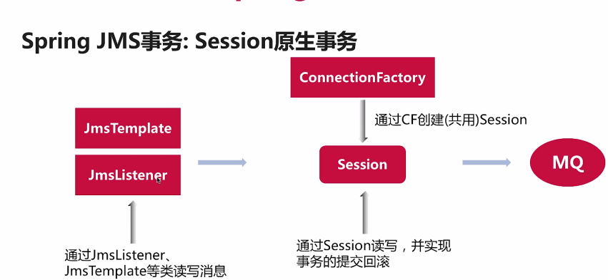
 
2)、Jms-session实例——c3-2-spring-trans-jms
对于session管理的jms事务而言，它的事务是作用在线程内 的生命周期上的。
对于listener触发的方法，listener用session去读了消息以后，触发了handle方法。
在handle里面触发了convertAndSend()。直到方法结束后这个listener才会去调用session的commit()去提交session管理的事务。
但是此时因为有一个异常，所以做了回滚操作。
   
如果直接调用handle方法的话，不通过listener，这个session事务的生命周期就只在convertAndSend()方法内部起作用，而不是整个handle方法起作用
所以就直接提交上去没有回滚。
a)、Spring Boot中使用JMS
b)、Spring Boot ActiveMQ Starter
c)、内置的可运行的ActiveMQ服务器
d)、实现读写ActiveMQ的事务

3.3.2.3、外部管理的事务：JmsTransactionManager、JTA

3.3.4、Spring外部事务与JTA
3.3.4.1、Spring内部事务与外部事务
1)、本地事务
 a、Spring容器管理事务的生命周期
 b、通过Spring事务接口调用
 c、业务代码与具体事务的实现无关
 d、
2)、外部(全局)事务
 a、外部事务管理器提供事务管理
 b、通过Spring事务接口，调用外部管理器
 c、使用JNDI等方式获取外部事务管理器的实例
 d、外部事务管理器一般由应用服务器提供，如Jboss等
 e、外部事务管理器提供JTA事务管理
 f、JTA事务管理器可以管理多个数据资源
 g、通过"两阶段提交"实现多数据源的事务
 
 两阶段提交:当我在一个JTA的事务里面，使用两个数据库的时候，我进行两阶段提交，也就是第一阶段先做一个第一阶段的提交；
  等所有的数据库都提交返回，没有问题的时候，然后在进行第二阶段的提交。
  第二阶段提交完成了以后数据才真正写进去相当于持久化。事务才算完成。
  如果在第一阶段提交完以后，某一些数据库返回了错误或者说没有及时返回，那么第二阶段没有及时提交而是直接rollback。
 事务.png "binaryTree")
 事务-不使用应用服务器.png "binaryTree")
 
3.3.4.2、JTA与Spring JTA实现
1)、JTA事务管理的用途
解决一个java服务访问多个数据源的时候，怎么样能够保证，满足他的事务性。 

3.3.4.3、JTA与XA
1)、XA
XA：是由X/Open提出的分布式事务的规范，这个规范定义了一个全局的事务管理器的接口-Transaction Manager
XA Resource
两阶段提交

2)、JTA
JTA实际上是XA规范在Java中的实现，JTA(Java Transaction API)。
 a、TransactionManager
 b、XAResource
 c、XID

3)、JTA事务管理的弊端
 a、两阶段提交
 b、事务时间太长、锁数据的时间太长
 c、低性能、低吞吐量

4)、不使用JTA实现多数据源的事务管理-Spring事务同步
 a、Spring事务同步机制
 b、多个数据源上实现近似事务一致性
 c、高性能、高吞吐量

3.3.4.4、JTA分布式事务实例
[JTA分布式事务处理](https://www.jianshu.com/p/029f28c060f6)

4、分布式系统
1)、定义与介绍
将不同的组件分布在不同的服务器上，给用户提供一个可靠、统一的服务。
分布：不同
用户：可靠、统一的服务

2)、分布式系统的原则
CAP原则
C：一致性
A：可用性
P：分区容错性 

3)、如何实现原则
分区容错性：多级部署，通过服务拆分，把一个服务部署在一个机器上；
可用性：在多级部署的基础上通过一些负载均衡或者服务注册等等技术，保证对于用户提供的服务是可用的；
不会因为某一个服务器的出错导致整个系统不可访问；
一致性(*)：
 a、强一致性：在分布式系统中对多个数据源、多个数据库的操作是原子性完成的，数据满足一致性要求（几乎是不可能的）；
 b、弱一致性：当一个业务请求要调用不同的服务时，是一个一个调用的，每一个服务的调用都是在这个服务内去满足一致性要求；
    对于用户来说他看到的结果有可能是一个中间结果，等业务正常完成时数据即可达到一致性要求。
 但是对于弱一致性来说，如果出错了，业务应该如何回滚？(*)
 c、最终一致性：在弱一致性的基础上，先允许它出错，但是我可以通过一些重试或者定时任务去扫描，然后针对这种出错的情况进行取消；
 甚至是通过一些人工干预的方式能够让这些数据达到最终一致性。(实现起来比较容易，而且性能也很好，开发和维护的成本也比较低，实际开发中大多数使用)

4)、BASE理论
 BASE: Basically Available(基本可用)、Soft state(软状态)和 Eventually consistent(最终一致性)
 相当于CAP原则中的一致性和可用性的权衡结果。

5)、分布式系统的形式
 a、多数据源：在一个java系统中使用多个数据库
 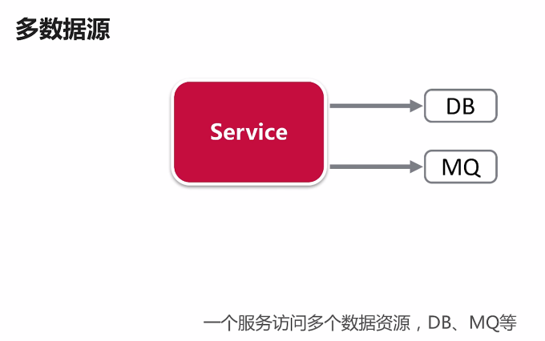
 b、多服务：一个系统把服务分成多个子服务，然后每个服务部署多个实例
 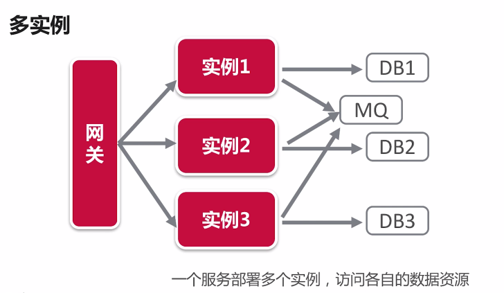
 c、SOA
 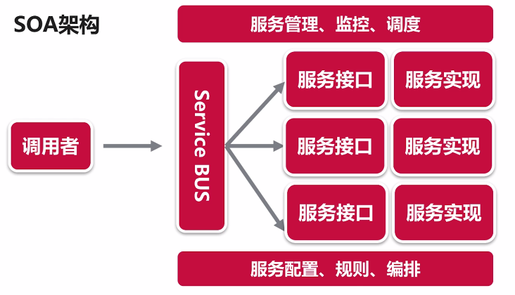
 d、微服务架构  
 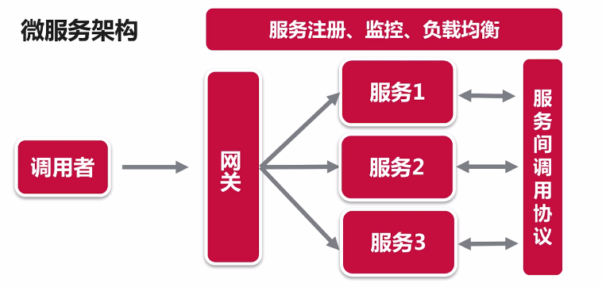

6)、分布式系统需要考虑的问题
 a、服务拆分
 b、数据拆分
 c、计算拆分
 d、服务状态以及异常处理
 
7)、微服务架构
 a、服务发现与注册
 b、服务网关与负载均衡
 c、监控与熔断机制
 d、配置、消息等
 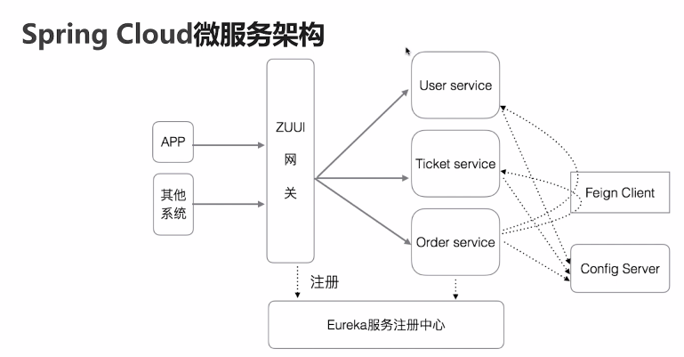

首先，访问的时候通过APP/网站方式进行访问，服务会在Eureka服务注册中心进行注册。网关会根据请求的url去服务注册中心拿到所有的url之后，
通过url匹配找到相应的服务。然后根据负载均衡把这个请求转发到某一个服务的某一个实例上去。然后网关还可以通过Hystrix组件针对每一个服务的调用
去做性能统计监控。如果服务之间有相互调用的请求时，会根据Feign Client组件去调用。调用时也会去Eureka去找到这个服务对应的实例是什么，然后还会
通过负载均衡的方式去调用。然后我们可以在Config Server里配置文件，我们所有的服务在启动时会先去联系Config Server下载配置。

4.1 Spring Cloud微服务架构
 1)、微服务架构组成
    a、服务
    b、服务注册中心
    c、网关：提供统一调用入口，可以负载均衡转发服务请求
    d、服务间调用协议：http方式 rest、rpc
 2)、Spring Cloud微服务架构
    a、Spring Cloud Netflix 微服务架构
    b、Spring Cloud Config 配置服务器
    c、Spring Cloud Bus 事件总线
 3)、Spring Cloud Netflix 微服务架构
    a、服务注册中心(Eureka)：服务注册和服务缓存
    b、网关(Zuul)：网关从服务注册中心取到所有服务的注册的配置,根据url找到相应的服务id;
    然后根据服务id注册的多个实例,通过一定的负载均衡的规则去把这个请求转发到相应的实例上面。
    网关也可以监控服务性能，可以查看每一个服务调用的时间。
    c、声明式Rest调用接口(Feign Client)：是一个服务间调用的接口,通过Http Rest的方式去进行服务间的调用;
    它可以通过标签的方式注明我们某一个方法它调用的接口是远程服务的哪一个接口等等。
    d、负载均衡：Ribbon，服务间调用时通过Ribbon进行负载均衡；
    e、监控、荣怒单组件：Hystrix与Hystrix Dashboard
 4)、Spring Cloud Config 配置服务器
    配置中心,在微服务分布式系统中,每个服务使用的配置可以在配置中心进行配置;
    当配置需要修改的时候,只需要在配置中心修改，通过特定刷新机制同步给各个服务去更新。
    a、配置：文件夹、Git、SVN、DB
    b、配置服务器
    c、服务 -> 配置服务器 -> 配置
    d、配置加密
4.2 Spring Cloud Netflix实战
 1)、User服务、Order服务
 2)、网关
 3)、服务注册中心、启用安全
 4)、服务间调用
 5)、Hystrix监控
 
5、分布式事务实现，模式和技术
1)、定义：在分布式系统中实现事务。在分布式部署的系统当中给用户提供一个可靠的服务;
让它能够通过一致的方式访问数据。
2)、分布式系统的CAP原则
 a、一致性
 b、可用性
 c、分区容错性
 实现分布式系统最重要的是实现一致性，如何实现一致性是重点考虑和设计的。
3)、事务的原则ACID
 a、A 原子性
 b、C 一致性
 c、I 隔离性
 d、D 持久性
4)、分布式事务的原则
 a、强一致性：类似本地事务ACID的完全实现，要求在分布式系统中，多个服务多个数据库之间，实现事务的四大特性；
 即使是在两个数据库的系统当中，我们实现强一致性可以通过JTA实现，但是对于一个复杂的分布式系统来说实现强一致性非常困难，
 甚至说在很多情况下甚至是不可能的，而且实现起来对性能影响非常大；
 b、弱一致性：在强一致性的基础上放弃原子性和隔离性，对于每一个操作只要求达到数据的一致性；例如，购买商品时要访问多个服务，收费、库存、订单等。
 我们在这一个业务方法上对多个服务的操作，不要求实现原子性和隔离性，我们只要求最终一致性的要求。在这种情况下实现系统出错时数据回滚可能比较复杂。
 c、最终一致性(大部分场景适用)：在弱一致性的基础上,我们允许它出错。但是出错时候我们不要求实现完全的一致性-数据回滚之类的操作，而是通过其他的像重试的方式去尝试
 着重新执行。或者说有另外的定时方法去检测我们这些出错的业务方法，把它作为其他的数据回滚操作，甚至还有一些人工干预去处理达到最终一致性。
 
5.1、Spring分布式事务实现
内容:
1)、回顾JTA与XA
2)、介绍Spring JTA分布式事务实现
3)、不使用JTA的分布式事务实现
4)、实例

5.1.1、XA与JTA
1)、XA是一个编程规范，这个规范里定义了一些事务管理的接口，还定义了一些XA Resource针对数据资源的封装。
事务管理的接口使用资源管理器针对多个数据的资源进行事务的管理，通过两阶段提交实现事务性。

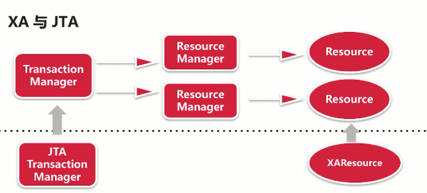
2)、JTA是XA规范在Java中的实现，在JTA里定义了一个JTA Transaction Manager，它根据XA规范定义了一个事务管理的接口，
也就是这个JTA Transaction Manager里面的接口。它可以针对多个 XA Resource进行多个数据库资源的事务管理。
XA Resource就是针对XA里面的Resource一个实现。
JTA事务管理器实现资源的管理实际上还是通过具体的数据资源的资源管理器实现。比如,
mq——ConnectionFactory进行具体的管理，数据库——jdbc connection实现具体管理，来实现事务。

JTA是在单个服务当中如果有多个数据源的情况下，实现分布式事务的方式。
但是应用到复杂的微服务系统或者说复杂的分布式系统当中，JTA的使用场景——消息中间件
通过消息中间件把每个服务串起来。

3)、JTA实现多服务的分布式事务
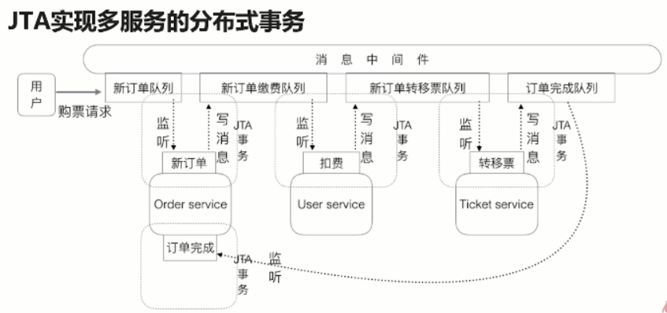

假设在Ticket Service处理的时候，在另外一个请求去查询用户余额信息时，这个时候由于已经扣费完了，但是ticket还没有处理完，
所以它就会看到扣费信息，但是看不到票据信息。这个就是没有实现数据的原子性和隔离性。
但是假设在Ticket Service时因为某种原因出错，我们可以让它去实现Order服务和User服务数据的回滚。
这样就能够实现弱一致性。又或者我们在出错的时候，把这个错误消息写到另外一个地方，然后又其他的程序去处理，这种实现方式就是最终一致性。

5.1.2、使用Spring JTA进行事务管理
1)、可以使用如JBoss之类的应用服务器提供的JTA事务管理器
2)、可以使用Atomikos、Bitronix等库提供的JTA事务管理器

5.1.3、不使用JTA
1)、为什么不使用JTA?
性能问题，两阶段提交——事务时间可能会很长。
2)、不使用JTA如何保证多个数据源上事务的正确性？
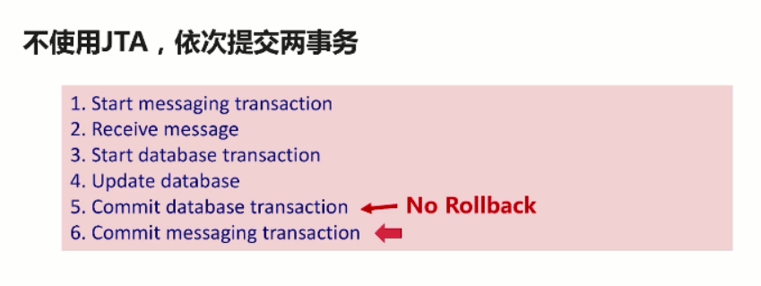
问题：在第6步出现问题，数据库已提交。

3)、Spring提供多个资源的事务同步方法
 a、XA与最后资源博弈
 b、共享资源
 c、最大努力一次提交
 d、链式事务

3.1)、XA与最后资源博弈

数据库支持JTA事务，在提交时，先做一阶段提交，然后提交message事务，最后做数据库二阶段提交。
问题：第6步 message已提交完，但是在第7步出错，这样还是避免不了。

3.2)、共享资源
适用场景：
 a、两个数据源共享同一个底层资源
 b、ActiveMQ使用DB作为存储
 c、使用DB上的connection控制事务提交
 d、需要数据源支持

3.3)、最大努力一次提交
 a、依次提交事务
 b、可能出错
 c、通过AOP或Listener实现事务直接的同步
3.4)、JMS最大努力一次提交+重试
 a、适用于其中一个数据源是MQ，并且事务由读MQ消息开始
 b、利用MQ消息的重试机制
 c、重试的时候需要考虑重复消息

.png "binaryTree")

3.5)、链式事务管理
 a、定义一个事务链
 b、多个事务在一个事务管理器里依次提交
 c、可能出错

5.1.4、如何选择
1)、根据具体业务的一致性要求
 a、强一致性事务：JTA(性能最差、只适用于单个服务内)
 b、弱、最终一致性事务：最大努力一次提交、链式事务(设计相应的错误处理机制)
2)、根据场景
 a、MQ-DB:最大努力一次提交+重试
 b、多个DB:链式事务管理
 c、多个数据源:链式事务、或其他同步方式

5.1.5、总结：
在Spring下面实现分布式事务主要有两种方式：使用JTA(强一致性)、不使用JTA——通过事务同步机制尽量保证事务一致。

5.2、分布式事务实现
5.2.1、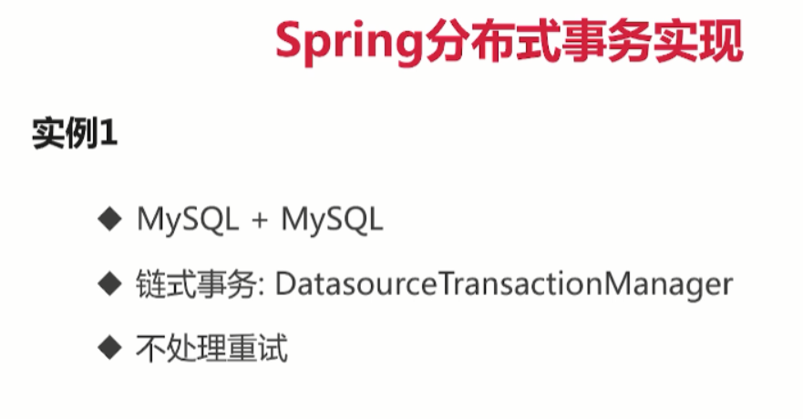
c5-1-spring-dtx-db-db
测试：如果存在error2时，在执行了customer_order之后，customer表回滚，而customer_order仍保存进数据。
原因：对 customer_order表的操作不在一个事务中执行的。它是直接提交上去额度过程。

5.2.2、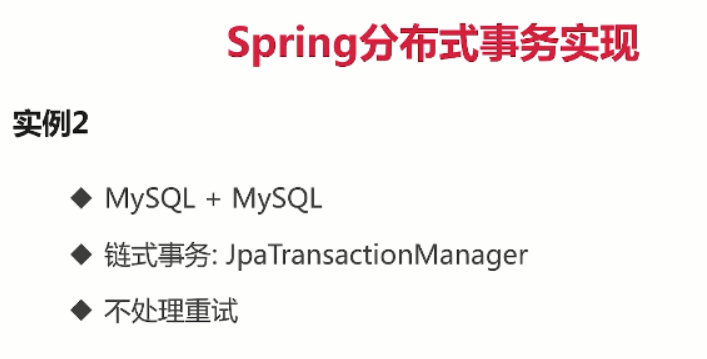
c5-2-spring-dtx-jpa-db
问题：在提交的过程中，如果说第二个事务，在提交的过程中出现了数据库的异常，第二个事务没有提交；
第一个事务的提交就没有办法回滚，在这种情况下是会出现错误的，但是在其他情况下都可以满足要求。

5.2.3、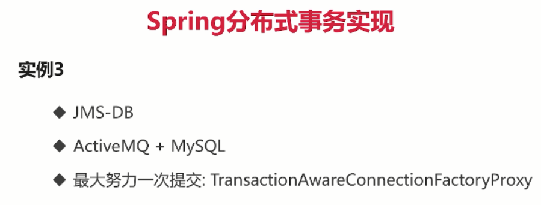
c5-3-spring-dtx-jms-db

5.3 分布式事务实现模式与技术
内容：
1)、分布式事务实现的几种模式
2)、幂等性、唯一性ID
3)、分布式锁、对象

5.3.1、分布式事务实现的几种模式
1)、消息驱动模式：Message Driven
使用mq的消息把分布式系统中多个服务的调用串起来。

2)、事件溯源模式：Event Sourcing
和消息驱动模式有点像，但是不同的是，消息驱动模式会使用一个消息的中间件和数据库共同使用，
通过消息中间件上面的消息的listener去触发一个消息，然后去完成一整个业务的请求。
但是事件溯源模式，我们只用使用一个基于事件的数据源(Event Store)，然后我们分布式系统的所有服务和实例
都能访问同一个Event Store，把我们的事件(操作的数据)发到Event Store里面，由它去统一的处理，
然后通过其它的方式去更新数据等等。

3)、TCC模式：Try-Confirm-Cancel
这种模式就是根据事务的方法去实现的，在我们实现事务的步骤就是先去执行操作，然后去做commit；
如果在这个过程中出现了错误就会做rollback操作，这三个操作的过程就是 Try-Confirm-Cancel。
这种模式一般是使用于有服务间调用的情况，也就是说我的某一个业务请求它需要访问其它的服务的时候，
那我在调用这个服务的时候，我先去调用这个服务，也就是做一个try事件;
如果说结束了，没有问题了，然后就会做一个confirm-类似事务的提交；
如果在我的业务方法的过程中出现了任何错误，那我会针对之前的try操作在去调用cancel方法-类似回滚的操作。

5.3.2、幂等性
1)、幂等性操作：任意多次执行所产生的影响，与一次执行的影响相同；
2)、方法的幂等性：使用同样的参数调用一个方法多次，与调用一次结果相同；
3)、接口的幂等性：接口被重复调用，结果一致。

微服务接口的幂等性：
 a、重要性：经常需要通过重试实现分布式事务的最终一致性；
 b、GET方法不会对系统产生副作用，具有幂等性；
 c、需要考虑 POST、PUT、DELETE方法的实现需要满足幂等性；
 
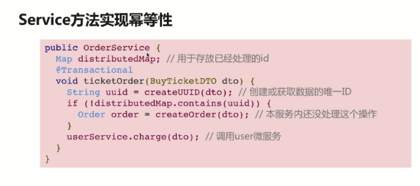
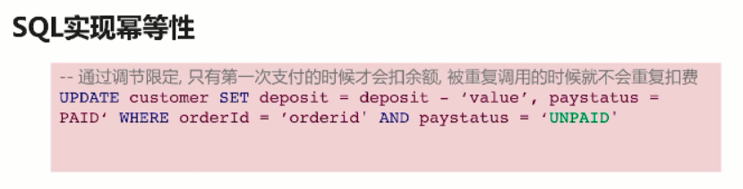

5.4、全局一致性ID和分布式对象
分布式系统唯一性ID：GUID
 a、分布式系统的全局唯一标识
 b、UUID：生成唯一ID的规范
 c、用于唯一标识、处理重复消息

1)、分布式系统唯一性ID生成方式：
 a、数据库自增序列
 b、UUID：唯一ID标准，128位，几种版本
 c、MongoDB的ObjectID：时间戳+机器ID+进程ID+序号
 d、Redis的INCR操作、Zookeeper节点的版本号

2)、使用何种方法？
 a、自增的ID：考虑安全性、部署
 b、时间有序：便于通过ID判断创建时间
 c、长度、是否数字类型：是否建索引

3)、分布式系统分布式对象
 a、Redis：Redisson库：RLock、RMap、RQueue等对象
 b、Zookeeper：Netflix Curator库：Lock、Queue等对象。
 
6、 分布式事务实现：消息驱动模式

6.1、分布式事务实现：消息驱动模式
1)、微服务架构的事务问题：
 a、服务间调用操作的回滚
 b、服务间调用失败的重试问题
2)、微服务架构的事务问题解决：
 a、方法1：减少服务间调用
 b、方法2：没有服务间调用，通过消息驱动调用服务
3)、注意的问题:
 a、消息中间件需要支持事务
 b、如何处理重试的消息：通过uuid、幂等性的实现来处理
 c、发生业务异常时回滚操作
4)、系统错误额度处理
 a、方法1：将出错未处理的消息写到失败队列，进行相应回滚操作
 b、方法2：通过定时任务检查超时订单，对未完成的订单做自动回滚
 c、方法3：保存出错消息，人工处理

6.2、消息驱动的分布式事务实现
实例：
 a、Order服务、User服务、Ticket服务
 b、ActiveMQ作为消息中间件
 c、错误处理：定时任务检查超时并回滚
 d、幂等性：实现方法的幂等性
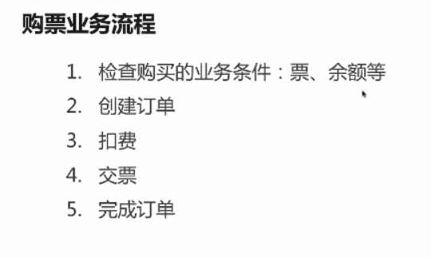

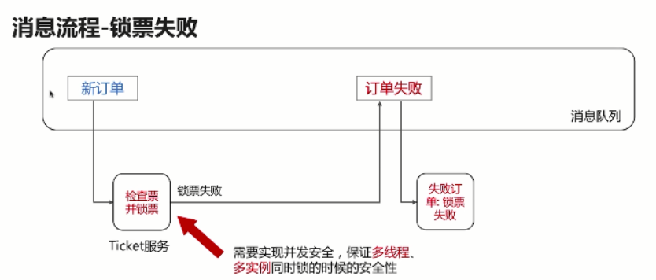
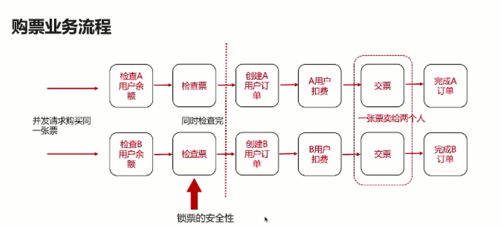

实现锁票的安全性：
 a、利用@JmsListener设置一个消费者，不适用于多实例
 b、使用事务和数据库锁的特性
 c、分布式锁：需要进行严格测试，数据库二级缓存等等
 
消息驱动方式：c6-spring-dtx-msg-driven
锁票时，在高并发情况下同时锁票不会出现问题，因为数据库的事务和锁的机制保证了只有一个用户可以锁成功。
也保证了方法的幂等性等等操作。

7、 分布式事务实现：事件溯源
7.1、事件溯源模式介绍
1)、消息驱动(msg-driven or event-driven)
 a、事件不要求持久化保存
 b、消息只是为了更新业务数据的状态，数据库才是一等数据
 c、不要求所有的数据操作都通过消息驱动

2)、事件溯源(event-sourcing)
 a、事件作为一等数据保存
 b、统一的时间管理器和接口，数据更新都由事件产生
 c、数据库中数据的当前状态根据事件的聚合产生
 d、聚合数据可以保存在数据库中、可以根据事件重新生成

3)、事件溯源的优点：
 a、历史重现：从时间中重新生成试图数据库
 b、方便的数据流处理与报告生成
 c、性能
 d、服务的松耦合
 
4)、事件溯源的缺点：
 a、只能保证事务的最终一致性
 b、设计和开发思维的转变、学习成本
 c、事件结构的改变
 d、扩展性：Event Store的分布式实现、事件的分布式处理
 
5)、消息驱动 VS 事件溯源：
 a、一等数据：事件 vs u、业务数据
 b、事件永久保存、历史重现
 c、所有数据更新都必须通过事件来产生
 d、Event Store服务承担更多的功能

6)、事件溯源的数据一致性：
 a、一个事件只处理一个服务的数据
 b、保证事件的至少一次处理、幂等性
 c、业务请求的错误处理：多次重试失败、网络异常、服务不可用

7)、事件溯源和CQRS（命令查询责任隔离）：
 a、CQRS：命令查询职责分离，系统实践的模式——把数据的操作和查询隔离开
 b、C端执行命令，Q端执行查询

7.2、事件溯源模式与Axon框架
1)、Axon框架介绍
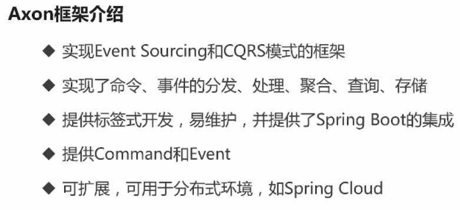
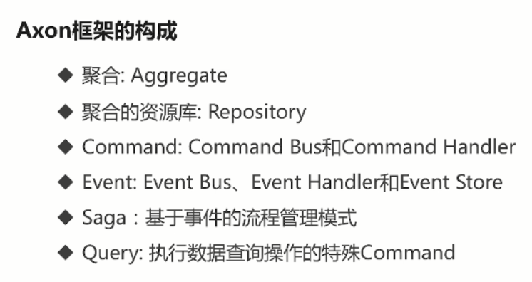
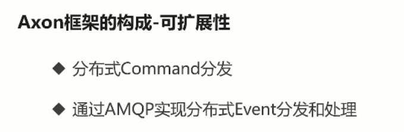
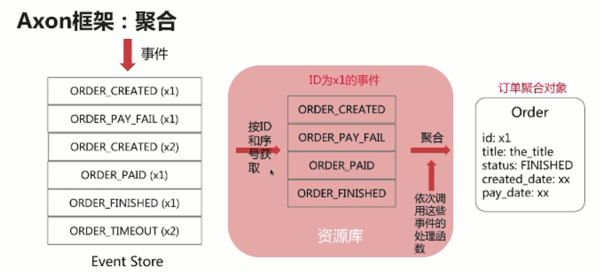
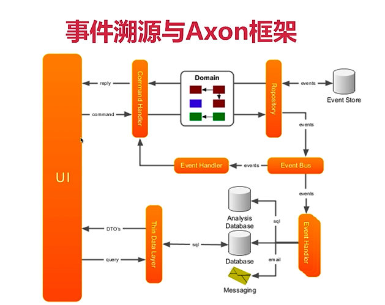
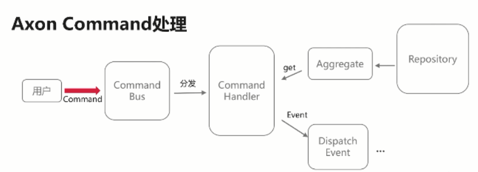
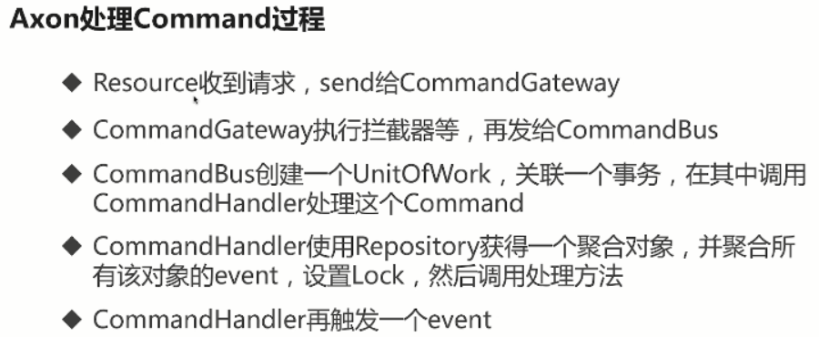
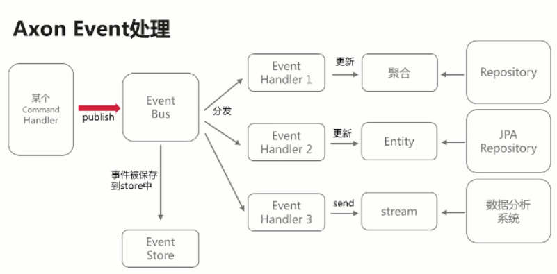
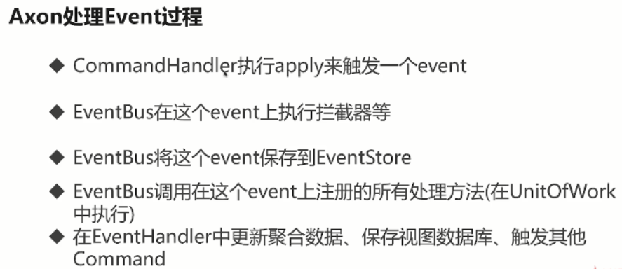
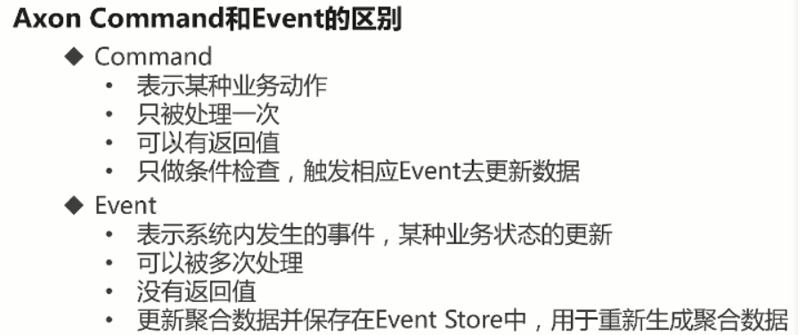
2)、Axon框架设计开发的步骤
3)、用Axon框架实现Event Sourcing的微服务实例
4)、Axon框架的分布式实现分析

7.3)、使用Axon框架的设计过程介绍
1)、账户管理：账户创建、查看、转账
2)、使用Axon框架的设计过程：
 a、领域模型设计
 b、业务-Command-Command处理
 c、数据-Event-Event处理
 d、将数据保存到数据库：聚合数据-映射到-视图数据
 e、查询-Query
3)、实例
 a、领域模型：账户Account
 b、业务Command：创建账户、存款、取款
 c、事件Event：账户创建、存款、取款
 d、将账户信息保存到数据库中，方便查询
 e、查询Command：查询账户