<<剑指Java面试-Offer直通车>>

## 一.计算机网络面试核心
### 1.网络基础知识讲解
#### 1.1 OSI开放式互联参考模型
第一层 物理层：机械、电子、定时接口通信信道上的比特流传输。
解决两台物理机之间的通讯需求：机器A往机器B发送比特流，机器B收到这些比特流，这便是物理层要做的事;
物理层主要定义了物理设备的标准。如：网线的类型、光纤的接口类型、各种传输介质的传输速率等。
它的主要作用是传输比特流(比特流：0101-二进制数据),将它们转化为电流强弱来进行传输,
到达目的后在转化为0101的机器码——也就是我们常说的数模转换与模数转换。
这层的数据叫做比特,网卡就是工作在这层里面的。

第二层 数据链路层：物理寻址,同时将原始比特流转变为逻辑传输线路。
在传输比特流的过程中会产生错传、数据传输不完整的可能，因此数据链路层应运而生。

数据链路层定义了如何格式化数据以进行传输,以及如何让控制对物理介质的访问。
这层通常还提供错误检测和纠正以确保数据传输的可靠性。
本层将比特数据组成了帧。交换机工作在这层里面,对帧解码,并根据帧中包含的信息把数据发送到正确的接受收方。

随着网络节点的不断增加，点对点通讯的时候是需要经过多个节点的。那么如何找到目标节点，如何选择最佳路径便成了首要需求。
此时便有了网络层。

第三层 网络层：控制子网的运行，如逻辑编址、分组传输、路由选择。
主要功能是将网络地址翻译成对应的物理地址,并决定如何从发送方路由到接受方。
网络层通过综合考虑：发送优先权、网络拥塞程度、服务质量以及可选路由的花费来决定，
从一个网络中节点A到另一个网络中节点B的最佳路径。
由于网络层处理并智能指导数据传送路由器连接网络各段，所以路由器属于网络层。
此层的数据我们称之为数据包，本层我们需要关注的协议主要是TCP/IP协议里面的IP协议。
随着网络通信需求的进一步扩大，通信过程中需要发送大量的数据。
如海量文件传输的，可能需要很长时间，而网络在通信的过程中会中断好多次，
此时为了保证传输大量文件时的准确性，需要对发出的数据进行切分，切割为一个一个的段落(segment)进行发送。
那么其中一个段落丢失了怎么办，要不要重传？每个段落要按照顺序到达吗？这个便是传输层要考虑的问题了。

第四层 传输层：接受上一层的数据，在必要的时候把数据进行分割，并将这些数据交给网络层，且保证这些数据段有效到达对端。
传输层解决了主机间的数据传输，数据域间的传输可以是不同网络的，并且传输层解决了传输质量的问题，该层称之为OSI模型中最重要的一层了。
传输协议同时进行流量控制或是基于接收方可接受数据的快慢程度规定适当的发送速率。
除此之外传输层按照网络能处理的最大尺寸将较长的数据包进行强制分隔，
例如以太网无法接收大于1500字节的数据包，发送方节点的传输层将数据分割成较小的数据片，
同时对每一数据片安排一序列号以便数据到达接收方节点的传输层时，能以正确的顺序重组，
该过程成为排序。
传输层中需要关注的协议有TCP/IP协议中的TCP协议和UDP协议。
现在我们已经保证给正确的计算机发送正确的封装之后的信息了，但是用户级别的体验好不好，
难道我每次去调用TCP去打包，然后调用IP协议去找路由，自己去发？
当然不行，所以我们需要建一个自动收发包，自动寻址的功能，于是发明了会话层。

第五层 会话层：不同机器上的用户之间建立及管理会话
会话层的作用就是建立和管理应用程序之间的通信。
现在我能保证应用程序自动收发包和寻址了。但我要用Linux给Windows收发包，
两个系统语法不一致，就像安装包一样，exe是不能在Linux上运行的。
于是就有了表示层。

第六层 表示层：信息的语法语义以及它们的关联，如加密解密、转换翻译、压缩解压缩
表示层帮我们解决不同系统之间的通信语法的问题。在表示层数据将按照网络能理解的方案进行格式化。
这种格式化也因所使用网络的不同而不同，此时虽然发送方知道自己发送的是什么东西，
转换成字节数组之后有多长，但接收方肯定不知道。

第七层 应用层
所以应用层的网络协议诞生了，它规定发送方和接收方必须使用一个固定长度的消息头，
消息头必须使用某种固定的组成。而且消息头里必须记录消息体的长度等一系列信息。
以方便接收方能够正确的解析发送方发送的数据。应用层旨在让你更方便的应用从网络中接收到的数据。
至于数据的传递没有该层你也可以直接在两台电脑间开杠，只不过传来传去就是一个1和0组成的字节数组。
该层需要重点关注的是与之相对应的TCP/IP协议中的http协议。

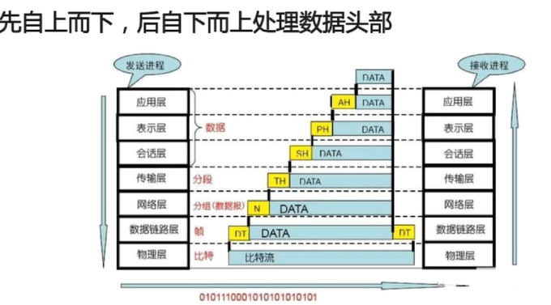
OSI参考模型并不是一个标准，而是一个制定标准是所使用的概念型框架。
事实的标准是TCP/IP四层架构参考模型。
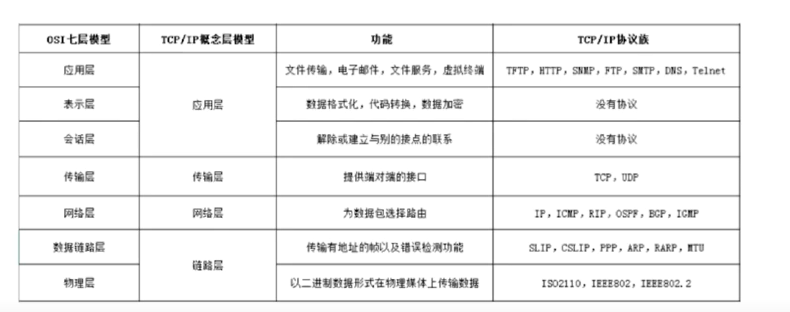

### 2.TCP的三次握手
1.IP协议：IP协议是无连接的通信协议，它不会占用两个正在通信的计算机的通信线路，这样IP
就降低了对网络线路的需求。每条线可以同时满足许多不同计算机之间的通信需要，
通过IP，消息或者其他数据会被分割为较小的独立的包，并通过因特网在计算机之间传送，
IP负责将每个包路由至它的目的地，但IP协议没有做任何事情来确认数据包是否按顺序发送，
或者包是否被破坏，所以IP数据包是不可靠的，需要由它的上层协议来做控制。

2.传输控制协议TCP属于传输层的协议
TCP(Transmission Control Protocol)简介：
1).面向连接的、可靠的、基于字节流的传输层通信协议；
2).数据传输时，应用层向TCP发送数据流，然后TCP把数据流分隔成适当长度的报文段，
此后TCP把结果包传给IP层，由它通过网络将包传送给目标节点的TCP层；
3).TCP为了保证不丢失包就给每个包一个序号(Sequence Number)，同时序号也保证了传送到目标节点的
包的按序处理，然后接收端实体对已成功收到的包发送ACK-已成功确认，如果发送端实体在合理的往返时延未收到确认，
那么对应的数据包就被假设为已丢失并且将会对其进行重传；
4).TCP用一个校验和函数来检验数据在传输过程中是否有误，在发送和接收时都要计算校验和。

### 3.TCP三次握手
3.1 TCP报文头

1)、Source Port: 源端口，占2个字节
2)、Destination Port: 目的端口 占2个字节
TCP不包含IP地址信息，TCP和UDP均会有源端口和目的端口。端口是属于传输层知识范畴的。
两个进程在计算机内部进行通信，可以由管道、内存共享、信号量、消息队列等方法进行通信。
而两个进程如果需要进行通信最基本的前提是唯一能够标识一个进程，通过这个标识找到对应进程。
在本地进程通信中，我们可以使用pid(进程标识符)来唯一标识一个进程，但pid只在本地唯一，
如果把两个进程放在不同的两台计算机，它们要进行通信的话pid就不够用了。
这样就需要另外一个手段——在传输层中使用协议端口号(protocal port number)，
IP层的ip地址可以唯一标识一个主机，而TCP协议和端口号可以唯一标识主机中的一个进程，
这样我们可以利用IP地址+协议+端口号去标识网络中的一个进程。
在一些场合把这个唯一标识的模式称为套接字(Socket)。虽然通讯的重点是应用进程，
但我们只要把要传送的报文加上目的主机的某一个合适的端口，剩下的工作就由TCP来完成。
3)、Sequence Number(序号)：4个字节，TCP连接中，传送的字节流中的每个字节都按顺序去编号，
例如一段报文的序号字段值就是107，而携带的数据共有100个字段，那么如果有下一个报文段的话，
其序号就应该是从207(107+100)开始。
4)、ACK确认号：4个字节 期望收到对方下一个报文的第一个数据字节的序号。
例如B收到了A发送过来的报文，其序列号字段是301，而数据长度是200字节，
这表明了B正确的收到了A发送的到序号500(301+200-1)为止的数据，因此B期望收到A的下一个数据序号是501，
于是B在发送给A的确认号段中会把ACK确认号置为501。
5)、Offset(数据偏移)：由于头部有可选字段，长度不固定，因此它指出TCP报文的数据距离TCP起始处有多远，
6)、Preserved：保留域
7)、TCP Flags：控制位，主要由8个标志位组成，每个标志位表示一个控制功能。
 a、URG：紧急指针标志，当它为1时，表示紧急指针有效；为0则忽略紧急指针
 b、ACK(*)：确认序号标志，为1时表示确认号有效，为0表示报文中不含确认信息忽略确认号字段；
 c、PSH：push标志，为1时表示是带有push标志的数据，指示接收方在接收该报文段以后应尽快
  将这个报文段交个应用程序而不是在缓冲区排队；
 d、RST：重置连接标志，用于重置由于主机崩溃，或其他原因而出现错误的连接，
  或者用于拒绝非法的报文段，和拒绝连接请求；
 e、SYN(*)：同步序号，用于建立连接过程，在连接请求中SYN=1和ACK=0表示该数据段没使用捎带的确认域，
  而连接应答捎带的确认即SYN=1和ACK=1;
 f、FIN(*)：finish标志，用于释放连接，为1时表示发送方已经没有数据发送了，即关闭本方数据流。

8)、window窗口：表示滑动窗口的大小，用来告知发送端接收端的缓冲大小，以此控制发送端发送数据的速率，
 从而达到流量控制
9)、Checksum检验和：既有校验，此校验和是对整个的TCP报文段，包括TCP头部和TCP数据以16为进行计算所得，
 由发送端计算和存储，并有接收端进行验证
10)、Urgent Pointer(紧急指针)：只有当TCP中的URG为1的时候才有效
11)、TCP Options：可选项，定义一些其他的可选参数

当应用程序希望通过TCP与另一个应用程序通信时，它会发送一个通信请求，这个请求必须被送到一个确切的地址，
在双方握手之后TCP将在两个应用之间建立全双通的通信，这个全双通的通信将占用两个计算机的通信线路，
直到它被对方或双方关闭为止。

3.2 TCP三次握手流程图
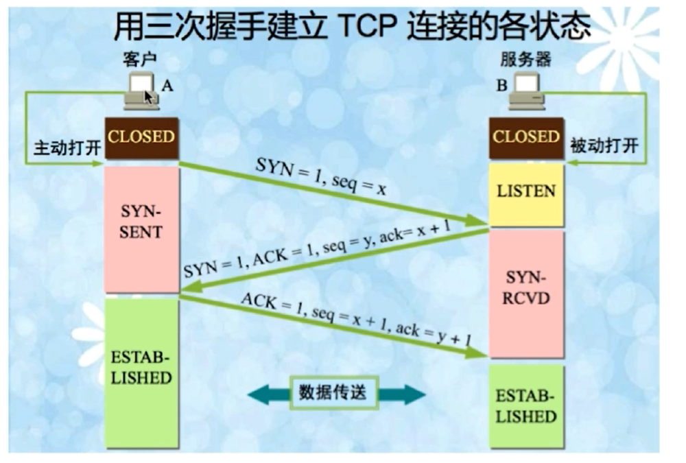
"握手"是为了建立连接，TCP三次握手的流程如下：
在 TCP/IP 协议中，TCP协议提供可靠的连接服务，采用三次握手建立一个连接。
1)、第一次握手：建立连接时，客户端发送SYN包[syn=j]到服务器，并进入SYN_SEND状态，等待服务器确认；
2)、第二次握手：服务器收到SYN包，必须确认客户的SYN(ack=j+1)，同时自己也发送一个SYN包(syn=k)，即SYN+ACK包，
 此时服务器进入SYN_RECV状态；
3)、第三次握手：客户端收到服务器的SYN+ACK包，向服务器发送确认包ACK(ack=k+1)，此包发送完毕，客户端和服务器进入ESTABLISHED状态，
 完成三次握手。

3.3 为什么需要三次握手才能建立起连接
 为了初始化Sequence Number的初始值。
 通信的双方要互相通知对方自己的初始化的Sequence Number(seq)，这个号要作为以后的数据通信的序号，
 以保证应用层接收到的数据，不会英文网络上的传输问题而乱序，即TCP会用这个序号来拼接数据。因此，
 在服务器回发它的seq(即第二次握手之后)，还需要发送确认报文给服务器，告诉服务器说，客户端已经收到你的初始化的seq了。
3.4 首次握手的隐患——SYN超时
问题起因分析：
 1)、Server端收到Client的SYN，回复SYN-ACK的时候未收到ACK确认，此时的连接处于一个中间状态——未成功 也没有失败
 2)、Server不断重试直至超时，Linux默认等待63s才断开连接
针对SYN Flood的防护措施
 1)、SYN队列满后，通过tcp_syncookies参数回发SYN Cookie
 2)、若为正常连接则Client会回发SYN Cookie，直接建立连接
建立连接后，Client出现故障怎么办？
 保活机制
 1)、向对方发送保活探测报文，如果未收到响应则继续发送
 2)、直到尝试次数达到保活探测数仍未收到响应则中断连接

### 4.TCP四次挥手
"挥手"是为了终止TCP连接，TCP四次挥手的流程图如下：
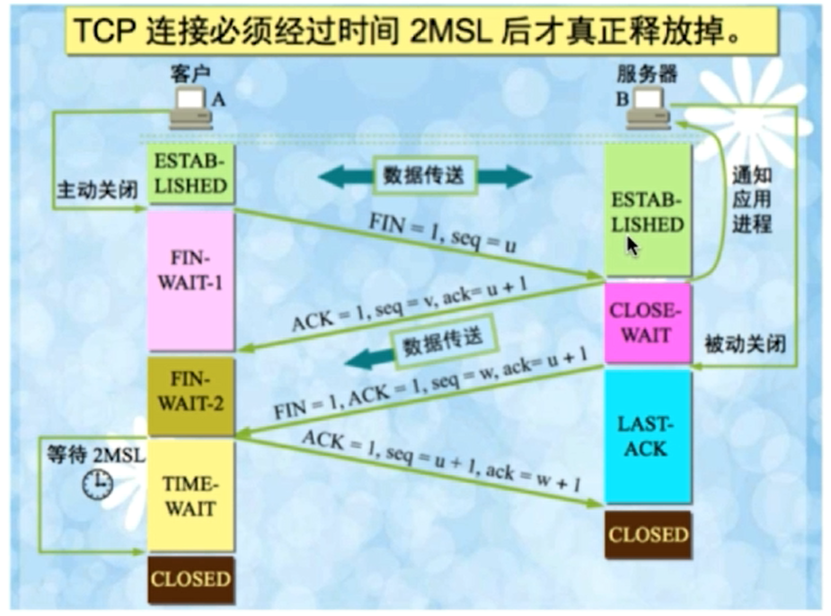
1)、第一次挥手：Client发送一个FIN，用来关闭Client到Server的数据传送，Client进入FIN_WAIT_1状态；
2)、第二次挥手：Server收到FIN包之后，会发送一个ACK给Client，确认序号为收到序号+1(与SYN相同，一个FIN占用一个序号)，Server进入CLOSE_WAIT状态；
3)、第三次挥手：Server发送一个FIN，用来关闭Server到Client的数据传送，Server进入LAST_ACK状态；
4)、第四次挥手：Client收到FIN后，Client进入TIME_WAIT状态，接着发送一个ACK给Server，确认序号为收到序号+1，Server进入CLOSED状态，完成四次挥手。

4.1、为什么会有TIME_WAIT状态？
原因：
1)、TIME_WAIT状态是为了确保有足够的时间让对方收到ACK，如果被动关闭的一方没有收到ACK就会触发被动端重发FIN包，
一来一去正好是2个MSL；
2)、有足够的时间让这个连接，不会跟后面的连接混合在一起，因为有些路由器会缓存IP数据包，如果连接被__，那么这些延迟被收到的包就有可能会跟新链接混在一起。

4.2、为什么需要四次握手才能断开连接？
因为TCP是全双工的，发送方和接收方都需要FIN报文和ACK报文，也就是说发送方和接收方各只需两次挥手即可，
只不过有一方是被动的，所以看上去就成了所谓的四次挥手。

4.3、服务器出现大量CLOSE_WAIT状态的原因
客户端一直在请求，但是返回给客户端的信息是异常的，服务端压根就没有收到请求。
在对方关闭socket连接，我方忙于读或写，没有及时关闭连接。
解决：
1)、检查代码，特别是释放资源的代码;
2)、检查配置，特别是处理请求的现成配置。

### 5.TCP和UDP的区别
5.1、UDP简介：用户数据报协议(User Datagram Protocol)
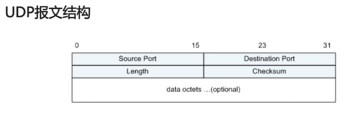
源端口
目标端口
数据包长度
既有校验值
用户数据

5.2、UDP特点
1)、面向非连接，传输数据之前源端和终断不建立连接，当它想传送时就简单抓取来自应用程序的数据，
并尽可能快的把它扔到网络上，在发送端UDP传送数据的速度仅仅是受应用程序生成数据的速度、计算机的能力、和传输带宽的限制，
在接收端UDP把每个消息段放到队列中，应用程序每次从队列中读取一个消息段；
2)、由于传输数据不建立连接，因此也就不需要维护连接状态，因此一台服务器可同时向多个客户端传输相同的消息；
3)、UDP数据包报头只有8个字节，相对于TCP额外开销较小；
4)、吞吐量只受应用软件生成数据的速率、传输带宽、源端和终端主机性能的限制；
5)、UDP尽最大努力交付，不保证可靠交付，不需要维持负载的链接状态表；
6)、UDP是面向报文的，发送方的UDP对应用程序交互下来的报文再添加守护后，向下交互给IP层，既不拆分也不合并而是保留这些报文的边界，
因此应用程序需要选择合适的报文大小；

5.3、TCP和UDP的区别
TCP和UDP是OSI模型中的运输层中的协议。TCP提供可靠的通信传输，而UDP则常被用于让广播和细节控制交给应用的通信传输。
二者区别如下：
1)、TCP面向连接，UDP面向无连接。TCP有三次握手的连接过程，UDP适合消息的多拨发布，
从单个点向多个点传输信息；
2)、可靠性：TCP是比较可靠的，是利用握手、确认和重传机制提供了可靠性保证，而UDP则可能会丢失，
没有不知道到底有没有被接收；
3)、有序性：TCP利用序列号保证了消息包的顺序交互，到达可能无序，但TCP最终会排序，
而UDP是不具备有序性的；
4)、速度：TCP速度较慢吗，因为要创建连接保证消息的可靠性和有序性需要做额外的很多事情，UDP则更适合对速度比较敏感的应用，
比如：在线视频媒体、电视广播、多元在线游戏等；
5)、量级：TCP属于重量级的，UDP属于轻量级的体现在源数据的头大小

### 6.TCP的滑窗
6.1、RTT和RTO
RTT(Round Trip Time)：发送一个数据包到收到对应的ACK，所花费的时间
RTO(Retransmission TimeOut)：重传时间间隔

6.2、TCP的滑动窗口
TCP会将数据拆分成段进行发送，出于效率和传输速度的考虑，我们不可能等一段一段数据去发送，等到上一段数据被确认后在发送下一段数据，
这个效率是非常低的，我们是要实现对数据的批量发送，TCP必须要解决可靠传输以及包乱序的问题。
所以TCP就要知道网络实际的数据处理带宽，或是数据处理的速度，这样才不会引起数据拥塞导致丢包。

TCP使用滑动窗口做流量控制与乱序重排，TCP的滑动窗口主要有两个作用：
 1)、保证TCP的可靠性
 2)、保证TCP的流控特性
 
6.3、滑动窗口的基本原理
对于TCP会话的发送方，任何时候在其发送缓存内的数据都可以分为四类：
 a、已经发送并且得到端的回应
 b、已经发送但还没有得到端的回应
 c、未发送但对端允许发送的
 d、未发送且由于达到window的大小对端不允许发送的数据
其中，b、c组成的连续空间就称为滑动窗口。
当收到接收方新的ACK对于发送窗口中后续字节的确认时，窗口就会进行滑动。

总结：
TCP最基本的可靠性来源于确认重传机制，TCP的滑动窗口的可靠性也是建立在重传基础上的，发送窗口只有收到接收端对于本段发送窗口内字节的ACK确认，
才会移动发送窗口的左边界，接收窗口只有在前面所有的段都确认的情况下才会移动左边界，当在前面还有字节未接收但收到后面字节的情况下，窗口是不会移动的，
并不对后续字节确认，一次确保对端会对这些数据重传。

### 7.HTTP相关
7.1、HTTP简介
HTTP(HyperText Transfer Protocol,超文本传输协议)：属于应用层协议，它是基于请求与响应模式的无状态的应用层协议，
常基于TCP的连接方式。http1.1版本中，给出一种持续连接的机制(KeepAlive)，绝大多数web开发都是构建在http协议之上的web应用。

主要特点：
1)、支持客户/服务器模式
2)、简单快速，客户端向服务器请求服务的时候，只需传送请求方法和路径；
请求方法常用的有：GET、HEAD、PUT；每种方法规定了客户端与服务器联系的类型不同；
由于http协议简单，使得http服务器的程序规模小，因而通讯速度很快；
3)、灵活，http允许传输任意类型的数据对象，正在传输的类型由Content Type加以标记；
4)、无连接，无连接的含义是限制每次连接只处理一个请求；服务器处理完客户的请求，并收到客户的应答后，即断开连接，采用这种方式可以节省传输时间，
从HTTP 1.1起，默认使用长连接，即服务器需要等待一段时间后，才断开连接，以保证连接特性；
5)、无状态，HTTP协议是无状态协议。无状态是指协议对于事务处理没有记忆能力。缺少状态意味着如果后续处理需要前面的信息，则必须重传，这样可能导致每次连接传送的数据量增大。
另一方面，在服务器不需要先前信息时它的应答就较快；

7.2、HTTP请求结构
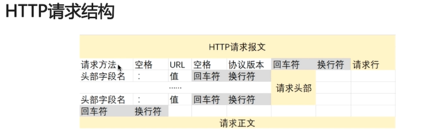
主要由 请求行、请求头部、空行、请求正文四部分组成。
1)、请求行：包括 请求方法(GET、PUT)、URL、协议版本号(HTTP 1.0/HTTP 1.1)
2)、请求头：名字 + ： + 空格 + 值

7.3、HTTP响应结构
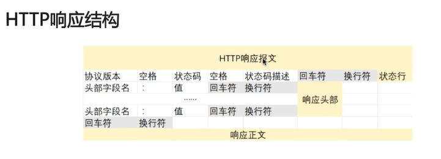
状态行、响应头部、响应正文

HTTP协议采用了请求/响应模型，客户端向服务器发送一个请求报文，请求报文包含 请求方法、URL、协议版本、请求头部和请求数据，
服务器以一个状态行作为响应，响应的内容包括协议的版本、成功/错误代码、服务器信息、响应头部、响应数据。

7.4、请求/响应步骤
 1)、客户端连接到Web服务器，一个HTTP客户端通常是浏览器与Web服务器的http端口，默认端口号是80，建立一个TCP套接字连接；
 2)、发送HTTP请求，即通过TCP套接字客户端向Web服务器发送一个文本的请求报文；
 3)、服务器接受请求并返回HTTP响应，Web服务器解析该请求，定位请求资源，服务器将资源副本写到TCP套接字由客户端读取；
 4)、释放TCP连接，若我们的连接模式为CLOSE，则服务器主动关闭TCP连接；客户端被动关闭连接释放TCP连接；
 若我们的连接模式为KeepAlive，则该模式会保持一段时间，在该时间内可以继续接收请求；
 5)、客户端浏览器解析HTML内容

面试：
1、在浏览器地址栏键入URL，按下回车之后经历的流程
 1)、浏览器会依据URL逐层查询DNS服务器缓存，解析URL中的域名所对应的IP地址；
 DNS缓存从近到远依次是 浏览器缓存、系统缓存、路由器缓存、IPS服务器缓存、根域名服务器缓存以及域名服务器缓存；
 从哪个服务器找到对应的IP则直接返回不在查询后面的缓存；
 2)、找到IP地址后，会根据IP地址和对应端口(模认80端口)，和服务器建立TCP连接（三从握手）
 3)、浏览器发送HTTP请求，该请求将发送给服务器
 4)、服务器对浏览器请求作出响应，并把对应的带有HTML文本的HTTP响应报文发送给浏览器；
 5)、浏览器收到HTML并在显示窗口内渲染
 6)、浏览器释放连接（四次挥手），连接结束
 
2、HTTP状态码
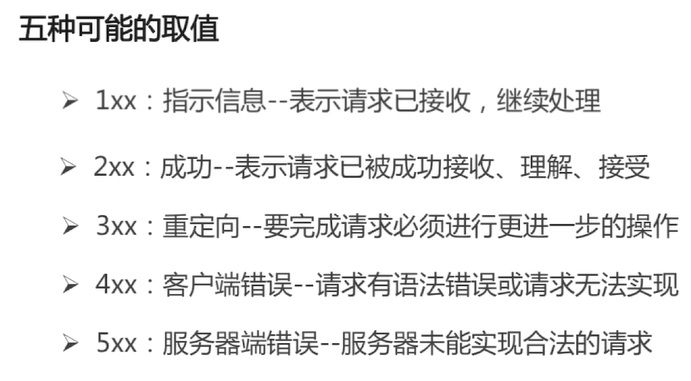
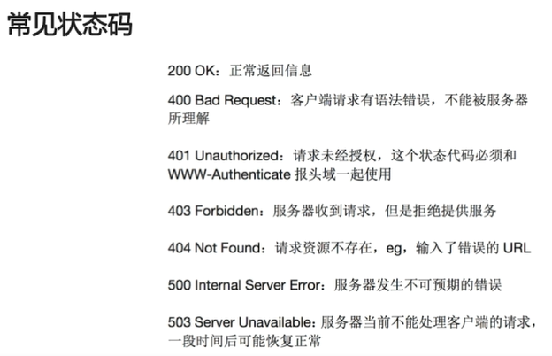

3、GET请求和POST请求的区别。
从三个层面解答。
 1)、HTTP报文层面：
  GET将请求信息放在URL，请求信息和URL之间以问号隔开，请求信息的格式为键值对；
  POST将请求信息放在报文体中，想获得请求信息必须解析报文，因此安全性较GET安全一些；
  
  事实上，要获得报文中的请求信息也是很容易的，因此安全性上两者并没有太多区别，具体解决传输过程中的安全问题，还要靠HTTPS。

  由于GET中的请求信息设置在URL中，因此是有长度限制的，因为URL本身是没有长度限制的，但是浏览器会对URL作出长度限制；
 POST将请求信息放在报文体中因此对报文长度是没有限制的
 
 2)、数据库层面：GET符合幂等性和安全性，POST不符合
  幂等性：对数据库的一次操作和多次操作获得的结果是一致的
  安全性：对数据库的操作，没有改变数据库中的数据
  GET请求是做查询操作的，因此不会改变数据库中原有的数据，大致的可以认为是符合幂等性和安全性的；
  POST则都不符合，POST请求方式会往数据库中提交数据，因此会改变数据库中的数据，
 其次POST请求方式每次获得的结果都有可能不一样，因为POST请求时作用在上一级的URL上的，则每一份请求都会添加一份新资源；
  这也是POST和GET的最大区别；
  
  3)、其他层面：GET可以被缓存、被存储、而POST不行
  GET请求会保存到浏览器的浏览记录中，GET请求URL能保存为浏览器书签
  POST请求不具备上诉功能；
  缓存也是GET请求被广泛应用的根本。
 
4、Cookie和Session的区别
因为HTTP是无状态的，也就意味着我们每次访问某个有登录需求的页面的时候都要不厌其烦的输入账号密码。
现实生活中，并没有出现这样的情况，这是因为引入了某些机制让HTTP具备了状态。其中的两个便是Cookie和Session。

Cookie简介：Cookie技术是客户端的解决方案，Cookie是由服务器发送给客户端的特殊信息，以文本的形式存放在客户端。
客户端每次向服务器发送请求的时候都会带上这些特殊的信息。
当用户使用浏览器访问一个支持Cookie的网站的时候，用户会提供包括用户名在内的个人信息，并且提交至服务器；
紧接着服务器在向客户端回传相应的超文本的同时也会返回这些信息，当然这些信息并不是存放在HTTP响应体（response body）中的，
而是放在http响应头(response head)，当用户端浏览器接受到来自服务器的响应的时候，浏览器会将这些信息存放在一个统一的位置；
自此，客户端再向服务端发送请求的时候，会把响应的Cookie发送至相应的服务器中；
服务器接受到之后，回解析Cookie与客户端相对应的内容。
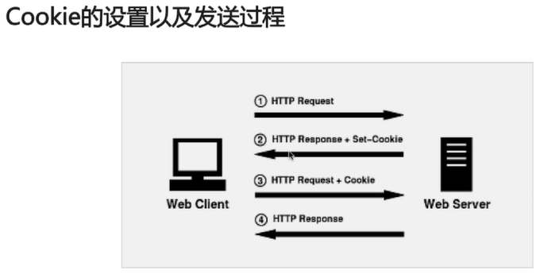

Session简介：Session机制是一种服务器端的机制，服务器使用了一种类似于散列表的结构来保存信息。
当程序需要为某个客户端的请求创建一个Session的时候，服务器首先检查这个客户端的请求里是否包含了一个session标识，
称为sessionId，如果已包含则说明以前已经为此客户端创建了Session，服务器就按照sessionId把这个Session检索出来使用。
如果检索不到就可能会新建一个，如果客户端请求不包含sessionId，则为此客户端创建一个Session，并且生成一个与此Session相关的sessionId。
sessionId的值是一个既不会重复又不容易被找到规律的字符串。sessionId会在本次响应中回发给客户端进行保存。
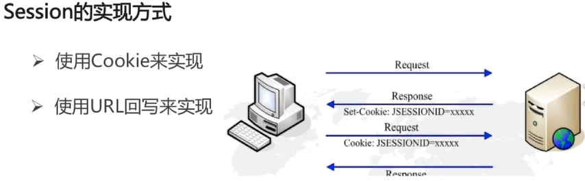

区别：
 1)、Cookie数据存放在客户的浏览器上，Session数据放在服务器上；
 2)、Session相对于Cookie更安全
 3)、Session会在一定时间内保存在服务器上当访问增多会比较占用服务器的性能，考虑到减轻服务器的使用开销应当使用Cookie。
 
5、HTTP和HTTPS的区别。
HTTP(HyperText Transfer Protocol,超文本传输协议)
HTTPS(Hyper Text Transfer Protocol Secure,超文本传输安全协议)
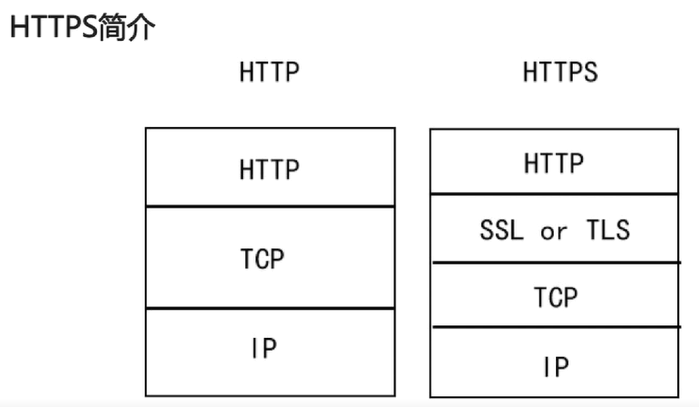
HTTPS是一种以计算机网络安全通信为目的的传输协议。在HTTP下面加入了SSL层，
从而具有了保护交换数据隐私以及完整性、提供对网站服务器身份验证的功能。简单来说，它就是安全版的HTTP。

SSL(Security Sockets Layer，安全套接层)：
 1)、为网络通信提供安全及数据完整性的一种安全协议
 2)、SSL位于TCP与各应用层之间是操作系统对外提供的API，SSL3.0后更名为TLS
 3)、SSL采用身份验证和数据加密保证网络通信的安全和数据的完整性

加密的方式：
 1)、对称加密：加密和解密都使用同一个密钥；
 2)、非对称加密：加密使用的密钥(公钥)和解密使用的密钥(私钥)是不相同的；
公钥和算法都是公开的，私钥是保密的，分对称加密性能较低但是安全性超强；由于其加密特性非对称加密算法能加密的长度也是有限的；
 3)、哈希算法：将任意长度的信息转换为固定长度的值，算法不可逆，常见的是MD5算法
 4)、数字签名：证明某个消息或者文件是某人发出/认同的
在实际的执行中，仅适用其中的某种方式并不能满足生产要求，要么非对称加密性能过低，要么对称密钥容易泄露。
因此HTTPS使用的是证书配合各种加密手段的方式。打出了一套相对安全的组合拳。

HTTPS数据传输流程：HTTPS在进行数据传输之前，会与网站服务器和Web浏览器进行一次握手，在握手时确认双方的加密密码信息；
具体过程如下：
 1)、Web浏览器将支持的加密算法信息发送给服务器；
 2)、服务器会选择一套浏览器支持的加密算法，将验证身份信息以证书的形式回发浏览器；
 3)、当浏览器收到证书之后首先会验证证书合法性，并结合证书公钥加密信息发送给服务器；
 4)、当网站服务器接收到浏览器发送过来的数据后，会使用网站本身的私钥将信息解密确定密码，然后通过密码解密Web浏览器发送过来的握手信息，
并验证哈希是否与Web浏览器一致，然后服务器会使用密码加密新的握手信息发送给浏览器
 5)、客户端浏览器解密，并计算经过哈希算法加密的握手消息，如果与服务器发送过来的Hash值一致，则此握手过程结束后服务器与浏览器会使用之前浏览器生成的随机密码和对称加密算法进行加密，
然后交换数据。

HTTP和HTTPS的区别：
 1)、HTTPS需要到CA申请证书(收费)，HTTP不需要；
 2)、HTTPS密文传输，HTTP明文传输；
 3)、连接方式不同，HTTPS默认使用443端口，HTTP使用80端口；
 4)、HTTPS=HTTP+加密+认证+完整性保护，较HTTP安全；

6、HTTPS真的很安全吗？
那倒未必。
 1)、浏览器默认填充http://，请求需要进行跳转，有被劫持的风险；
 2)、可以使用HSTS(HTTP Strict Transport Security)优化。

### 8.socket相关
两个进程如果需要通信最基本的一个前提是能够唯一的标识一个进程。在本地进程通信中我们可以使用PID来唯一标识一个进程，
但是PID只在本地唯一，网络中的两个进程PID冲突的几率还是有的，此时就需要另辟蹊径。

IP层的IP地址可以唯一标识一台主机，而TCP协议和端口号可以唯一标识主机的一个进程，这样我们可以利用IP+协议+端口号来唯一标识网络中的一个进程。
能够标识之后，它们就可以用socket进行通信了。
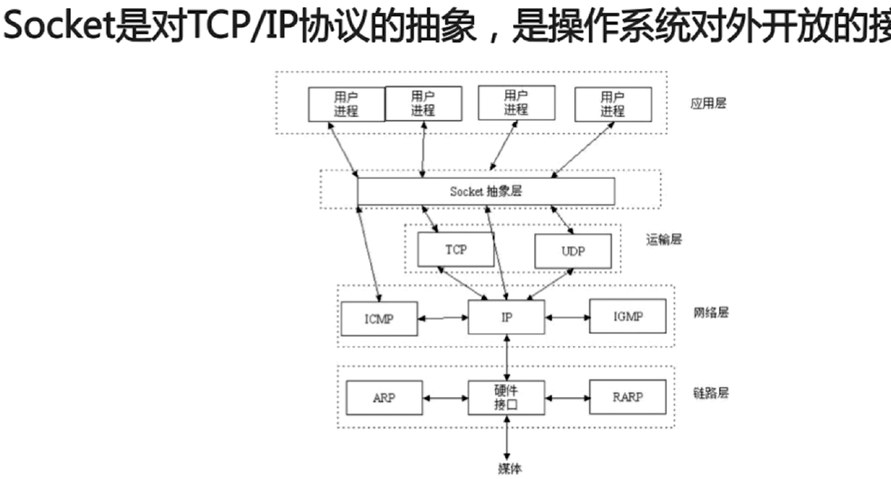

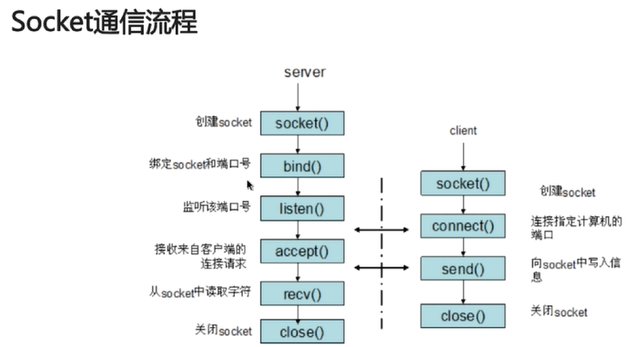

Socket相关的面试题：
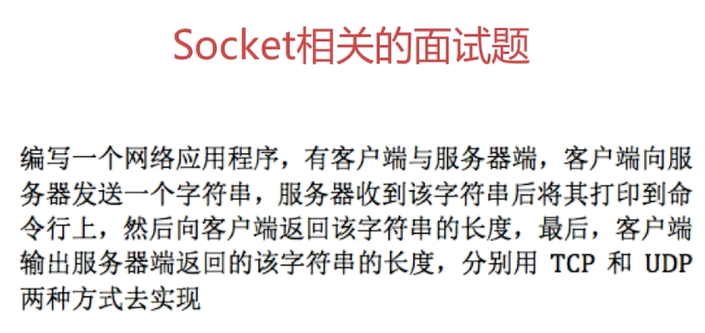

### 2.数据库
关系型数据库考点：架构、索引(*)、锁(*)、语法、理论范式。
一个面试题引发的[血案]
(面试)如何设计一个关系型数据库？
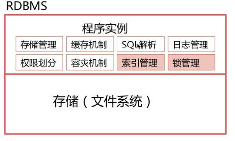
首先数据库的最主要功能就是存储数据，因此它会有一个存储模块(文件系统)来负责存储数据；存储模块就类似OS文件系统，
将数据最终持久化存入磁盘中；可是光存储还是不行的，我们还需要组织，并且用到这些数据，因此我们还需要程序实例，
用逻辑结构来映射出物理结构，并且在程序中提供获取以及管理数据的方式还有必要的问题追踪机制。
接下来细分下程序的模块：
a、首先对数据的格式，以及文件的风格进行统一的管理，即把物理数据通过逻辑的形式给组织和表示出来，
 于是便涉及到了存储管理模块（注：为了执行效率，尽可能的减少IO）；
b、为了更快更好的优化程序，应该想到做项目的时候使用缓存机制；
c、提供给外界指令来操作数据库——可读的SQL语言，需要一个SQL解析模块，将SQL编译解析转换成机器可识别的指令；
 需要注意缓存不宜过大，算法中需要淘汰机制，淘汰一些不常用的数据；
d、此外做的SQL操作需要记录下，来方便我们做数据库的主从同步或者灾难恢复，因此需要日志管理去对操作记录做记录；
e、需要提供用户管理数据的私密空间——权限划分；
f、异常机制——容灾机制；
g、索引管理(*)
h、锁管理(*)

#### 2.1 索引模块(*)
常见问题
 1、为什么要使用索引？
  我们先试试用最简单的方式实现查询——全表扫描，即将整张表的数据全部或者分批次加载到内存当中。我们知道存储的最小单位是块或者页，
  它们是由多行数据组成的，主动去轮询找到我们要的目标并返回，这种方式是很慢的，当只有很少的数据查询效率会高，
  但是在数据流很大的表里进行查询的时候该方法显然不适用了，因此很多情况下需要避免全表扫描的情况发生，所以数据库引入一种更高效的机制，
  这便是索引了，它的灵感来自于字典。
  索引可以避免全表扫描，去查找数据，提升检索效率。
  
 2、什么样的信息能成为索引？
  主键、唯一键以及普通键等。
 3、索引的数据结构
  二叉查找树、平衡二叉树、红黑树、B-Tree、B+-Tree(mysql)、Hash结构
 4、密集索引和稀疏索引的区别

#### 2.1.1优化索引-二叉查找树(*)
二叉查找树是每个节点最多有两个子树的树结构，通常子树被称作左、右子树。
二叉查找树的重要性知识，对于树中的每一个节点X，它的左子树的任意节点的值均小于X，
同时，右子树的任意节点的值均大于X。
平衡二叉树：任意一个节点的左子树，它的高度不超过1。

二叉查找树的查找用的是二分查找，对半搜素，时间复杂度是O(logn)。
缺点：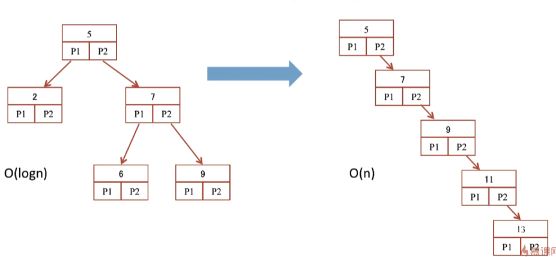

#### 2.1.2优化索引-B-Tree(*)
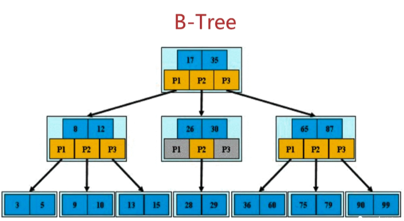
B-Tree：平衡多路查找树，如果每个节点最多有M个孩子，那么这样的树就是M阶B树。
定义：
 1)、根节点至少包括两个孩子
 2)、树中每个节点最多包含有m孩子(m>=2)
 3)、除根节点和叶节点外，其他每个节点至少有ceil(m/2)个孩子，ceil——取上限。
 4)、所有叶子节点都位于同一层
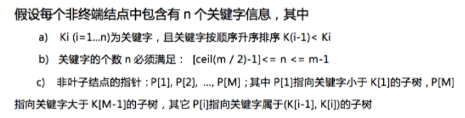

#### 2.1.3优化索引-B+树(*)
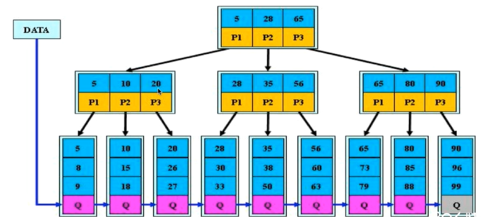
B+树：是B树的变体，其定义基本与B树相同，除了：
 1)、非叶子节点的子树指针与关键字个数相同
 2)、非叶子节点的子树指针P[i],指向关键字值[K[i], K[i+1])的子树
 3)、非叶子节点仅用来索引，数据都保存在叶子节点中
 4)、所有叶子节点均有一个链指针指向下一个叶子节点

结论：B+数更适合用来做存储索引。
 1)、B+树的磁盘读写代价更低，B+树的内部结构并没有指向具体信息的指针，不存放数据只存放索引信息，
  因此其内部节点相比于B树更小，如果把所有同一内部节点的关键字存放在同一盘块中，
  这个盘块所能容纳关键字数量也就越多，一次性读入内存的关键字数量也越多，想对来说IO读写次数降低了；
 2)、B+树的查询效率更加稳定，由于内部节点并不是最终指向文件内容的节点，而只是叶子节点中关键字的索引，
  所以任何关键字的查找，必须走一条从根节点到叶子节点的路，所有关键字查询的长度相同，
  导致每一个数据的查询效率也几乎是相同的——O(logn);
 3)、B+树更有利于对数据库的扫描，B树在提高了磁盘的IO性的同时并没有解决元素遍历的效率低下的问题，
  而B+树只需要遍历叶子节点就可以解决对全部关键字的扫描，所以用于数据库中频繁使用的范围查询，
  这也是数据库选择B+树作为主流索引数据结构的原因。

#### 2.1.4优化索引-运用Hash以及BitMap(*)
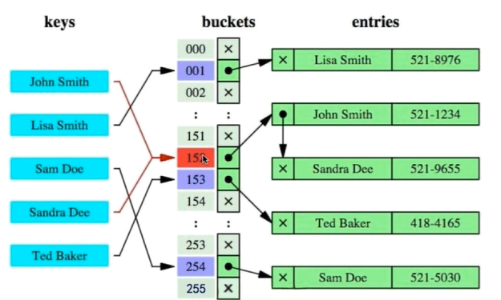
缺点：
 1)、仅仅能满足"=","IN"，不能使用范围查询
 2)、无法被用来避免数据的排序操作
 3)、不能利用部分索引键查询
 4)、不能避免表扫描
 5)、遇到大量Hash值相等的情况后性能并不一定就会比B-Tree索引高
 
 BitMap索引是个神器——位图索引。
 
问题：索引的数据结构？
 通常索引的数据结构是B+树，比较小众的是也有Hash结构还有BitMap等。

#### 2.1.5密集索引和稀疏索引的区别
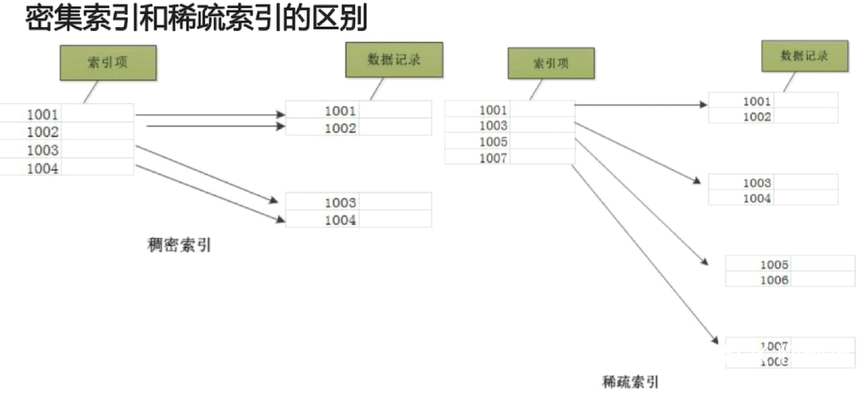
 1)、密集索引文件中的每个搜素码值都对应一个索引值
 2)、稀疏索引文件只为索引码的某些值建立索引项

InnoDB：
 1)、若一个主键被定义，该主键则作为密集索引
 2)、若没有主键被定义，该表的第一个唯一非空索引则作为密集索引
 3)、若不满足以上条件，innodb内部会生成一个隐藏主键（密集索引）
 4)、非主键索引存储相关键位和其对应的主键值，包含两次查找
 
#### 2.1.6索引额外的问题之如何调优Sql
 1)、如何定位并优化慢查询SQL？
  a、根据慢日志定位慢查询sql
   指令：show variables like '%quer%';
        show status like '%slow_queries%';
  b、使用explain等工具分析sql
   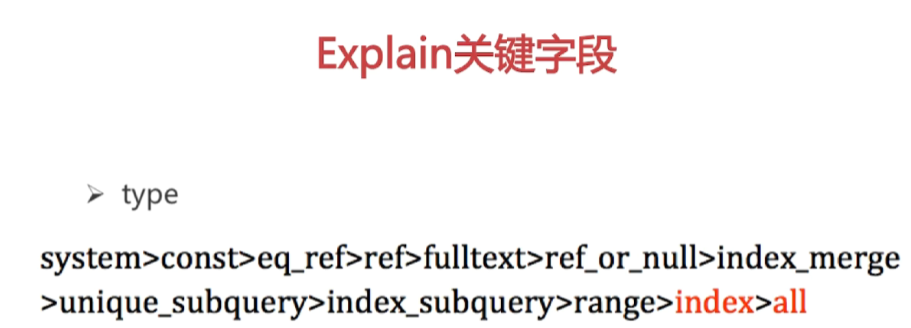
   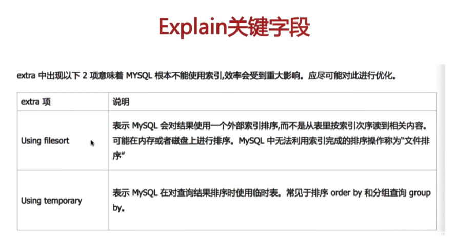
  c、修改sql或者尽量让sql走索引
  
 2)、联合索引的最左匹配原则的成因
  联合索引：由多列组成的索引。
  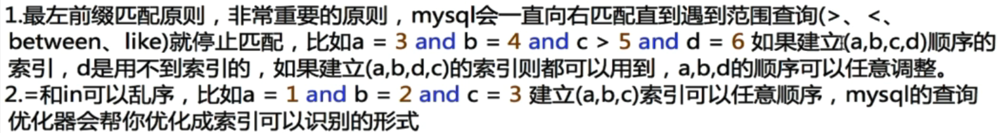
  Mysql创建复合索引的规则是首先会对复合索引最左边的索引字段的数据数据进行排序，在第一个字段的排序基础上在对后面第二个字段进行排序，
  所以第一个字段是绝对有序的，第二个字段就是无序的了，因此通常情况下直接使用第二个字段进行条件判断是用不到索引的。
 
 3)、索引是建立得越多越好吗？
  a、数据量小的表不需要建立索引，建立会增加额外的索引开销；
  b、数据变更需要维护索引，因此更多的索引意味着更多的维护成本，更多的索引也意味着需要更多的空间；

#### 2.2 锁模块(*)
常见问题：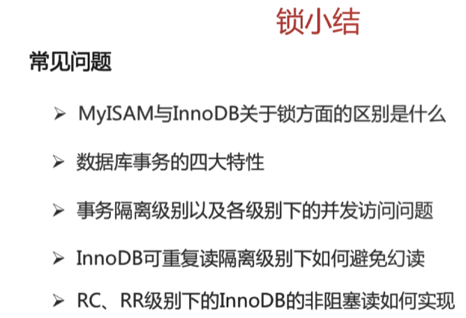
 1)、MyISAM与InnoDB关于锁方面的区别是什么？
  a、MyISAM默认用的是表级锁，不支持行级锁；
   (1)先上读锁，在上读/写锁：
    MyISAM当对数据进行SELECT的时候，它会对自动加上一个表级的读锁；而对数据进行增删改的时候，
    它会加上一个表级别的写锁；当读锁未被释放的时候，另外一个session想要为同一张表加上写锁就会被阻塞，直到所有的读锁都被释放为止。
    "lock tables table_name read/write; unlock tables"显示增加/释放锁。
    读锁有一个另外的名字——共享锁，即一个session对表加上一个读锁，另一个session依然能对表里的数据进行读操作；
    select ... for update;——select 上了排他锁的话，就必须等释放后才可在加读锁。
   (2)先上写锁，在上读/写锁：
    当上了写锁，再次上读锁/写锁 都需要等待写锁释放；写锁——排它锁。
    表级锁与索引无关。
  b、InnoDB默认用的是行级锁，也支持表级锁；
   select *** lock in share mode;——显示上共享锁，只要当前行加了共享锁之后，其他session就无法加排它锁；
   行级锁——查询id为3的行——加上共享锁之后，对Id为4的行进行修改并没有被锁住。
   (1)先上读锁，后上读锁——不会上锁，可以读
   (2)innoDB在SQL没有用到索引的时候用的是表级锁；SQL用到索引的时候用的是行级锁以及。。锁；
   
   c、MyISAM适合的场景
    (1)频繁执行全表count语句
    (2)对数据进行增删改的频率不高，查询非常频繁
    (3)没有事务的场景
   d、InnoDB适合的场景
    (1)数据增删改查都相当频繁额度场景
    (2)可靠性要求比较高，要求支持事务
 2)、数据库锁的分类
  1)、按锁的粒度划分，可分为表级锁、行级锁、页级锁；其中InnoDB默认支持行级锁同时支持表级锁，
   InnoDB对行级上锁的时候会先上一种表级别的意向锁；MyISAM仅支持表级锁，而不常用的bdb引擎支持页级锁；
  2)、按锁级别划分，可分为共享锁、排它锁
  3)、按加锁方式划分，可分为自动锁、显式锁
  4)、按操作划分，可分为DML锁、DDL锁——对表结构变更
  5)、按使用方式划分，可分为乐观锁——版本号、时间戳方式实现、悲观锁
  
 3)、数据库事务的四大特性
  ACID：原子性、一致性、隔离性、持久性
  
 4)、事务隔离级别以及各级别下的并发访问问题
  事务并发访问引起的问题以及如何避免？
  a、更新丢失——一个事务的更新覆盖了另一个事务的更新，mysql所有事务隔离级别在数据库层面上均可避免；
  b、脏读——一个事务读到另一个事务未提交的更新数据，该问题可以在"已提交读——READ-COMMITTED"事务隔离级别以上去避免；
  c、不可重复读——事务A多次读取同一数据，事务B在事务A多次读取的过程中对数据做了更新并提交，导致事务A多次读取同一数据时，
   结果不一致；REPEATABLE-READ事务隔离级别以上可避免；
  d、幻读——事务A读取与搜索条件相匹配的若干行，事务B已插入或删除行等方式来修改事务A的结果集，导致事务A看起来像出现幻觉一样；
   SERIALIZABLE事务隔离级别可避免。
 
 事务隔离级别越高，安全性越高，串行化执行越严重，这样就降低了数据库的并发度，因此可以依赖业务的需要来设置。
 
 5)、InnoDB可重复读(RR)隔离级别下如何避免幻读？
  a、表象：快照读(非阻塞读)——伪MVCC
  b、内在：next-key锁(行锁+gap锁)
  (1)当前读：select... lock in share mode, select... for update
  (2)当前读：update, delete, insert
   当前读便是加了锁的增删改查语句，不管上的是共享锁还是排它锁均为当前读；因为读取的是进入的最新版本，
   并且读取之后还需要保证其他并发事务不能修改当前记录所以称为当前读；对读取的记录加锁，其中除了select... lock in share mode加了共享锁之外，
   其他都是排它锁，那为什么update, delete, insert也是当前读呢？
   RDBMS主要有两大部分组成：程序事例、和存储
   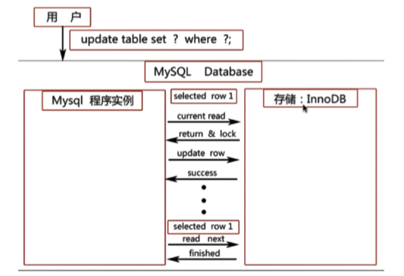
  (3)快照读：不加锁的非阻塞读，select，注不加锁的条件是在隔离级别不为SERIALIZABLE的前提下才成立的，
   在SERIALIZABLE下面由于是串行读所以此时的快照读也退化成当前读——select... lock in share mode模式；
   快照读的实现是基于多版本并发控制——MVCC，可以认为MVCC是行级锁的一个变种，但是它在很多情况下避免了加锁操作，
   因此开销更低；既然是基于多版本也就意味着快照读有可能读到的并不是数据的最新版本，可能是之前的历史版本。
   
   在RC隔离级别下当前读和快照读读到的数据版本是一样的；
   在RR隔离级别下快照读返回的结果和没修改前的是一样的，当前读返回的是数据的最新版本；
   在RR下面事务首次调用快照读的地方很关键——创建快照的时机决定了读取数据的版本。
 
 6)、RC、RR级别下的InnoDB的非阻塞读如何实现？
  a、每行数据记录除了存储数据外，还有额外的一些字段其中最关键的是三个：
   DB_TRX_ID、DB_ROLL_PTR、DB_ROW_ID字段；
   DB_TRX_ID：该字段用来标识最近一次对本行记录做修改(insert、update)它的事务的标识符，
    最后一次修改本行记录的事务id；
   DB_ROLL_PTR：回滚指针，指写入回滚端undo日志记录，如果一行记录被更新，则undo log report包含
    该行记录被更新之前内容所必须的信息；
   DB_ROW_ID：行号，包含一个随着新行插入和单调递增的行id，当有innodb自动产生聚集索引时，聚集索引会包括这个行id的值；
    否则这个行id不会出现在任何索引中；如果innodb的表既没有主键也没有唯一键，innodb会为我们隐式出创建一个自增的隐藏主键字段，
    即DB_ROW_ID;
  b、undo日志：当我们对记录进行变更操作时，就会产生undo记录；undo中存储的是老版数据，当一个旧的事务需要读取数据时，
   为了能读取到老版本的数据，需要顺着undo链找到满足其可..的记录，undo log分两种：insert undo log和 update undo log；
   其中insert undo log：表示的是事务对insert新纪录产生undo log只在事务回滚时需要，并可以在事务提交后就可以立即丢弃；
   update undo log：事务对记录进行delete、update操作时产生的undo log，不仅在事务回滚时需要，快照读也需要，所以不能随便删除；
    只有当数据库所使用的快照中不涉及该日志记录，对应的回滚日志才会被删除；
   
   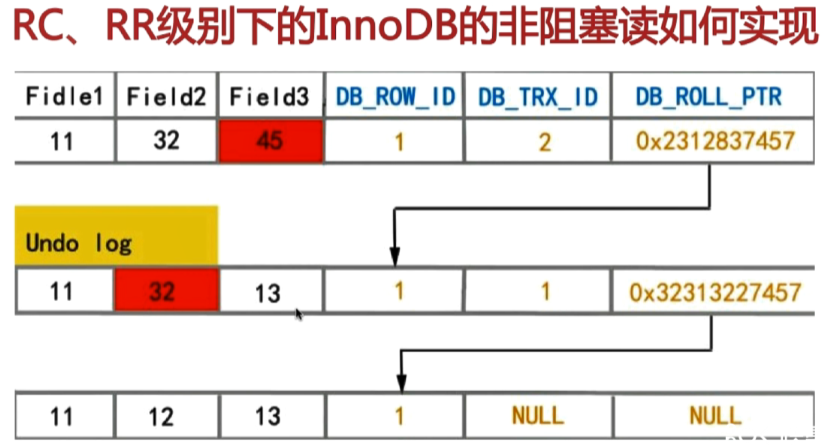
   将Field2中的值，从12 -> 32，流程：
    首先用排它锁锁住该行，随后把该行修改前的值拷贝一份到undo log里面，最后修改当前行的值，填写事务id——DB_TRX_ID，
    使用回滚指针指向undo log中修改前的行；
   
   c、read view：可见性判断，当我们去做快照读select的时候，会针对我们查询的数据创建出一个read view，来决定当前事务
    能看到的是哪个版本的数据，有可能是当前最新版本的数据，也有可能只允许看undo log里面某个版本的数据，
    read view遵循一个可见性算法，主要是将要修改的数据的DB_TRX_ID取出来，与系统其他活跃事务id做对比，如果 >= 这些id的话，
    就通过 DB_ROLL_PTR 去取处undo log 上一层的DB_TRX_ID， 直到小于这些活跃事务id为止；
    这样就保证了我们获取到的数据版本是当前可见的最稳定的版本；
    
  正是因为生成时机的不同，造成了RC、RR两种隔离级别的不同可见性，在RR级别下，session在 start transaction之后的第一条快照读，
   会创建一个快照——read view，将当前系统中其他的活跃事务记录起来，此后在调用快照读的时候，还是用的是同一个read view；
   而在RC级别下，事务中每次调用快照读的时候都会创建一个新的快照，这就是之前为什么在RC下能用快照读看到别的事务已提交的对表记录的增删改；
   而在RR下如果首次使用快照读是在别的事务对数据进行增删改并提交之前，此后即便别的事务对数据做了增删改并提交，还是读不到数据变动的原因。
   
   正因为以上的三个因子才使得innodb在RR或者RC级别支持非阻塞读，而读取数据时的非阻塞就是所谓的MVCC，innodb的非阻塞读机制实现了仿照版的MVCC，
   MVCC——代表多版本并发控制，读不加锁，读写不冲突，极大增加系统性能；
   那为什么这里实现了伪MVCC呢？因为并没有实现核心的多版本共存，undo log中的内容只是串行化的结果记录了多个事务的过程，不属于多版本共存。
   
 7)、next-key锁(行锁+gap锁)
  行锁：对单个行记录上锁
  gap锁：gap就是索引树中插入新记录的空隙，Gap锁 即锁定一个范围，但不包括记录本身；gap锁的目的是为了防止同一事务的两次当前读出现幻读的情况；
   gap锁在RC级别以及更低的隔离级别下面是没有的；
  
 8)、在RR下面，无论删、改、查，当前读若用到主键或者唯一键会用到Gap锁吗？
  视情况而定，如果where条件全部命中，则不会用Gap锁，只用加记录锁；
  如果where条件部分命中或者全不命中，则会加Gap锁；
 9)、Gap锁会用在非唯一索引或者不走索引的当前读中；以及仅命中检索条件的部分结果集，并且用到主键索引以及唯一索引的当前读中；
  a、非唯一索引：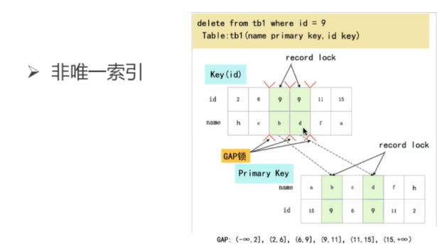
  b、不走索引：当当前读不走索引的时候，它会对所有的Gap都上锁；这种情况要避免，会降低数据库效率。
  
 总结：innodb RR级别主要通过引用next-key锁来避免幻读问题。

#### 2.3 重点语法(*)
 1)、GROUP BY：分组统计
  a、满足"SELECT子句中的列名必须为分组列或列函数"；
  b、列函数对于group by子句定义的每个组各返回一个结果；
 2)、HAVING：
  a、通常与GROUP BY子句一起使用，当它在GROUP BY子句使用时，我们可以应用它在GROUP BY子句之后来指定过滤的条件，
   如果省略了GROUP BY子句，HAVING子句的行为就想WHERE子句一样，HAVING支持所有WHERE操作符；
  b、WHERE过滤行，HAVING过滤组；
  c、出现在同一SQL的顺序：WHERE>GROUP BY>HAVING
 3)、统计相关：COUNT、SUM、MAX、MIN、AVG

### 3.Redis
Mysql的数据都是存放在磁盘中的，虽然，在数据库层也做了对应的缓存，但这种数据库层次的缓存一般针对的是查询的内容，而且力度也比较小；
一般只有表中数据没有发生变动的时候数据库对应的cache才会发挥作用。但这并不能减少业务系统对数据库产生的增删改查的IO压力，因此，
缓存数据库营运而生。该技术实现了对热点数据的高速缓存，提高应用的响应速度，极大缓解后端数据库的压力。
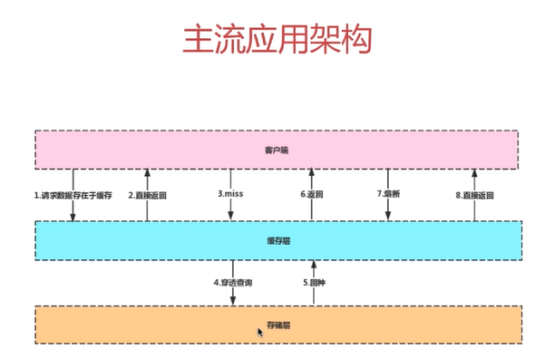

#### 3.1 缓存中间件——Memcache和Redis的区别
Memcache：代码层次类似Hash
 a、支持简单数据类型
 b、不支持数据持久化存储
 c、不支持主从同步
 d、不支持分片(Sharding)
Redis：
 a、数据类型丰富
 b、支持数据磁盘持久化存储
 c、支持主从同步
 d、支持分片

问题1：为什么Redis能这么快？
100000+ QPS（QPS即query per second，每秒内查询次数）
 a、首先它是完全基于内存，绝大部分请求是存粹的内存操作，执行效率高；
  redis采用的是单进程、单线程模型的KV数据库，由C语言编写，它将数据储存在内存里面，读写数据的时候，都不会受到硬盘IO速度的限制；
  所以速度极快；
 b、数据结构简单，对数据操作也简单，redis不使用表，它的数据库不会预定义或者强制去要求用户对redis存储的不同数据进行关联，
  因此性能相比关系型数据库要高出不止一个量级，其存储结构就是键值对类似于hashmap，hashmap的优势就是查找和操作的时间复杂度都是O(1)的；
 c、采用单线程，单线程也能处理高并发请求，想多核也可启动多实例；
 d、使用多路I/O复用模型——非阻塞IO

#### 3.2 多路I/O复用模型
FD：File Descriptor，文件描述符
 一个打开的文件通过唯一的描述符进行引用，该描述符是打开文件的元数据到文件本身的映射。

在I/O复用模型中最重要的模型调用就是Select系统调用。用来监听文件是否可读、可写。

Redis采用的I/O多路复用函数：epoll/kqueue/evport/select?
 a、因地制宜
 b、优先选择时间复杂度为O(1)的I/O多路复用函数作为底层实现
 c、以时间复杂度为O(n)的select作为保底
 d、基于react设计模式监听I/O事件
 
#### 3.3 Redis常用数据类型
一、常用数据类型
a、String：最基本的数据类型，k-v键值对，值最大能存储512M。String类型是二进制安全的，
 意思是Redis的String可以包含任何数据，比如jpa图片，或者序列化的对象；
 len——已用长度，free——可用长度，buf[]——数据空间
b、Hash：字典，String元素组成的字典，特别适合存储对象；
c、List：列表，Redis是简单的字符串列表，按照String元素插入顺序排序；按照后进先出的原则，
 使用List可以实现最新消息排行榜的功能，
d、Set：String元素组成的无序集合，通过哈希表实现，不允许重复；
e、Sorted Set：通过分数来为集合中的成员进行从小到大的排序，不允许重复；
f、高级用法：用于计数的HyperLogLog，用于支持存储地理位置信息的Geo；

二、底层数据类型基础
 a、简单动态字符串，b、链表，c、字典，d、跳跃表，e、整数集合，f、压缩列表，g、对象；
 
#### 3.4 从海量Key里面查询出某一固定前缀的Key
留意细节：摸清数据规模，即问清楚边界
KEYS pattern：查找所有符合给定模式pattern的key
缺点：
 a、KEYS指令一次性返回所有匹配的key
 b、键的数量过大会使服务卡顿

SCAN cursor[MATCH pattern] [COUNT count]
scan指令可以无阻塞的提取出指定模式的key列表，scan每次执行只会返回少量元素，
所以可以用于生产环境，而不会像keys命令带来的可能会阻塞服务器问题；
 a、SCAN是一个基于游标的迭代器，需要基于上一次的游标延续之前的迭代过程；
 b、当SCAN指令的游标参数即 cursor被置为0时，服务器将开始一次新的迭代，而当服务器向用户返回值为0的游标时，
  就表示迭代已经结束，以0作为游标开始新一次迭代；一直调用SCAN指令直到命令返回游标0，我们称这次过程为一次完整的遍历；
 c、SCAN增量式迭代命令并不保证每次执行都返回某个给定数量的元素，支持模糊查询；
 d、此外，对于增量式迭代命令是没有办法保证返回数量的，只能是大概率符合count参数；
 
#### 3.5 （*）如何通过Redis实现分布式锁
[分布式锁实现（一）：Redis](https://juejin.im/post/6844903662762852359)
[分布式锁实现（二）：Zookeeper](https://juejin.im/post/6844903663073230862)
1)、分布式锁：是控制分布式系统或不同系统之间共同访问共享资源的一种锁的实现，如果不同系统，
或同一个系统的不同主机之间共享某个资源时，往往需要互斥来防止彼此干扰，进而保证一致性。

2)、分布式锁需要解决的问题？
 a、互斥性：任一时刻只能有一个客户端获取锁，不能同时有两个客户端获取锁；
 b、安全性：锁只能由持有该锁的客户端删除不能由其他客户端删除；
 c、死锁：获取锁的客户端因为某些原因而宕机，而未能释放锁，其他客户端再也无法获取到该锁而导致的死锁，
  此时需要有机制来避免这类问题的发生；
 d、容错：当部分节点，比如一些redis节点宕机的时候，客户端仍然能够获取锁和释放锁；

3)、如何通过Redis实现分布式锁？
SETNX key value：如果key不存在，则创建并赋值；
 a、时间复杂度：O(1)；
 b、返回值：设置成功，返回1；设置失败，返回0；

正因为SETNX又上诉功能，并且操作是原子的，因此初期的时候被用来实现分布式锁；
我们可以在执行某段代码逻辑的时候，先尝试使用SETNX对某个key设值；
如果设值成功，则证明此时没有别的线程在执行该段代码，或者说占用该独占资源，
这个时候我们线程就可以顺利的去执行该段代码逻辑；
如果设值失败，则证明此时有别的程序或者线程占用该资源，那么当前线程就需要等待，
直至SETNX成功。

4)、如何解决SETNX长期有效的问题？
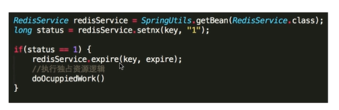
EXPIRE key seconds
 a、设值key的生存时间，当key过期时(生存时间为0)，会被自动删除；
 b、缺点：原子性得不到满足，假设SETNX执行成功后就直接挂掉了，来不及expire，
  此时Key就会被一直占用，就意味着其他线程永远也执行不了独占的资源逻辑了；

5)、解决
SET key value [EX seconds] [PX milliseconds] [NX|XX]
 a、EX second：设置键的过期时间为second秒；
 b、PX millisecond：设置键的过期时间为millisecond毫秒；
 c、NX：只有键不存在时，才对键进行设置操作；
 d、XX：只在键已经存在时，才对键进行设置操作；
 e、SET操作成功完成时，返回OK，否则返回nil；
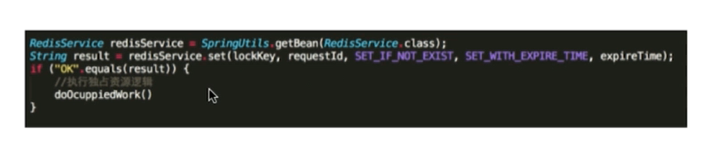

6)、大量的key同时过期的注意事项
如果大量的key设置过期的时间如果过于集中，到过期的时间点，因为删除key是需要时间的，
redis可能会因为批量的删除key出现短暂的卡顿现象。
 解决方案：在设置key的过期时间的时候，给每个key加上随机值；使的过期的时间分散一些；

#### 3.6 （*）如何使用Redis做异步队列
使用List作为队列，RPUSH生产消息，LPOP消费消息；
 缺点：没有等待队列里有值就直接消费；

弥补：可以通过在应用层引入Sleep机制去调用LPOP重试；

不使用Sleep：BLPOP key[key ...] timeout：阻塞直到队列有消息或者超时；
 缺点：只能供一个消费者消费。

解决：生产一次让多个消费者消费
使用redis的pub/sub：主题订阅者模式
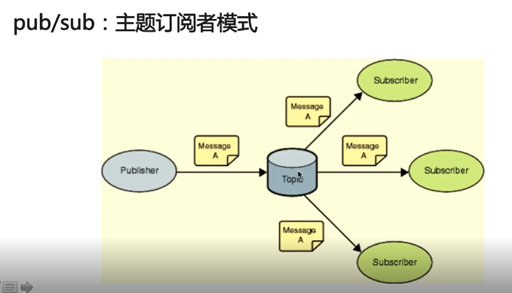
 a、发送者(pub)发送消息，订阅者(sub)接收消息；
 b、redis客户端可以订阅任意数量的频道(topic)——消费者关注的主题；

pub/sub的缺点：
 消息的发布是无状态的，即发布完消息后无法保证该消息是否被接收，是否在传播过程中丢失，
 即对于发布者来说消息是即发即失的，此时如果某个消费者在生产者在发送消息的时候下线，
 重新上线之后是接收不到该消息的，要解决该问题就得使用专业的消息队列如kafka等来解决。

#### 3.7 （*）Redis如何做持久化
一旦服务器进程退出，数据库的数据就会丢失，为了解决这个问题redis主要提供了三种持久化的方案，
将内存中的数据保存到磁盘中，避免数据丢失。
##### 3.7.1 RDB(快照)持久化
1)、RDB(快照)持久化：保存某个时间点的全量数据快照；
rdb文件可以通过两个文件来生成：
 a、SAVE：阻塞Redis的服务器进程，直到RDB文件被创建完毕；
 b、BGSAVE：Fork出一个子进程来创建RDB文件，不阻塞服务器进程；

2)、自动化触发RDB持久化的方式
 a、根据redis.conf配置里的SAVE m n定时触发(用的是BGSAVE)
 b、主从复制时，主节点自动触发
 c、执行Debug Reload
 d、执行Shutdown且没有开启AOF持久化

3)、BGSAVE原理
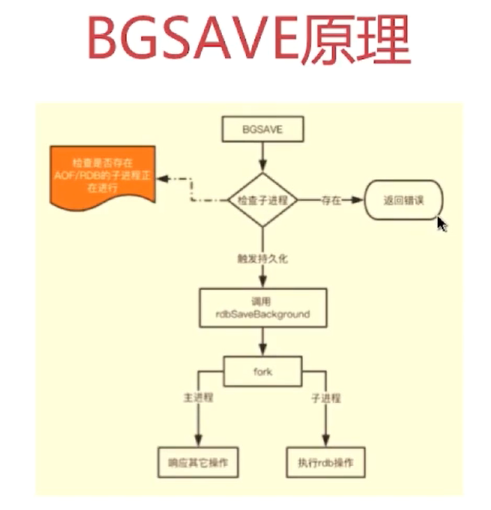
 系统调用fork()：进程，实现了Copy-on-Write(写时复制)
 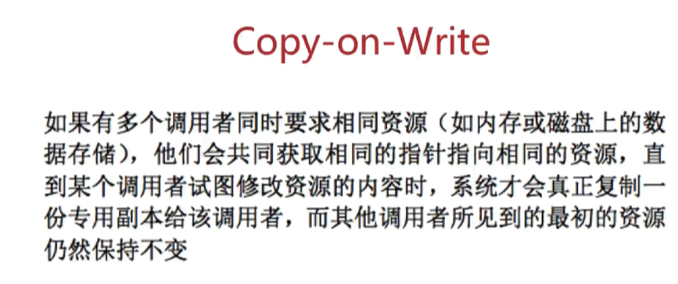

4)、RDB持久化缺点
 a、内存数据的全量同步，数据量大会由于I/O而严重影响性能；
 b、可能会因为Redis挂掉而丢失从当前至最近一次快照期间的数据
为避免上诉问题，可以采用另一种持久化方式——AOF

##### 3.7.2 AOF持久化
1)、AOF(Append-Only-File)持久化：通过保存Redis服务器所执行的写状态来记录数据库的。
 a、RDB持久化相当于备份数据库状态，而AOF持久化是备份数据库接收到的指令；
 b、在AOF持久化的文件中，数据库会记录下所有变更数据库状态的命令，除了指定数据库的查询命令，
  其他的命令都是来自于client，这些命令一append的形式追加保存到AOF文件中(增量)；
 c、AOF持久化默认关闭；

2)、AOF日志文件是一个纯追加的文件，就算是遇到突然停电的情况，也能够尽最大的权力去保证数据的无损；
随着写操作的不断增加，AOF文件会越来越大。
日志重写解决AOF文件大小不断增加的问题，原理如下：
 a、调用fork()，创建一个子进程；
 b、子进程把新的AOF写到一个临时文件里，不依赖原来的AOF文件，
 c、主进程持续将新的变动同时写到内存和原来的AOF里，这样即使重写失败也能保证数据的安全；
 d、主进程获取子进程重写AOF的完成信号，往新AOF同步增量变动；
 e、使用新的AOF文件替换掉旧的AOF文件

3)、Redis数据的恢复
RDB和AOF文件共存情况下的恢复流程：
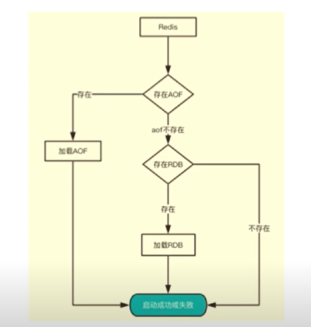

4)、RDB和AOF的优缺点
 a、RDB优点：全量数据快照，文件下，恢复快
 b、RDB缺点：无法保存最近一次快照之后的数据
 c、AOF优点：可读性高，适合保存增量数据，数据不易丢失
 d、AOF缺点：文件体积大，恢复时间长

5)、RDB-AOF混合持久化方式：目前较为推荐Redis持久化方式，默认配置
 BGSAVE做镜像全量持久化，AOF做增量持久化；因为BGSAVE会耗费较长时间，不够实时，
 在停机时会导致大量丢失数据的问题，所以需要AOF配合使用。
 在Redis实例重启时，会使用BGSAVE持久化文件重新构建内容，再使用AOF重放近期的操作指令来实现完整恢复重启之前的状态。

#### 3.8 （*）Redis如何做持久化Pipeline及主从同步
1)、使用Pipeline的好处
 a、Pipeline和Linux的管道类似
 b、Redis基于请求/响应模型，单个请求处理需要一一应答
 c、为了提升效率，Pipeline登场，它允许客户端一次发送多条命令而不需要上一条命令执行的结果；
  客户端这边首先将执行的命令写入到缓存中，最后一次性发送给redis，Pipeline将多次I/O往返的时间缩减为一次；
 d、如果有顺序依赖的指令建议分批发送；

2)、主从同步原理
 按照同步内容的多少可以分为全同步和增量同步。
 全同步流程：
  a、Slave发送sync命令到Master
  b、Master启动一个后台进程，将Redis中的数据快照保存到文件中，这一步即bgsave
  c、Master将保存数据快照期间接收到的写命令缓存起来
  d、Master完成写文件操作后，将该文件发送给Slave
  e、Slave接受到文件之后，将文件保存到磁盘中，然后加载文件到内存中去恢复数据快照
  f、当Slave完成数据快照恢复之后，Master将这期间收集的写命令发送给Slave端进行回放；
 全量同步完成之后后续所有写操作都是在Master上进行，所有读操作都是在Slave上进行。

 增量同步流程：
  a、Master接受到用户的操作指令，判断是否需要传播到Slave
  b、将该操作记录到AOF文件，首先将操作转换成Redis内部协议格式，并以字符串形式存储；
  c、将该操作传播到其他Slave：1、对齐主从库；2、往相应缓存写入指令；
  d、将缓存中的数据发送给Slave；

缺点：
主从模式的弊端就是不具备高可用性，当Master挂掉之后Redis将不能对外提供写入操作；
因此Sentinel应运而生。

3)、Redis Sentinel(哨兵)
Redis官方提供的集群管理工具，其本身也是一个独立运行的进程，它能监控多个Master、Slave
集群，发现Master宕机之后能进行自动切换，主要功能有如下几点：
 a、监控：检查主从服务器是否运行正常
 b、提醒：当被监控的某个Redis服务器出现异常行为，Sentinel通过API向管理员或者其他应用程序发送故障通知；
 c、自动故障迁移：主从切换，当一个服务器不能正常工作时，Sentinel会开始一次自动故障迁移操作，
  它会将失效的主服务器的其中一个从服务器升级为新的Master，并让之前的其他的Slave改为复制新的Master,
  当客户端试图连接失效的主服务器时，集群也会向客户端返回新Master的地址；

Redis Sentinel是一个分布式系统，你可以在一个架构中运行多个Sentinel进程，这些进程使用留言协议，
来接收关于主服务器是否下线的信息，并使用投票协议决定是否执行自动故障迁移，以及选择哪个从服务器作为新的主服务器。

4)、留言协议Gossip
Gossip：在杂乱无章中寻求一致
 a、每个节点都随机地与对方通信，最终所有节点的状态达成一致；
 b、种子节点定期随机向其它节点发送节点列表以及需要传播的消息；
 c、不保证信息一定会传递给所有节点，但是最终会趋于一致；

#### 3.9 （*）Redis的集群原理
1)、如何从海量数据里快速找到所需？
 a、分片：按照某种规则去划分数据，分散存储在多个节点上，降低单节点服务器的压力，
  Redis Cluster采用无中心结构每个节点保存数据和整个集群的状态，每个节点都和其它所有节点连接，
  节点之间通过Gossip协议传播信息和发现新节点；
  Redis集群的主要目的是要将不同的key分散放置到不同的redis节点，那实现的原理是什么呢？
  通常的做法就是获取key的hash值，然后根据节点数来求模，但这样的方法有明显的的弊端；
 b、常规的按照哈希划分无法实现节点的动态递减；

解决：一致性哈希算法
 对2^32取模，将哈希值空间组织称虚拟的圆环，将数据Key使用相同的函数Hash计算出哈希值

Hash环的数据倾斜问题。
 一致性哈希算法在服务器节点很少的时候容易因为节点分布不均而造成的数据倾斜，
 具体是被缓存的对象大部分集中缓存在某一台服务器上。

引入虚拟节点解决数据倾斜的问题。
 即对每一个服务器节点计算多个Hash。

结合Redis集群技术，我们还可以在期间引入主从同步，redis哨兵机制，来进一步确保集群的高可用。

### 4.Linux
#### 4.1 Linux的体系结构
 a、体系结构主要分为用户态(用户上层活动)和内核态
 b、内核：本质是一段管理计算机硬件设备的程序
 c、系统调用：内核的访问接口，是一种不能在简化的操作
 d、公共函数库：系统调用的组合拳
 e、Shell(*)：命令解释器，可编程

#### 4.2 查找特定文件
find：find path [options] params
 作用：在指定目录下查找文件；
  a、find ~ -name "fineName"：精准查找文件
  b、find ~ -name "target*"：模糊查找文件
  c、find ~ -iname "target*"：不区分文件名大小写去查找文件
  d、man find：更多关于find指令的使用说明

#### 4.3 检索文件内容
grep：grep [options] pattern file
 全称：Global Regular Expression Print
 作用：查找文件里符合条件的字符串

管道操作符 |：
 a、可将指令连接起来，前一个指令的输出作为后一个指令的输入
 b、需要注意的是只处理前一个命令正确输出，不处理错误输出
 c、管道命令右边的命令必须能够接收标准输入流，否则传递过程中数据会被抛弃

面试里常用的方式：
 a、grep 'partial\[true\]' bsc-plat-al-data.info.log
  作用：在内容里面查找包含某个字段的文件，并将相关行给展示出来
 b、grep -o 'engine\[[0-9a-z]*\]'
  作用：通过选择 -o选项，筛选出相关的符合正则表达式的内容；
 c、grep -v 'grep'
  作用：过滤掉包含相关字符串的内容

#### 4.4 对日志内容做统计
awk：awk [options] 'cmd' file
 a、一次读取一行文本，按输入分隔符进行切片，切成多个组成部分
 b、将切片直接保存在内建的变量中，$1，$2...($0表示行的全部)
 c、支持对单个切片的判断，支持循环判断，默认分隔符为空格

面试里常用的方式：
 a、awk '{print $1,$4}' xxx.txt
  作用：筛选出文件内容里某些列的数据
 b、awk '$1=="tcp"' && $2==1{print $0}' xxx.txt
  作用：依据一定条件筛选出文件内容里某些列的数据
 c、awk '{enginearr[$1]++}END{for{i in enginearr}print i"\t"enginearr[i]}'
  作用：对内容逐行做统计操作，并列出对应的统计结果
 
#### 4.5 批量替换文件内容
sed：sed [option] 'sed command' filename
 a、全名stream editor，流编辑器
 b、适合用于对文本的行内容进行处理

面试里常用的方式
 a、sed -i 's/^Str/String/' xxx.java
  作用：筛选出以Str打头的行，并将Str替换成String，-i直接在目标文本去修改
 b、sed -i's/\.$/\;/' xxx.java
  作用：筛选出 . 结尾的行，并将 . 替换成 ; 
 c、sed -j's/Jack/me/g' xxx.java
  作用：筛选出包含Jack的行，并将该字符串替换成me，g指的是对整行Jack都进行替换，没有g表示只替换该行第一次的Jack
 d、sed还能进行删除行操作

### 5. Java底层知识：JVM
问题：谈谈你对Java的理解
 a、平台无关性
 b、GC
 c、语言特性
 d、面向对象
 e、类库
 f、异常处理

#### 5.1 Java如何实现平台无关
1、Compile Once, Run Anywhere如何实现？
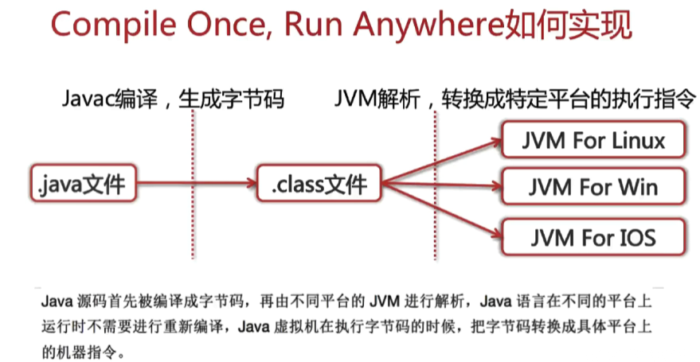
 a、编译时：使用javac指令，编译的是java源码，即将源码编译生成字节码，并存入到对应的 .class文件中；
  class文件保存的就是java文件翻译成的二进制字节码，也就是说java类文件中的属性、方法、以及类中的常量信息都会分别存储在.class文件中；

 b、运行时
 
  如何查看字节码：idea中使用javap指令
  
2、为什么JVM不直接将源码解析成机器码去执行？ 
 a、准备工作：每次执行都需要各种检查，整体性能受到影响
 b、兼容性：也可以将别的语言解析成字节码

#### 5.2 JVM如何加载 .class文件
1、Java虚拟机
 虚拟机是一种抽象化的计算机，通过在实际的计算机上仿真模拟各种计算机功能来实现的，
JVM有自己完善的硬件架构，如处理器、堆、栈、寄存器等，还具有相应的指令系统。
Java虚拟机屏蔽了与具体操作系统平台相关的信息，使得Java程序只需生成在Java虚拟机上运行的目标代码(字节码)，
就可以在多种平台上不加修改地运行。

JVM的两块核心：JVM内存结构模型、GC。
JVM是一个内存中的虚拟机，也就意味着JVM的存储就是内存，我们所写的所有类、常量、变量、方法都在内存中，
这决定着我们程序是否运行的健壮，是否高效。

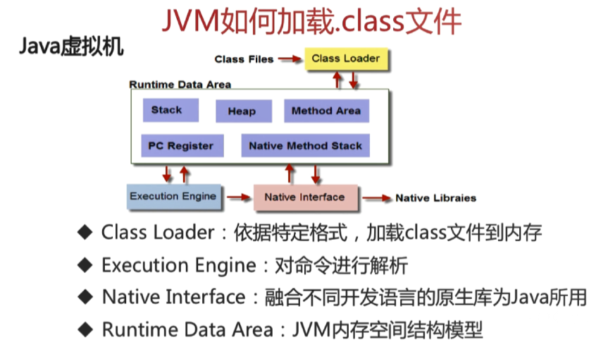

2、JVM如何加载 .class文件？
 JVM主要有 Class Loader、Runtime Data Area、Execution Engine以及Native Interface这四部分组成，
它主要通过Class Loader将符合其格式要求的class文件加载到内存，并通过Execution Engine去解析class文件的字节码并提交给操作系统去执行。

#### 5.3 什么是反射
 Java反射机制是在运行状态中，对于任意一个类，都能够知道这个类恶毒所有属性和方法；
对于任何一个对象，都能够调用它的任意方法和属性；这种动态获取信息以及动态调用对象方法的功能成为java语言的反射机制。

1、写一个反射的例子
ReflectSample.java
通过例子可以了解到，反射就是把java类中的各种成分映射成一个个的java对象。

#### 5.4 谈谈ClassLoader
1、类从编译到执行的过程
 a、编译器将Robot.java源文件编译为Robot.class字节码文件
 b、ClassLoader——类加载器将字节码转换为JVM中的Class<Robot>对象
 c、JVM利用Class<Robot>对象实例化为Robot对象

2、谈谈ClassLoader
 ClassLoader在Java中有着非常重要的作用，它主要工作在Class装载的加载阶段，其主要作用是从系统外部获得Class二进制数据流。
它是Java的核心组件，所有的Class都是由ClassLoader进行加载的，ClassLoader负责通过将Class文件里的二进制数据流装载进系统，
然后交给Java虚拟机进行连接，初始化等操作。

3、ClassLoader的种类
 a、BootStrapClassLoader：C++编写，加载核心库java.*
 b、ExtClassLoader：Java编写，加载扩展库javax.*
 c、AppClassLoader：Java编写，加载程序所在目录
 d、自定义ClassLoader：Java编写，定制化加载

4、自定义ClassLoader实现
MyClassLoader.java
 关键函数：findClass、defineClass

#### 5.5 谈谈ClassLoader的双亲委派机制
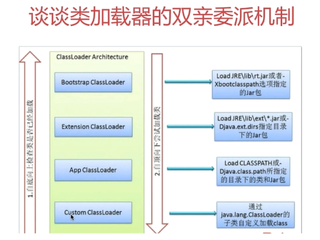
为什么要使用双亲委派机制去加载类？
 避免多份同样字节码的加载

#### 5.6 loadClass和forName的区别
1、类的加载方式
 a、隐式加载：new
 b、显式加载：loadClass，forName等
 对于显式加载来讲，当我们获取到class对象之后需要调用class对象的newInstance方法来生成对象的实例，
而通过new来隐式加载则无需调用类对象的newInstance方法即可获取实例，并且new支持调用带参数的构造器，
生成带参数的实例，而class对象的newInstance方法不支持传入参数，需要通过反射调用构造器对象的newInstance方法才能支持参数。

2、loadClass和forName的区别
 首先，它们都能在运行时对任意一个类，都能够知道该类的所有属性和方法，对于任意一个对象，都能调用它的任意方法和属性。
Class.forName得到的class是已经初始化完成的，而Classloader.loadClass得到的class是还没有链接的，

3、类的装载过程(class对象的生成过程)：
 a、加载：通过ClassLoader加载class文件字节码，生成Class对象
 b、链接：
  (1)、校验：检查加载的class的正确性和安全性
  (2)、准备：为类变量(static变量)分配存储空间并设置类变量初始值
  (3)、解析(可选)：JVM将常量池内的符号引用转换为直接引用
 c、初始化：执行类变量赋值和静态代码块

#### 5.7(*) Java内存模型之线程独占部分
1、你了解Java的内存模型吗？
 1)、内存简介：
  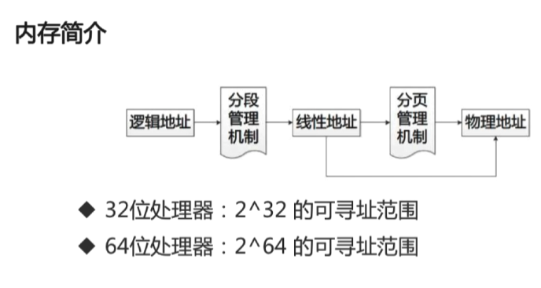

 2)、地址空间的划分：
  a、内核空间
  b、用户空间：Java进程实际运行时的空间，32位系统用户进程最大可以访问3GB，内核代码可以访问所有物理内存，
   而64位用户进程最大可以访问超过512GB，内核代码可以访问所有物理内存。
 3)、JVM内存模型——JDK8
  Java程序运行在虚拟机之上，运行时需要内存空间，虚拟机执行Java程序的过程中会把它管理的内存划分为不同的数据区域，方便管理，
  线程角度：
   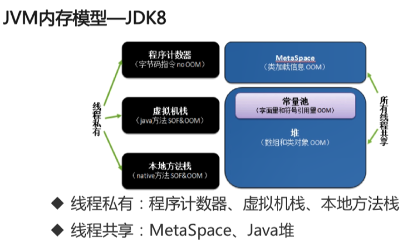
   a、程序计数器：
    (1)当前线程所执行的字节码行号指示器；
    (2)改变计数器的值来选取下一条需要执行的字节码指令；
    (3)由于JVM的多线程是通过线程轮流切换并分配处理器执行时间的方式来实现的，在任何一个确定的时刻，一个处理器只会执行一条线程中的指令，
    (4)因此为了线程切换后能恢复到正确的位置，每条线程都需要有一个独立的程序计数器，各条线程间的计数器互不影响独立存储；
    (5)对Java方法计数，如果是Native方法则计数器值为Undefined；
    (6)由于只是记录行号，程序计数器不会发生内存泄露；
    
   b、Java虚拟机栈(Stack)：
    (1)Java方法执行的内存模型
    (2)每个方法被执行时都会创建一个栈帧，即方法运行期间的基础数据结构，栈帧用于存储局部变量表、操作数栈、动态链接、返回地址等，当方法结束时栈帧才会被销毁，不需要GC可自动销毁；
     局部变量表和操作数栈：
      局部变量表：包含方法执行过程中的所有变量，为操作数栈提供必要的数据支撑；
      操作数栈：入栈、出栈、复制、交换、产生消费变量
      .png "binaryTree")
   
   c、本地方法栈：与虚拟机栈相似，主要作用于标注了native方法；
2、Java虚拟机栈引出问题——递归为什么会引发 java.lang.StackOverflowError异常？
Fibonacci.java
当线程执行一个方法时，就会随之创建一个对应的栈帧，并将建立的栈帧压入虚拟机栈中。当方法执行完毕的时候，便会将栈帧出栈，
因此可知线程安全执行的方法所对应的栈帧必定位于Java栈的顶部，而我们的递归函数不断去调用自身，
每一次方法调用会涉及：
 a、每一次调用方法就会生成一个栈帧；
 b、它会保存当前方法的栈帧状态，将它放到虚拟机栈中；
 c、栈帧上下文切换的时候，会切换到最新的方法栈帧当中；
而由于每个线程的虚拟机栈深度是固定的，递归实现将导致栈深度的增加，递归过深，站帧数超过虚拟栈深度就会报错。
解决该问题的思路就是限制递归的次数，或者甚至使用循环的方法替代递归。
此外虚拟机栈过多还会引发java.lang.OutOfMemoryError异常。
当虚拟机栈可以动态扩展时，如果无法申请足够多的内存就会抛出这个异常。

#### 5.8(*) Java内存模型之线程共享部分
1、元空间(MetaSpace)与永久代(PermGen)的区别：
 云空间使用本地内存，而永久代使用的是jvm内存
 
MetaSpace相比PermGen的优势
 a、字符串常量池存在永久代中，容易出现性能问题和内存溢出
 b、类和方法的信息难以确定，给永久代的大小指定带来困难
 c、永久代会为GC带来不必要的复杂性
 d、方便HotSpot和其他JVM如Jrockit的集成

2、Java堆(Heap)
 a、Java堆是JVM所管理的内存中最大的一块，Java堆是被所有线程共享的一块内存区域，
  在虚拟机启动时创建，此内存存在的唯一目的就是存放对象实例，几乎所有的对象实例都在这里分配内存；
 b、Java堆是垃圾收集器管理额主要区域；

#### 5.9(*) Java内存模型之常考题
1、JVM三大性能调优参数 -Xms -Xmx -Xss的含义：
 a、-Xss：规定了每个线程虚拟机栈(堆栈)的大小，一般情况下256k足够了，此配置将会影响此进程中并发线程数的大小；
 b、-Xms：堆的初始值，即该进程创建出来的时候它的专属Java堆的大小，一旦容量超过了Java堆的初始容量，
  Java堆将会自动扩容，扩容到 -Xmx大小；
 c、-Xmx：堆能达到的最大值，通常情况下 -Xms和-Xmx设置成一样大小，因为当heap不够用发生扩容时，会发生内存抖动，
  影响程序运行时的稳定性；

2、Java内存模型中堆和栈的区别——内存分配策略
 程序运行时有三种内存分配策略：静态的、栈式的、堆式的
  a、静态存储：编译时确定每个数据目标在运行时的存储空间需求，因而在编译时就可以给他们分配固定的内存空间，
   这种分配策略要求程序代码中不允许有可变数据结构的存在，也不允许有嵌套或者递归的结构出现，
   因为它们都会导致编译程序无法计算准确的存储空间；
  b、栈式存储：数据区需求在编译时未知，运行时模块入口前确定，按照先进后出的原则进行分配；
  c、堆式存储：编译时或运行时模块入口都无法确定，动态分配

联系：引用对象、数组时，栈里定义变量保存堆中目标的首地址
创建好的数组和对象实例都会被保存在堆中，想要引用堆中的某个对象或者数组，可以在栈中定义一个特殊变量，这个变量的取值
等于数组或者对象在堆内存中的首地址，栈中的变量就成了数组或对象的引用变量。以后就可以在程序中使用栈中的引用变量来访问堆中的数组。
引用变量就相当于起别名，引用变量是普通的变量，定义时在栈中分配，引用变量在程序运行到其作用域之外后就会被释放掉；
而数组和对象本身在堆中分配，即使程序运行到使用new产生数据或者对象的语句所在的代码块之外，数组和对象本身占据的内存不会被释放。
它们在没有引用变量指向的时候才会变为垃圾，需要等待随后的一个不确定的时间被垃圾回收器释放掉。

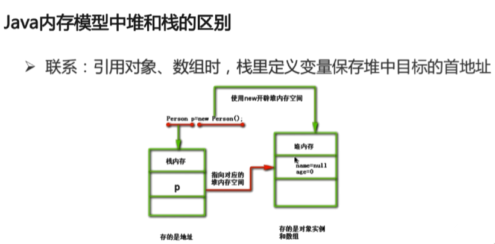
区别：
 a、管理方式：栈自动释放，堆需要GC
 b、空间大小：栈比堆小
 c、碎片相关：栈产生的碎片远小于堆
 d、分配方式：栈支持静态和动态分配，而堆仅支持动态分配
 e、效率：栈的效率比堆高

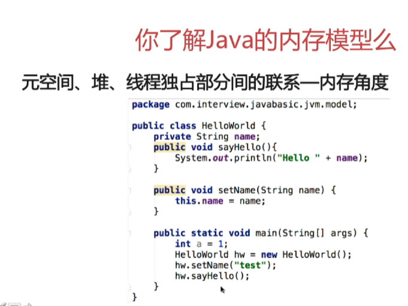
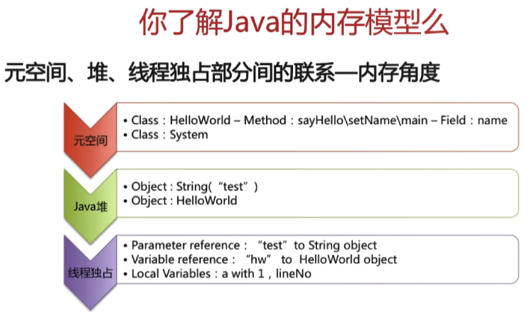

3、不同JDK版本之间的intern()方法的区别——JDK6 VS JDK6+
方法的区别.png "binaryTree")
方法的区别-JDK6.png "binaryTree")
jdk6: false false

方法的区别-JDK7及以上.png "binaryTree")
jdk7及以上: false true

### 6. Java底层知识：GC相关
#### 6.1 垃圾回收之标记算法
1、对象被判定为垃圾的标准
 没有被其他对象引用。

2、判定对象是否为垃圾的算法
 1)、引用计数算法
 2)、可达性分析算法

3、引用计数算法
 1)、通过判断对象的引用数量来决定对象是否可以被回收；
 2)、堆中的每个对象实例都有一个引用计数器，被引用则 +1，完成引用则-1；
 3)、任何引用计数为0的对象实例都可以被当做垃圾收集；
优点：执行效率高，程序执行受影响较小；
缺点：无法检测出循环引用的情况，导致内存泄露；
ReferenceCounterProblem.java

4、可达性分析算法
 通过判断对象的引用链是否可达来决定对象是否可以被回收。
 
可作为GC Root的对象
 a、虚拟机栈中引用的对象（栈帧中的本地变量表）；
 b、方法区中的常量引用的对象；
 c、方法区中的类静态属性引用的对象；
 d、本地方法栈中JNI（Native方法）的引用对象；
 e、活跃线程的引用对象；

#### 6.2 谈谈你了解的垃圾回收算法
1、垃圾回收算法：
 a、标记-清除算法（Mark and Sweep）
  标记：从根集合进行扫描，对存活的对象进行标记；
  清除：对堆内存从头到尾进行线性遍历，回收不可达对象内存
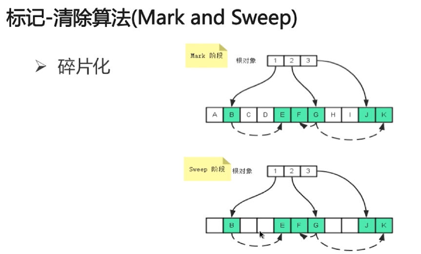
缺点：由于标记-清除不需要进行对象间的移动，并且仅对不存活的对象进行处理，因此标记清除之后会产生大量不连续的内存碎片。
空间碎片太多可能会导致以后程序运行过程中需要分配较大的对象时，无法找到足够的连续内存而不得不提前触发另一次垃圾收集工作。

2、复制算法(Copying)：
 a、分为对象面和空闲面；
 b、对象在对象面上创建；
 c、当被定义为对象的块内存用完时，就将还存活的对象从对象面复制到空闲面；
 d、将对象面所有对象内存清除；

该算法适用于对象存活率低的场景，比如：年轻代。这样每次都对整个区域进行内存回收，内存分配时，也就不用考虑内存碎片等复杂情况。
推倒重建只需要移动堆顶指针，按顺序分配内容即可。实现简单，运行高效。
优点：
 解决碎片化问题；
 顺序分配内存，简单高效；
 适用于对象存活率低的场景；
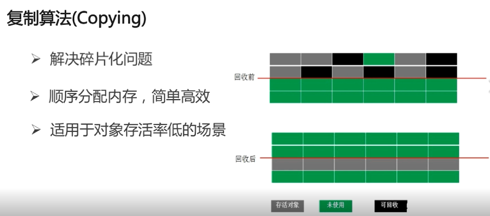

对于老年代，复制回收算法就力不从心了。对象块中的对象存活率高，复制的效率变低。如果不想浪费50%的空间，就需要有额外的空间进行担保，以应对所有对象都存活的极端情况。
而标记-整理算法比较适合老年代
3、标记-整理算法（Compacting）：
 a、标记：从根集合进行扫描，对存活对象进行标记；
 b、清除：移动所有存活的对象，且按照内存地址次序一次排列，然后将末端地址内存以后的内存全部回收；
标记-整理算法是在标记-清除算法的基础上又进行了对象的移动，因此成本更高，但是却解决了内存碎片的问题。

优点：
 a、避免内存的不连续性；
 b、不用设置两块内存互换；
 c、适用于存活率高的场景；

4、分代收集算法（Generational Collector）：
 a、垃圾回收算法的组合拳；
 b、按照对象生命周期的不同划分区域以采用不同的垃圾回收算法；
 c、目的：提高JVM的回收效率；

JDK8及以后的版本去掉了永久代。
5、分代收集算法的GC分类——Minor GC
 发生在年轻代的垃圾收集工作，采用的是复制算法。年轻代几乎是所有java对象出生的地方。
 即java申请的内存和存放，都是在这个地方进行，大部分对象不需要长久的存活，具有朝生夕灭的性质。当一个对象被判定为死亡的时候，
 GC有责任回收掉这一部分对象的内存空间。新生代是垃圾回收的频繁区域

年轻代：尽可能快速的收集掉那些生命周期短的对象
主要分成两个区：
 a、Eden区
 b、两个Survivor区

6、对象如何晋升到老年代？
 a、经历一定Minor次数依然存活的对象；
 b、Survivor区中存放不下的对象；
 c、新生的大对象（-XX:+PretenuerSizeThreshold）；
 
7、常用的调优参数：
 a、-XX:SurvivorRatio：Eden和Survivor的比值，默认8:1；
 b、-XX:NewRatio：老年代和年轻代内存大小的比例；
 c、-XX: MaxTenuringThreshold:对象从年轻代晋升到老年代经过GC次数的最大阈值（默认15）

8、老年代：存放生命周期较长的对象
 a、标记-清理算法
 b、标记-整理算法
 c、Full GC 和 Minor GC
 d、Full GC 比 Minor GC慢，但执行频率低

9、触发Full GC的条件
 a、老年代空间不足；
 b、永久代空间不足；
 c、GMS GC时出现promotion failed, concurrent mode failure
 d、Minor GC晋升到老年代的平均大小大于老年代的剩余空间
 e、调用System.gc()（是否回收由虚拟机决定，码农只是提醒）
 f、使用RMI来进行RPC或管理的JDK应用，每小时执行1次Full GC

#### 6.3 Java垃圾回收之新生代垃圾收集器
1、Stop-the-World：
 a、JVM由于要执行GC而停止了应用程序的执行
 b、任何一种GC算法中都会发生
 c、多数GC优化通过减少Stop-the-World发生的时间来提高程序性能；

2、Safepoint：
 a、分析过程中对象引用关系不会发生变化的点
 b、产生Safepoint的地方：方法调用；循环挑战；异常跳转等
 c、安全点数量要适中

3、常见的垃圾收集器
JVM的运行模式：
 a、Server：启动速度较慢；
 b、Client：启动速度较快；
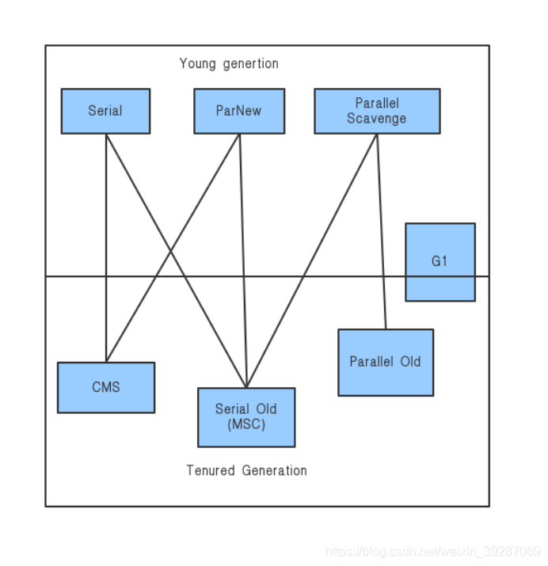

4、年轻代常见的垃圾收集器：
1)、Serial收集器（-XX：+UseSerialGC,复制算法）
 a、单线程收集，进行垃圾收集时，必须暂停所有线程；
 b、简单高效，Client模式下默认的年轻代收集器
2)、ParNew收集器（-XX:+UseParNewGC，复制算法）多线程
 a、多线程收集，其余的行为，特点和Serial收集器一样
 b、单核执行效率不如Serial, 在多核下执行才有优势
 c、默认开启的收集线程和CPU相同
3)、Parallel Scavenge收集器（-XX：+UseParallelGC, 复制算法）多线程
 a、吞吐量=运行用户代码时间/（运行用户代码时间+垃圾收集时间）
 b、比起关注用户线程停顿时间，更关注系统的吞吐量
 c、在多核执行下才有优势，Server模式下默认的年轻代收集器
 d、-XX: +UseAdaptiveSizePolicy 让虚拟机自己执行调优

#### 6.4 Java垃圾回收之老年垃圾收集器
1、老年代常见的垃圾收集器
 1)、Serial old 收集器（-XX:+UseSerialOldGC, 标记-整理算法）
  a、单线程收集，进行垃圾收集时，必须暂停所有工作线程；
  b、简单高效，Client模式下默认的老年代收集器；
 2)、Parallel Old收集器（-XX:+UseParallelOldGC, 标记-整理算法）
  多线程，吞吐量优先
 3)、CM收集器（-XX:+UseConcMarkSweepGC, 标记-清除算法）
  几乎不存在停顿时间
  a、初始标记：stop-the-world (非常短暂）
  b、并发标记：并发追溯标记，程序不会停顿
  c、并发预清理：查找执行并发标记阶段从年轻代晋升到老年代的对象
  d、重新标记；暂停虚拟机，扫描CMS堆中的剩余对象
  e、并发清理：清理垃圾对象，程序不会停顿
  f、并发重置；重置CMS收集器的数据结构
 4)、G1收集器（-XX:+UseG1GC, 复制-标记-整理算法）
  Garbage First收集器的特点
   a、并行和并发
   b、分代收集
   c、空间整合
   d、可预测的停顿
  区别：
   将整个Java堆内存划分成多个大小相等的Region；
   年轻代和老年代不再物理隔离。

#### 6.5 Java垃圾回收之常见面试题
1、Object的finalize()方法的作用是否与C++的析构函数作用相同？
 a、与C++的析构函数不同，析构函数调用时机确定，而它的是不确定的；
 b、将未被引用的对象放置于F-Queue队列；
 c、方法执行随时可能会被终止；
 d、给予对象最后一次重生的机会；

2、Java中的强引用，软引用，弱引用，虚引用有什么用？
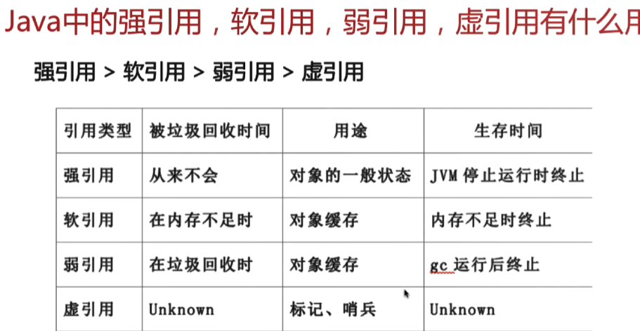
 a、强引用(Strong Reference)
  1.最普遍的引用：Object o = new Object();
  2.一个对象具有强引用，当内存和空间不足的时候，
   JVM宁可抛出OutOfMemoryError终止程序也不会回收具有强引用的对象；
  3.我们可以通过将对象设置为Null来弱化引用，使其被回收；
 
 b、软引用(Soft Reference)
  1.对象处在有用但非必须的状态；
  2.只有当内存空间不足时，GC会回收该引用的对象的内存；
  3.软引用可以用来实现高速缓存；
  String str = new String("abc"); // 强引用
  SoftReference<String> softRef = new SoftReference<String>(str);//软引用
 
 c、弱引用(Weak Reference)
  1.非必须的对象，比软引用更弱一些；
  2.GC时会被回收；
  3.被回收的概率也不大，因为GC线程优先级比较低；
  4.适用于引用偶尔被使用且不影响垃圾收集的对象；
  String str = new String("abc"); // 强引用
  WeakReference<String> weakRef = new WeakReference<String>(str);//软引用
 
 d、虚引用(Phantom Reference)
  1.不会决定对象的生命周期；
  2.任何时候都可能被垃圾收集器回收；
  3.跟踪对象被垃圾收集器回收的活动，起哨兵作用；
  4.必须和引用队列ReferenceQueue联合使用；
  String str = new String("abc"); // 强引用
  ReferenceQueue queue = new ReferenceQueue();
  PhantomReference ref = new PhantomReference(str, queue);

3、引用队列（ReferenceQueue）
 a、无实际存储结构，存储逻辑依赖于内部节点之间的关系来表达
 b、存储关联的且被GC的软引用、弱引用以及虚引用
 
### 7.Java多线程与并发
#### 7.1 进程和线程的区别
1、进程是资源分配的最小单位，线程是CPU调度的最小单位。
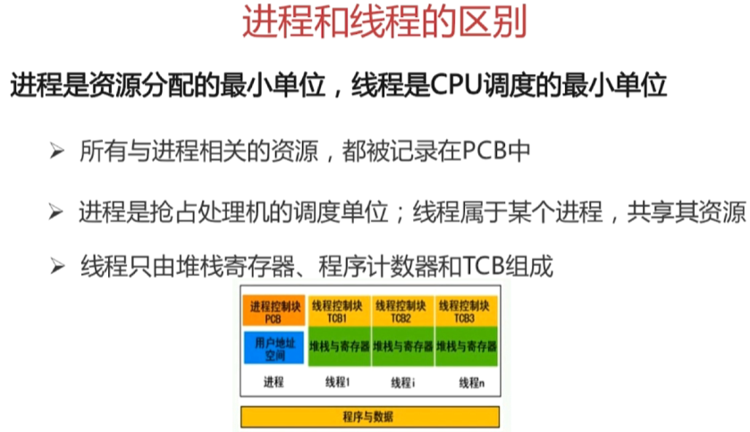
 a、线程不能看做独立应用，而进程可看做独立应用
 b、进程有独立额度地址空间，相互不影响，线程只是进程的不同执行路径
 c、线程没有独立的地址空间，多进程的程序比多线程程序健壮
 d、进程的切换比线程的切换开销大

2、Java进程和线程的关系
 a、Java对操作系统提供的功能进行封装，包括进程和线程
 b、每运行一个程序会产生一个进程，进程包含至少一个线程
 c、每个进程对应一个JVM实例，多个线程共享JVM里的堆
 d、Java采用单线程编程模型，程序会自动创建主线程
 e、主线程可以创建子线程，原则上要后于子线程完成执行

#### 7.2 Thread中的start和run方法的区别
 a、调用start()方法会创建一个新的子线程并启动
 b、run()方法只是Thread的一个普通方法的调用

#### 7.3 Thread和Runnable是什么关系
 a、Thread是实现了Runnable接口的类，使得run支持多线程
 b、因类的单一继承原则，推荐多使用Runnable接口

#### 7.4 如何处实现处理线程的返回值
 1、如何给run()方法传参？
  a、构造函数传参
  b、成员变量传参
  c、回调函数传参
 2、如何实现处理线程的返回值？
  a、主线程等待法——CycleWait.java
   缺点：循环多久不确定
  b、使用Thread类的join()阻塞当前线程以等待子线程处理完毕
   比主线程等待更精准，缺点：粒度不够细
  c、通过Callable接口实现：通过FutureTask Or线程池获取
   FutureTaskDemo.java、ThreadPoolDemo.java

#### 7.5 线程的状态

#### 7.6 sleep和wait的区别
 基本的差别：
  a、sleep是Thread类的方法，wait是Object类中定义的方法；
  b、sleep()方法可以在任何地方使用
  c、wait()方法只能在synchronized方法或者synchronized块中使用
 最主要的本质区别
  a、Thread.sleep只会让出CPU,不会导致锁行为额度改变
  b、Object.wait不仅让出CPU,还会释放已占有的同步资源锁
  WaitSleepDemo.java

#### 7.7 notify和notifyAll的区别
两个概念：
 a、锁池EntryList
 b、等待池WaitSet
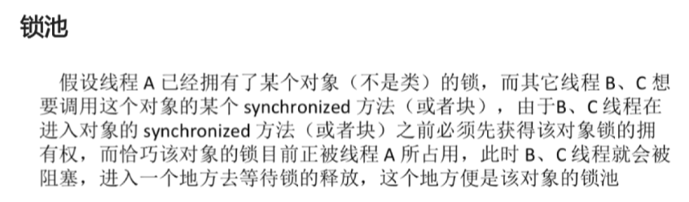

区别：
 a、notifyAll会让所有处于等待池的线程全部进入锁池去竞争获取锁的机会；
 b、notify只会随机选取一个处于等待池中的线程进入锁池去竞争获取锁的机会；
 NotificationDemo.java
 
#### 7.8 yield函数
YieldDemo.java
#### 7.9 如何中断线程
InterruptDemo.java
#### 7.10 前述方法及线程状态总结

### 8.Java多线程与并发-原理
#### 8.1 synchronized
1、线程安全的主要诱因：
 a、存在共享数据(也称临界资源)
 b、存在多条线程共同操作这些共享数据
 
2、解决问题的根本方法：
 同一时刻有且只有一个线程在操作共享数据，其他线程必须等到该线程处理完数据后再对共享数据进行操作。

3、互斥锁的特性
 互斥性、可见性
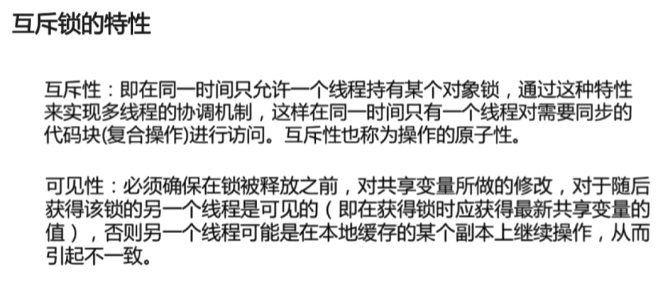
 synchronized锁的不是代码，锁的是对象。
 
4、根据获取的锁的分类：获取对象锁和获取类锁
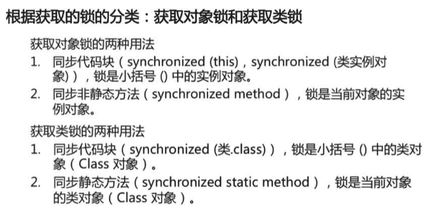
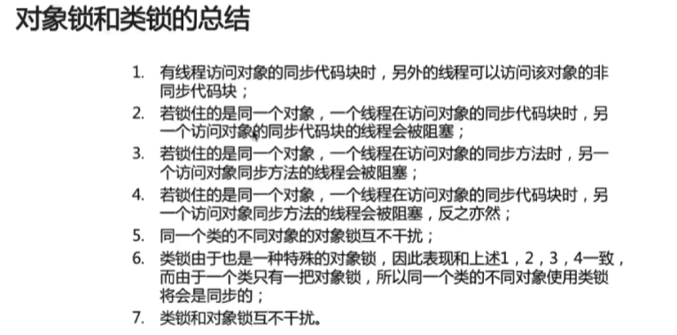

#### 8.2 synchronized底层实现原理
1、对象在内存中的布局
 a、对象头
 b、实例数据
 c、对齐填充

2、对象头
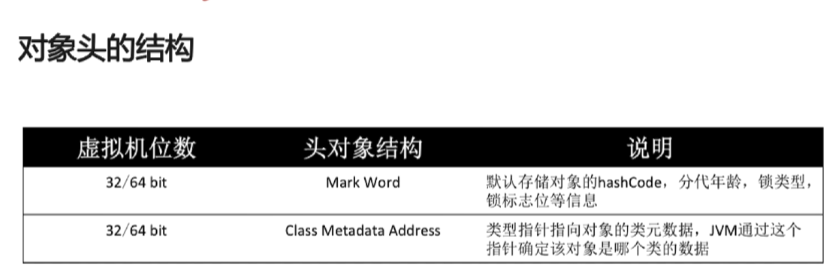
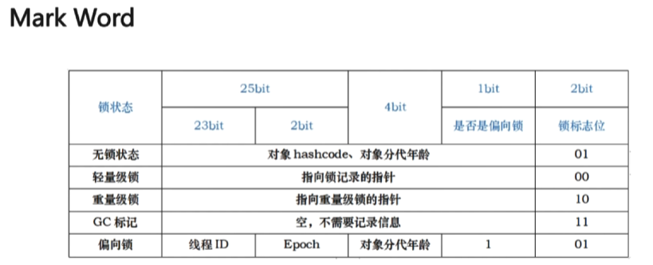

Monitor：每个Java对象天生自带了一把看不见的锁。
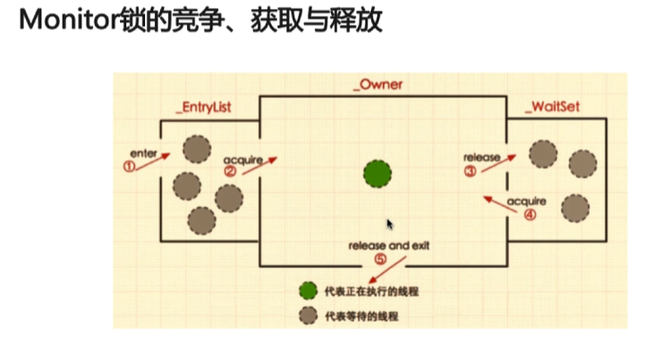
Monitor对象存在于每个Java对象的对象头中，synchronized便是通过这种方式去获取锁的，这也是Java中任意对象可以作为锁的原因。

3、锁
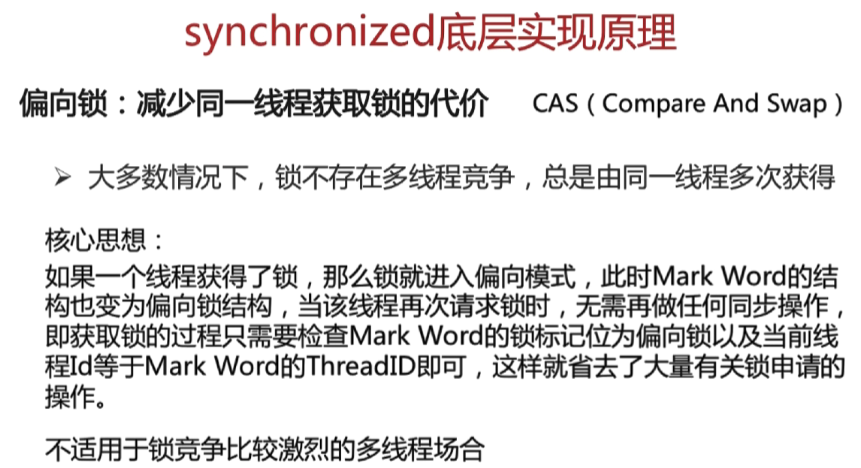
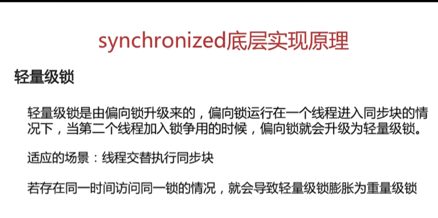
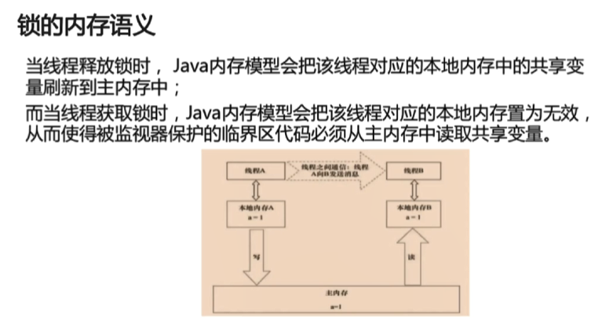
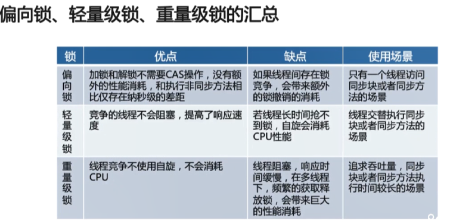

#### 8.3 synchronized和ReentrantLock
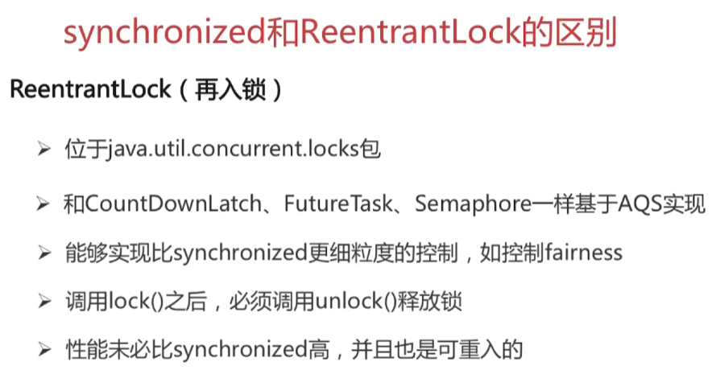
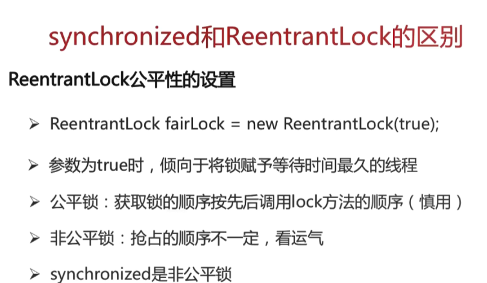
ReentrantLockDemo.java
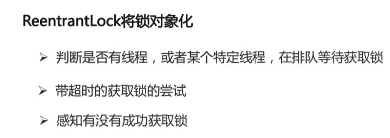
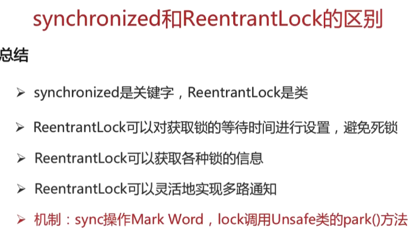

