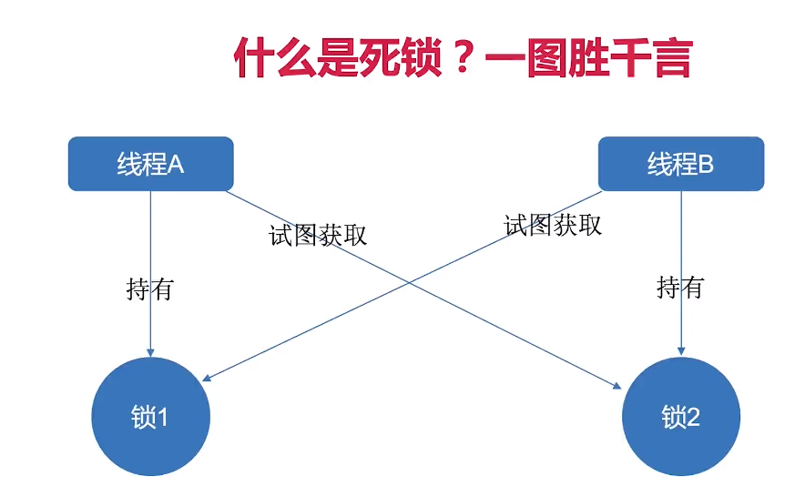
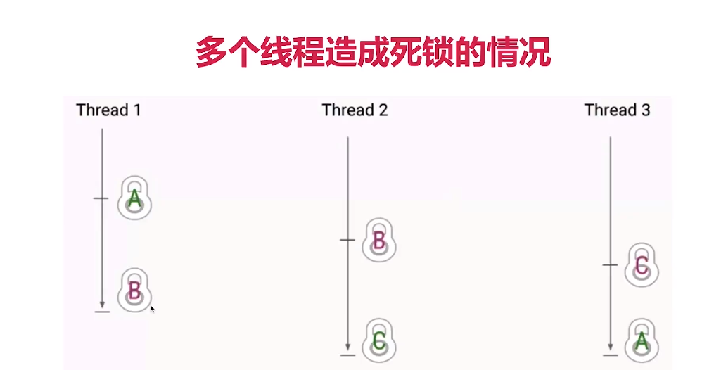

1、写一个必然死锁的例子
2、发生死锁必须满足那些条件？
3、如何定位死锁？
4、有哪些解决死锁问题的策略？
5、讲讲经典的哲学家就餐问题
6、实际工程中如何避免死锁？
7、什么是活跃性问题？活锁、饥饿和死锁有什么区别？

第三部分————死锁————从产生到消除
1、死锁是什么？有什么危害？(*)
一定是发生在并发中；
互不相让：当两个（或更多）线程（或进程）相互持有对方所要的资源，又不主动释放，导致所有人都无法继续前进，导致程序陷入无尽的阻塞，这就是死锁。

2、死锁的影响(*)
死锁的影响在不同的系统中是不一样的，这取决于系统对死锁的处理能力
1)、数据库中：可以检测并放弃事务
2)、JVM中：无法自动处理

3、死锁发生几率不高但危害大
1)、不一定发生，但是遵守“墨菲定律”
2)、一旦发生，多是高并发场景，影响用户多
3)、整个系统崩溃、子系统崩溃、性能降低
4)、压力测试无法找出所有潜在的死锁

4、发生死锁的例子(*)
1)、最简单的情况：MustDeadLock.java
a、当类的对象flag=1时(r1)，先锁定o1，睡眠500ms，然后锁定o2；
b、而r1在睡眠的时候另一个flag = 0的对象(r2)线程启动，先锁定o2，睡眠500ms，等待r1释放O1；
c、r1、r2相互等待，都需要对方锁定的资源才能继续执行，从而死锁。

2)、实际生产中的例子：转账
TransferMoney.java

3)、模拟多个随机转账
MultiTransferMoney.java

5、死锁发生的4个必要条件(*)
1)、互斥条件
2)、请求与保持条件：第一个线程去请求第二把锁，但是同时保持第一把锁
3)、不剥夺条件
4)、循环等待条件
四个缺一不可。

6、如何定位死锁？(*)
6.1 jstack命令行：
1)、首先使用命令行查看到java的pid：jps
2)、jstack pid

6.2 ThreadMXBean代码演示
ThreadMXBeanDetection.java

7、修复死锁的策略
7.1 线上发生死锁应该怎么办？
a、首先保存案发现场，然后立刻重启服务器（使用java相应的命令把整个堆栈信息保存下来），不能进一步影响用户体验；
b、暂时保证线上服务的安全，然后再利用刚才保存的信息，排查死锁，修改代码，重新发版。

7.2 常见修复策略
a、避免策略：哲学家就餐的换手方案、转账换序方案
思路：避免相反的获取锁的顺序
TransferMoneyFix.java
b、检测与恢复策略：一段时间检测是否有死锁，如果有就剥夺某一个资源，来打开死锁
c、鸵鸟策略：如果我们发生死锁的概率极其低，那么我们就直接忽略它，直到死锁发生的时候，在人工修复。

7.2.1 哲学家就餐的换手方案
DiningPhilosophers.java 死锁
解决方案：
1)、服务员检查(避免策略)；
2)、改变一个哲学家拿叉子的顺序(避免策略)
3)、餐票(避免策略)
4)、领导调节(检测与恢复策略)

7.2.2 死锁的检测与恢复策略
1)、检测算法：锁的调度链路图
2)、恢复策略：
(1) 恢复方法1：进程终止
逐个终止线程，直到死锁消除：
终止顺序：
a、优先级(是前台交互还是后台处理)
b、已占用资源、还需要的资源
c、已经运行时间

(2) 恢复方法2：资源抢占
a、把已经分发出去的锁给收回来
b、让线程回退几步，这样就不用结束整个线程，成本比较低
 缺点：可能同一个线程一直被抢占，那就造成饥饿
 
7.3 实际工程中如何有效避免死锁(*)
1)、设置超时时间：
 a)、Lock的tryLock(long timeout, TimeUnit unit)
 b)、synchronized不具备尝试锁的能力
 造成超时的可能性很多：发生死锁、线程陷入死循环、线程执行很慢。
 
2)、多使用并发类而不是自己设计锁：
 a)、ConcurrentHashMap、ConcurrentLinkedQueue、AtomicBoolean等
 b)、实际应用中 java.util.concurrent.atomic 十分有用，简单方便且效率比使用Lock更高；
 c)、多用并发集合少用同步集合，并发集合比同步集合的可扩展性更好
 d)、并发场景需要用到map。首先想到用ConcurrentHashMap。
 
3)、尽量降低锁的使用粒度：用不同的锁而不是一个锁。
 
4)、如果能使用同步代码块，就不使用同步方法：自己指定锁对象
5)、给你的线程起个有意义的名字：debug和排查时事半功倍，框架和JDK都遵守这个最佳实践。
6)、避免锁的嵌套：MustDeadLock类
7)、分配资源前先看能不能收回来：银行家算法
8)、尽量不要几个功能使用同一把锁：专锁专用
 
8、其他活性故障(*)
 死锁是最常见的活跃性问题，不过除了刚才的死锁之外，还有一些类似的问题，会导致程序无法顺利执行，统称为活跃性问题
8.1 活锁(LiveLock)
8.1.1 什么是活锁：线程之间不停的在运行，但是程序无法进一步的推进。
 程序一直在运行，但是一直在做没有意义的工作。
 例如：在完全相同的时刻进入餐厅，并同时拿起左边的餐叉，那么这些哲学家就会等待五分钟，同时放下手中的餐叉，在等五分钟，又同时拿起这些餐叉。
 特点：
 a、虽然线程并没有阻塞，也始终在运行（所以叫做“活锁”，线程是“活”的），但是程序却得不到进展，因为线程始终重复做同样的事。
 b、如果这里死锁，那么就是这里两个人都始终一动不动，直到对方先抬头，他们之间不在说话了，只是等待
 c、如果发生活锁，那么这里的情况就是，双方都不听的对对方说“你先起来吧，你先起来吧”，双方一直在说话在运行，在消耗资源。
 d、死锁和活锁的结果都是一样的，就是谁都不能先抬头。
8.1.2 代码演示
 LiveLock.java
原因：重试机制不变，消息队列始终重试，吃饭始终谦让
解决：以太网的指数退避算法
加入随机因素 LiveLockFix.java

8.1.3 工程中的活锁实例：消息队列
消息如果处理失败，就放在队列开头重试；
由于依赖服务出了问题，处理该消息一直失败；
没阻塞，但程序无法继续。
 
解决：放到队列尾部，重试机制

8.1.4 如何解决活锁问题

8.2 饥饿
1)、当线程需要某些资源(例如CPU)，但是却始终得不到；
2)、线程的优先级设置的过于低，或者有某些线程持有锁同时又无限循环从而不释放锁，或者某程序始终占用某文件的写锁；
3)、饥饿可能会导致响应性差：比如，我们的浏览器有一个线程负责处理前台响应(打开收藏夹等动作)，另外的后台线程负责下载图片和文件，
计算渲染等。在这种情况下，如果后台线程把CPU资源都占用了，那么前台线程将无法得到很好的执行，这会导致用户的体验很差。

解决：为了避免饥饿的发生一方面是逻辑上不应该有对于锁的使用完不释放的逻辑错误；不应该在程序中设置优先级。

9、常见面试问题
1)、写一个必然死锁的例子，生产中什么场景下会发生死锁？
MustDeadLock.java
在一个方法中获取多个锁

2)、发生死锁必须满足哪些条件？
一共四个
a、互斥条件
b、请求与保持条件
c、不能剥夺条件
d、循环等待条件

3)、如何定位死锁？
a、jstack命令
b、ThreadMXBean：在程序运行中可以找到。

4)、有哪些解决死锁问题的策略？
a、避免策略（推荐）：哲学家就餐换手方案、转账换序方案
b、检测与恢复策略：一段时间检测是否有死锁，如果有就剥夺某一个资源来打开死锁
c、鸵鸟策略：不推荐

5)、讲一讲经典的哲学家就餐问题

如果所有的哲学家都拿起左边的筷子，死锁就会发生；
解决方案：(7.2.1 哲学家就餐的换手方案)

6)、实际工程中如何避免死锁？
 (7.3 实际工程中如何有效避免死锁)
 
7)、什么是活跃性问题？活锁、饥饿和死锁有什么区别？

思维导图地址
https://naotu.baidu.com/file/ec7748c253f4fc9d88ac1cc1e47814f3?token=bb71b5895a747d67

面试总结(*)
1)、写一个必然死锁的例子？
MustDeadLock.java

2)、生产中什么场景下会发生死锁？
在一个方法中获取多个锁
3)、发生死锁必须满足哪些条件？
(死锁发生的4个必要条件)
4)、如何用工具定位死锁？
(如何定位死锁)
5)、有哪些解决死锁问题的策略？
(修复死锁的策略)
6)、避免策略和检测与恢复策略的主要思路是什么？
(常见修复策略)
7)、讲一讲经典的哲学家就餐问题？怎么解决？
(哲学家就餐的换手方案),(讲一讲经典的哲学家就餐问题)
8)、实际开发中如何避免死锁？
(实际工程中如何有效避免死锁)
9)、什么是活跃性问题？活锁、饥饿和死锁有什么区别？
(其他活性故障)