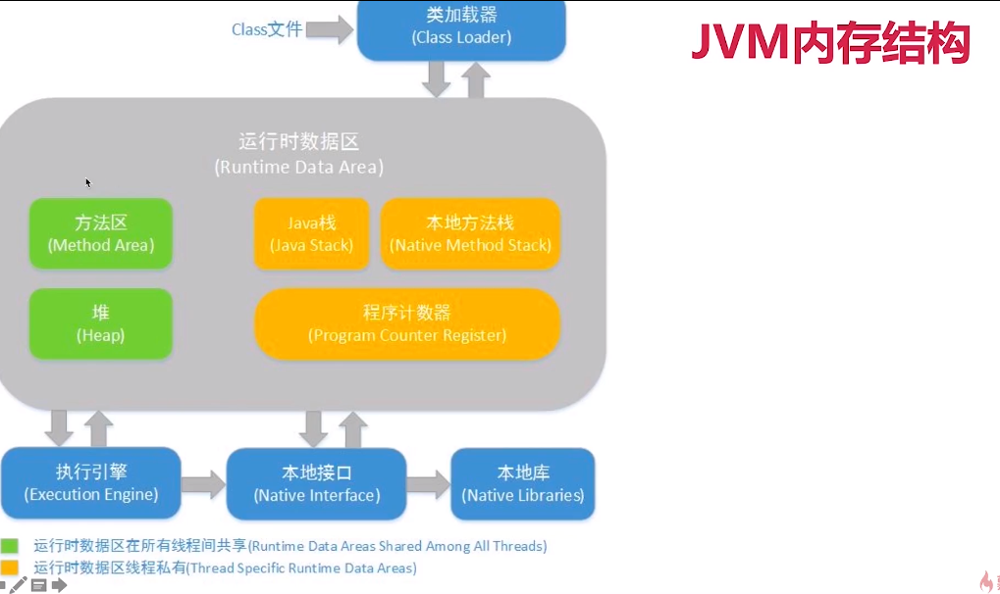
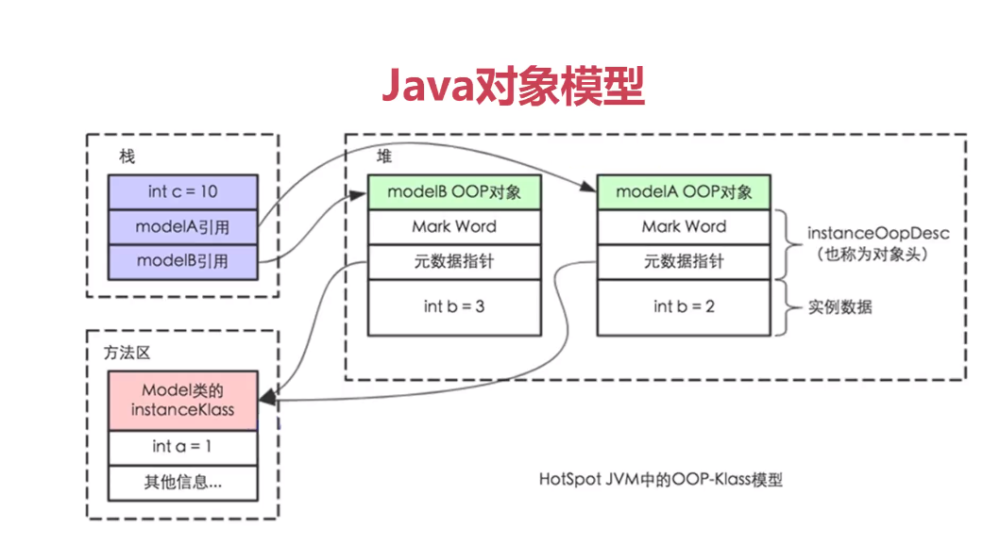

Java内存模型————底层原理

彩蛋：自顶向下的好处
什么是自顶向下？
先讲使用场景，再讲用法，最后讲原理。
先从现象出发，再看背后原因。

1、什么叫底层原理？
我们在Java代码中，使用的控制并发的手段例如synchronized关键字，最终也是要转化为CPU指令来生效的，
我们来回顾一下，从Java代码到最终执行的CPU指令的流程： 
1)、最开始，我们编写的Java代码，是*.java文件 
2)、在编译（javac命令）后，从刚才的*.java文件会变出一个新的Java字节码文件（*.class） 
3)、JVM会执行刚才生成的字节码文件（*.class），并把字节码文件转化为机器指令 
4)、机器指令可以直接在CPU上运行，也就是最终的程序执行 
而不同的JVM实现会带来不同的“翻译”，不同的CPU平台的机器指令又千差万别；
所以我们在java代码层写的各种Lock，其实最后依赖的是JVM的具体实现（不同版本会有不同实现）和CPU的指令，才能帮我们达到线程安全的效果。
由于最终效果依赖处理器，不同处理器结果不一样，这样无法保证并发安全，
所以需要一个标准，让多线程运行的结果可预期，这个标准就是JMM。

2、三兄弟：JVM内存结构 VS Java内存模型 VS Java对象模型
2.1 JVM内存结构：和Java虚拟机的运行时区域有关

2.1.1 堆(heap): 整个区域中最大的一块，所占用的内存也是最多的，并且在所有线程间共享；
主要保存一些通过 new或者其他指令所创建的一些实例对象，也包括数组，这些实例对象如果不再被引用就会被垃圾回收；
堆的优势在运行时动态分配。

2.1.2 虚拟机栈(VM stack):也叫Java栈，线程私有
这个栈中保存了一些基本的数据类型，以及对于对象的引用

2.1.3 方法区(method area):线程共享
存储已经加载的各个static 静态变量，或者是类信息以及常量信息，还包含了永久引用

2.1.4 本地方法栈：线程私有
保存和本地方法相关，主要是native方法

2.1.5 程序计数器：线程私有
所占区域最小，主要保存当前线程所执行到的字节码的行号数，也就是上下文切换是的数据， 
还包括下一条需要执行的指令、分支、循环等异常处理。

2.2 Java内存模型(*)：和Java并发编程有关

2.3 Java对象模型：和Java对象在虚拟机中的表现形式有关

1)、Java对象自身的存储模型
2)、JVM会给这个类创建一个instanceKlass，保存在方法区，用来在JVM层表示该Java类；
3)、当我们在Java代码中，使用new创建一个对象的时候，JVM会创建一个instanceOopDesc对象，这个对象中包含了对象头以及实例数据；

3、JMM是什么?
3.1 为什么需要JMM？——Java Memory Model
C语言不存在内存模型的概念，导致很多行为依赖于处理器本身的内存一致性模型，
不同的处理器结果不一样；无法保证并发安全；所以在这个情况下就需要一个标准，让多线程运行的结果可预期。

3.2 JMM是什么？
1)、JMM是一种规范，需要各个JVM的实现来遵守的，以便于开发者可以利用这些规范，更方便的开发多线程程序。
2)、JMM是工具类和关键字的原理：volatile、synchronized、Lock等的原理都是JMM

JMM性质：重排序、可见性、原子性

4、重排序(*)
4.1 重排序的代码案例、什么是重排序
重排序分析：OutOfOrderExecution.java
这4行代码的执行顺序决定了最终x和y的结果，一共有3种情况：
1)、a=1; x=b(0); b=1;y=a(1); 最终结果是：x=0,y=1；
2)、b=1; y=a(0); a=1;x=b(1); 最终结果是：x=1,y=0；
3)、b=1; a=1; x=b(1);y=a(1); 最终结果是：x=1,y=1；

4.2 重排序的好处：提高处理速度

4.3 重排序的3种情况：编译器优化、CPU指令重拍、内存的"重排序"

5、可见性(*)

6、原子性(*)

7、面试常见问题
