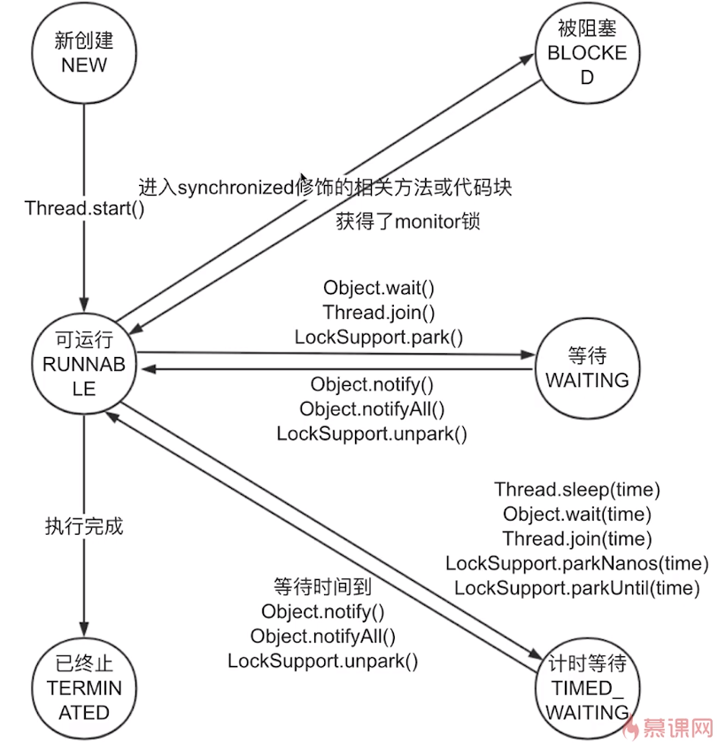

第一部分————线程8大核心基础
1、实现多线程的方法到底有1种还是2种还是4种？
正确的方法：2种。
一种是继承Thread类，另一种方法是声明一个实现Runnable接口。
1.1 两种方法对比
实现Runnable接口更好：
1）、从代码架构角度：具体的任务（run方法）应该和“创建和运行线程的机制（Thread类）”解耦，用Runnable对象可以实现解耦。
2）、如果说继承Thread类实现的话，每次我们想新建一个任务只能去新建一个独立的线程，而新建一个独立的线程的损耗是比较大的：需要创建、执行、销毁；
而如果使用Runnable,我们就可以利用后续的线程池之类的工具，而利用这样的工具就可以大大减小这些创建线程和销毁线程所带来的损耗————资源的节约上
3)、继承了Thread之后，由于Java不支持双继承导致这个类就无法继承其他的类了，这大大限制了我们的可扩展性。

两种方法的本质对比：run()方法
继承Thread（一旦子类重写了父类的方法，也就意味着父类方法直接被覆盖，被抛弃，它将不会被这次的调用所采纳）：run()整个都被重写;
实现Runnable：最终调用target.run();

1.2 思考题：同时用两种方法会怎么样？
BothRunnableThread.java
从面向对象的思想去考虑
由于已经重写了父类的run()方法，所以即便我们传入了Runnable对象，也不会执行父类的方法。

总结：准确的讲，创建线程只有一种方式那就是构造Thread类，而实现线程的执行单元有两种方式：
方法一：实现Runnable接口的run()方法，并把Runnable实例传给Thread类
方法二：重写Thread的run方法（继承Thread类）
还有其他的实现线程的方法，例如线程池等，它们也能新建线程，但是细看源码，从没有逃出过本质，也就是实现Runnable接口和继承Thread类。

1.3 典型错误观点分析
a、"线程池创建线程也算是一种新建线程的方式"
ThreadPool5.java 是通过new Thread();实现的

b、"通过Callable和FutureTask创建线程，也算是一种新建线程的方法"
实现了Runnable接口，本质离不开Runnable

c、"无返回值的是实现runnable接口，有返回值是实现callable接口，所以callable是新的实现线程的方式"
本质没有创新，离不开Runnable接口
d、定时器
DemoTimmerTask.java 表面现象，也是离不开那两种方法
e、匿名内部类
AnonymousInnerClassDemo.java
f、Lambda表达式
Lambda.java

总结：多线程的实现方式，在代码中写法千变万化，但其本质万变不离其宗。
本质就是通过各种各样的包装，比如通过线程池包装、定时器包装，但是其本质都是那两种方式。

（*）面试问题：有多少种实现多线程的方式？
 答题思路，有以下5点：  
从不同的角度看，会有不同的答案。 典型答案是两种，分别是实现Runnable接口和继承Thread类；
但是，我们看原理，其实Thread类实现了Runnable接口，并且看Thread类的run方法，会发现其实那两种本质都是一样的，
run方法的代码如下： 
@Override 
public void run () {
    if (target != null) {
         target.run();
    }
}
方法一和方法二，也就是“继承Thread类然后重写run()”和“实现Runnable接口并传入Thread类”在实现多线程的本质上，并没有区别，都是最终调用了start()方法来新建线程。
这两个方法的最主要区别在于run()方法的内容来源： 
方法一：run()整个都被重写；方法二：最终调用target.run(); 
然后具体展开说其他方式； 还有其他的实现线程的方法，例如线程池等，它们也能新建线程，但是细看源码，从没有逃出过本质，也就是实现Runnable接口和继承Thread类。  
结论:我们只能通过新建Thread类这一种方式来创建线程，但是类里面的run方法有两种方式来实现：第一种是重写run方法；
第二种实现Runnable接口的run方法，然后再把该runnable实例传给Thread类。
除此之外，从表面上看线程池、定时器等工具类也可以创建线程，但是它们的本质都逃不出刚才所说的范围。

2、怎样才是正确的线程启动方式？
2.1 start()和run()的比较
2.1.1 start()方法含义：
a、启动新线程————主线程会请求jvm运行线程，线程何时能运行由线程调度器决定。
start方法会让两个线程同时运行，第一个就是主线程，第二个才是刚刚创建的子线程；

b、准备工作————调用start()方法只是告诉jvm在合适的时候来启动；
第二个就是新线程需要准备工作才能运行，首先它会让自己处于就绪状态，
就绪状态指的是我已经获取到除CPU以外的其他资源，比如说我已经设置了上下文、栈、线程状态以及PC(寄存器，PC指向了程序运行的位置)；

c、不能重复调用start():
CantStartTwice.java————报错

d、start方法的执行流程是什么？ 
1)、检查线程状态，只有NEW状态下的线程才能继续，否则会抛出IllegalThreadStateException（在运行中或者已结束的线程，都不能再次启动，详见CantStartTwice类）
2)、被加入线程组 
3)、调用start0()方法启动线程 
注意点： start方法是被synchronized修饰的方法，可以保证线程安全；
由JVM创建的main方法线程和system组线程，并不会通过start来启动。

2.1.2 run()方法：
那两种方式：“继承Thread类然后重写run()”和“实现Runnable接口并传入Thread类”。

(*)面试问题：一个线程两次调用start()方法会出现什么情况？为什么？
start()方法开始的时候就会对当前线程的状态进行一个检查，如果不符合规定（如果已经执行了start()方法）就会抛出异常；
线程的状态：new状态 -> runnable -> 结束。

(*)面试问题：既然start()方法会调用run()方法，为什么我们选择调用start()方法，而不是直接调用run()方法呢？
因为调用start()方法才是真正意义上启动一个线程，它会去经历线程的各个生命周期；
而如果直接调用run()方法，它就是一个普通的方法而已，不会通过子线程去调用。

3、上山容易下山难————如何正确停止线程？(*难点)
Java中停止线程的原则是什么？ 
在Java中，最好的停止线程的方式是使用中断interrupt，但是这仅仅是会通知到被终止的线程“你该停止运行了”，被终止的线程自身拥有决定权（决定是否、以及何时停止），
这依赖于请求停止方和被停止方都遵守一种约定好的编码规范。
任务和线程的启动很容易。在大多数时候,我们都会让它们运行直到结束,或者让它们自行停止。
然而,有时候我们希望提前结束任务或线程,或许是因为用户取消了操作,或者服务需要被快速关闭，或者是运行超时或出错了。 
要使任务和线程能安全、快速、可靠地停止下来,并不是一件容易的事。Java没有提供任何机制来安全地终止线程。
但它提供了中断(Interruption),这是一种协作机制,能够使一个线程终止另一个线程的当前工作。 
这种协作式的方法是必要的,我们很少希望某个任务、线程或服务立即停止,因为这种立即停止会使共享的数据结构处于不一致的状态。
相反,在编写任务和服务时可以使用一种协作的方式:当需要停止时,它们首先会清除当前正在执行的工作,然后再结束。
这提供了更好的灵活性,因为任务本身的代码比发出取消请求的代码更清楚如何执行清除工作。 
生命周期结束(End-of-Lifecycle)的问题会使任务、服务以及程序的设计和实现等过程变得复杂,而这个在程序设计中非常重要的要素却经常被忽略。

一个在行为良好的软件与勉强运行的软件之间的最主要区别就是,行为良好的软件能很完善地处理失败、关闭和取消等过程。

3.1 如何正确停止线程(*)？
原理介绍：使用interrupt来通知，而不是强制
我们的线程和任务被创造并且启动之后，大部分情况下都是运行到结束的，自然停止；
但是在有些情况下需要用到停止————或许是用户主动取消、或许服务需要突然关闭以及运行超时或者出错线程也需要被停止；
Java语言没有一种机制来安全正确的停止线程，但是它提供了interrupt这是一种合作机制，也就是说我们用一个线程来通知另一个线程，让它停止当前的工作。
在Java中我们如果想停止一个线程，能做的最多的就是告诉它————该中断了；而被中断的线程本身，它自身拥有决定权，它不仅能有决定何时去响应这个中断，
它还拥有最高决定权就是停不停止。

3.2 通常线程会在什么情况下停止？
1)、run()方法的所有代码都运行完毕了；
2)、有异常出现，并且方法中没有被捕获；

3.3 最佳实践：如何正确停止线程(*)
3.3.1 通常线程会在什么情况下停止————普通情况
RightWayStopThreadWithoutSleep.java

3.3.2 线程可能被阻塞
RightWayStopThreadWithSleep.java

3.3.3 如果线程在每次迭代后都阻塞
RightWayStopThreadWithSleepEveryLoop.java 
不需要加入判断条件————Thread.currentThread().isInterrupted()

3.3.4 while内 try/catch 的问题：中断失效
CantInterrupt.java 
java语言在设计sleep()函数的时候，当它一旦响应中断，于是便会把线程的interrupted标记位给清除；
导致程序不能退出。

3.3.5 实际开发中的两种最佳实践
1)、优先选择：传递中断

处理中断的最好方法是什么？ RightWayStopThreadInProduct.java
优先选择在方法上抛出异常。
用throws InterruptedException标记你的方法，不采用try语句块捕获异常，以便于该异常可以传递到顶层，让run方法可以捕获这一异常，例如
void subTask() throws InterruptedException {
    sleep(delay);
}
由于run()方法内无法抛出checked Exception（只能用try catch），顶层的方法必须处理该异常，避免漏掉或者被吞掉的情况，增强了代码的健壮性。

2)、不想或无法传递：恢复中断
如果不想或无法传递InterruptedException （例如用run方法的时候，就不让该方法throws InterruptedException),
那么应该选择在catch子句中调用 Thread.currentThread().interrupt(); 来恢复设置中断状态，以便在后续的执行依然能够检查到刚才发生了中断。
RightWayStopThreadInProduct2.java

3)、不应屏蔽中断————禁止屏蔽

总结：为啥使用interrupt中断线程？
首先，被中断的线程自身拥有如何响应中断的权利，因为有些线程的某些代码是非常重要的，我们必须要等待这些线程处理完或者准备好之后，
由他们自己主动终止或者不理会，而不是粗鲁的使用stop()方法，这样使我们的线程代码在实际中更加安全，也完成了清理工作，数据的完整性也得到了保障。

3.4 停止线程的错误方法(*)
3.4.1 被弃用的stop、suspend和resume方法
suspend和resume 不会释放锁，会造成死锁；

3.4.2 用volatile设置boolean标记位
参考 volatiledemo下文件

3.5 （*）停止线程————面试题常见问题
3.5.1 如何停止线程？
首先，使用interrupt来请求，好处：可以保证数据安全、我们要把主动权交给被中断的线程。
其次要想停止线程需要三方配合，请求方、被停止方、子方法被调用方相互配合
作为请求方我们发出一个中断信号，而被停止方它必须在适当的时候去检查这个信号并且去处理这个信号，每个线程都应该去做这样的事情，
以便于自己可以被停止，如果我们是写子方法的，这个子方法是会被我们线程所调用，那么有两点实践：优先在方法层抛出这个Exception，
以便于其他人去做进一步的处理，或者在收到中断信号之后，把它再次设为中断状态这两种方法都可以，如果这三方配合默契的话，我们就可以利用
interrupt来达到线程停止的效果。
最后，stop/suspend已废弃，volatile的boolean无法处理长时间阻塞的情况，而这种情况在生产环境很有可能发生。

原理：用interrupt来请求线程停止而不是强制，好处是安全。 
想停止线程，要请求方、被停止方、子方法被调用方相互配合才行： 
a) 作为被停止方：每次循环中或者适时检查中断信号，并且在可能抛出InterrupedException的地方处理该中断信号；
b) 请求方：发出中断信号； 
c) 子方法调用方（被线程调用的方法的作者）
要注意：优先在方法层面抛出InterrupedException，或者检查到中断信号时，再次设置中断状态；
 最后再说错误的方法：stop/suspend已废弃，volatile的boolean无法处理长时间阻塞的情况。

3.5.2 如何处理不可中断的阻塞？
并没有通用的方法，针对相应的情况可以使用特定的方法，使用可以响应中断的方法。
如果线程阻塞是由于调用了 wait()、sleep() 或 join() 方法，你可以中断线程，通过抛出 InterruptedException 异常来唤醒该线程。 
但是对于不能响应InterruptedException的阻塞，很遗憾，并没有一个通用的解决方案。 但是我们可以利用特定的其它的可以响应中断的方法，
比如ReentrantLock.lockInterruptibly()，比如关闭套接字使线程立即返回等方法来达到目的。 
答案有很多种，因为有很多原因会造成线程阻塞，所以针对不同情况，唤起的方法也不同。  
总结就是说如果不支持响应中断，就要用特定方法来唤起，没有万能药。
 
4、线程的一生————6个状态（生命周期）(*)

4.1 状态含义和变化
1)、New：代表已创建但还没启动的新线程，当我们用new Thread();新建一个线程之后，但是还没有执行start()方法，此时就处于New的状态；
2)、Runnable（可运行状态）：从New，调用了start()方法之后，就会处于Runnable状态；Runnable有可能在执行，也有可能没有在执行（等待CPU分配运行时间）；
比如说一个线程拿到了CPU资源了————Runnable状态，CPU资源是被我们调度器不停的调度，所以有的时候，会突然被拿走，一旦我们某一个线程拿到了CPU资源，正在运行了，
突然CPU资源被抢走分配给别人，此时这个线程还是Runnable状态；因为虽然它并没有在运行中，但它依然是处于可运行状态，随时随地都有可能又被调度器分配回来CPU资源，然后就又可以运行了；
3)、Blocked：当一个线程进入到被synchronized的代码块的时候，并且该锁（monitor）已经被其他线程所拿走了，此时的状态是Blocked；等待另外线程释放排它锁在进入可运行状态
4)、Waiting：等待，与第三个状态类似；一方面是没有设置timeout参数的Object.wait()、Thread.join()、LockSupport.park(); 直到被唤醒才可进入可运行状态；
5)、Timed Waiting：计时等待，和等待状态非常类似，有时间期限；Thread.sleep(time)、Object.wait(time)、Thread.join(time)、LockSupport.parkNanos(time)、LockSupport.parkUntil(time);
6)、Terminated：终止，run()正常退出、出现未被捕获的异常；

4.2 状态转换的注意点、阻塞的定义、面试问题
注意点：
1)、NEW -> RUNNABLE -> TERMINATED 只能是单向的，
2)、状态不能跳跃
阻塞状态：
一般习惯而言，把Blocked(被阻塞)、Waiting(等待)、Timed_waiting(计时等待)都称为阻塞状态，
不仅仅是Blocked
(*) 线程有哪几种状态？
六种状态，参考4.1。

5、Thread类和Object类中的重要方法详解
5.1 (*)面试题：
1)、为什么线程通信的方法wait()，notify()和notifyAll()被定义在Object类里？而sleep定义在Thread类里？

2)、用3种方式实现生产者模式

3)、Java SE8和Java1.8和JDK8是什么关系，是同一个东西吗？

4)、Join和sleep和wait期间线程的状态分别是什么？为什么？

5.1 方法概览
Thread类：
1)、sleep相关：相关————指的重载方法，参数不同；
2)、join：等待其他线程执行完毕
3)、yield相关：放弃已经获取到的CPU资源
4)、currentThread：获取当前执行线程的引用
5)、start、run相关：启动线程相关
6)、interrupt相关：中断线程
7)、stop、suspend、resume相关：已废弃
Object类：
1)、wait、notify、notifyAll相关：让线程暂时休息和唤醒

5.2 wait、notify、notifyAll方法详解(*)
wait和notify都需要在synchronized保护的代码块或者方法中执行，否则会抛出异常。
1)、作用、用法：阻塞阶段、唤醒阶段、遇到中断
阻塞阶段：执行wait方法的时候，必须拥有对象的monitor锁；
直到发生以下4种情况之一时，才会被唤醒：
a、另一个线程调用这个对象的notify()方法且刚好被唤醒的是本线程；
b、另一个线程调用这个对象的notifyAll()方法；
c、过了wait(long timeout)规定的超时时间，如果传入0就是永久等待；
d、线程自身调用了interrupt()；

唤醒阶段：notify、notifyAll
notify：唤醒单个正在等待某对象monitor的线程，唤醒的时候如果有多个线程都在等待，
那么只会任意选取一个去唤醒；一旦被唤醒，线程就不在是等待的状态了，它就会重新参与到线程的调度中，
等待时机合适被调度进来就会继续执行了。
notifyAll：把所有等待线程都唤醒。

遇到中断：
假设线程已经执行wait()，在此期间如果被中断，它会抛出InterruptedException，并且释放掉已经获取到的monitor。

2)、代码演示：4种情况
a、普通用法：Wait.java
notify和notifyAll展示：WaitNotifyAll

b、只释放当前monitor展示：WaitNotifyReleaseOwnMonitor.java

3)、特点、性质
wait、notify、notifyAll特点、性质
a、用之前必须首先拥有monitor————synchronized锁；
b、使用notify只能唤醒一个，由JVM决定是哪个
c、这三个方法都是属于Object类，Object是所有对象的父类，所以任何对象都可以调用这个方法；
d、类似功能的Condition
e、同时持有多个锁————防止死锁发生
4)、原理
wait原理：
入口集Entry Set，等待集 Wait Set

5)、状态转化的特殊情况：
a、从Object.wait()状态刚被唤醒时，通常不能立刻抢到monitor锁，那就从Waiting先进入Blocked状态，抢到锁后在转换到Runnable状态
b、如果发生异常，可以直接跳到终止Terminated状态，不必再遵循路径，比如可以从Waiting直接到Terminated

6)、手写生产者消费者设计模式：ProducerConsumerModel.java
a、为什么要使用生产者和消费者模式？
在线程世界中，生产者就是生产一些数据，消费者就是消费这些数据。但是它们的速度很有可能是不一致的。
有的时候是生产者快，有的时候是生产者慢。如果有一种设计模式可以解决它们相互等待的问题，而不至于一个过快，一个过慢，两者相互配合比较困难。
该模式就是将消费方和生产方进行解耦，可以达到更加顺畅的配合。

7)、wait、notify、notifyAll常见面试问题
a、用程序实现两个线程交替打印0~100的奇偶数
WaitNotifyPrintOddEvenSyn.java
WaitNotifyPrintOddEvenWait.java
基本思路：synchronized
更好的方法：wait/notify

b、为什么wait()需要在同步代码块内使用，而sleep()不需要？
主要是让通信变得可靠，防止死锁或者永久等待的发生；
如果我们把wait()和sleep()都放到同步代码块里面的话，
那么很有可能在执行wait()之前，线程突然切过去，切到另外一个执行notify()的线程，这个线程回来执行这个wait()。。。

c、为什么线程通信的方法wait()、notify()和notifyAll()被定义在Object类里？而sleep定义在Thread类里？
主要是因为在Java中wait、notify和notifyAll是一个锁级别的操作，而这个锁是属于某一个对象的，每个对象的对象头中都含有几位用来保存当前锁的状态的，
所以这个锁是绑定到某一个对象中，而并不是线程中；
假设我们把wait、notify和notifyAll定义到线程中，就会造成很大的局限性，这样一来我们每一个线程是可以休眠，但是如果我们使用某一个线程持有多个锁，
并且这些锁之间是相互配合的，那么这样一个某一个线程可以持有多把锁，但是不能实现灵活地逻辑了。

d、wait方法是属于Object对象的，那调用Thread.wait会怎么样？
Thread比较特殊，就是线程退出的时候，它会自动的执行notify()，这样会使我们设计的流程受到干扰，所以在调用wait方法或者创建某一个锁对象时不要用Thread类。

e、如何选择用notify还是notifyAll?
主要根据业务，是要唤醒多个线程还是只唤醒一个线程。

f、notifyAll之后所有的线程都会再次抢夺锁，如果某线程抢夺失败怎么办？
进入阻塞状态，等待释放。

g、用suspend()和resume()来阻塞线程可以吗？为什么？
不可以。由于安全问题已经被弃用了。推荐用wait和notify来实现相应的休眠和唤醒的功能。
8)、彩蛋 Java相关概念
a)、JavaSE、JavaEE、JavaME是什么？
JavaSE：标准版—————平时开发使用
JavaEE：企业版
JavaME：移动版

b)、JRE和JDK和JVM是什么关系？
JRE:Java Runtime Environment java运行环境，主要是运行用，包含JVM和一些类库
JDK:Java Development Kit java开发工具包，主要是开发用
JVM:Java Virtual Machine Java虚拟机，JRE的一部分
服务器一般是JRE，不见得一定有JDK，JDK包含JRE。

c)、Java版本升级都包括了哪些东西的升级？
d)、Java8和Java1.8和JDK8关系，是同一个东西吗？
是同一个东西。

5.3 sleep方法详解
a、作用：让线程在预期的时间执行，其他时候不要占用CPU资源。
b、特点：(1)、不释放锁，包括synchronized和lock；
(2)、和wait不同 wait方法的执行必须在同步方法中进行，而sleep则不需要；wait()是Object类的方法，sleep()是Thread类的方法
c、sleep方法响应中断：
1)、抛出InterruptedException
2)、清除中断状态

d、总结(*)：
sleep可以让线程进入Waiting状态，并且不占用CPU资源，但是不释放锁，直到规定时间后在执行，休眠期间如果被中断，会抛出异常并清除中断状态。

e、wait/notify、sleep异同（方法属于哪个对象，线程状态怎么切换）
相同： 阻塞：Wait和sleep方法都可以使线程阻塞，对应线程状态是Waiting或Time_Waiting。响应中断： wait和sleep方法都可以响应中断Thread.interrupt()。 
不同： 同步方法中：wait方法的执行必须在同步方法中进行，而sleep则不需要。释放锁： 在同步方法里执行sleep方法时，不会释放monitor锁，但是wait方法会释放monitor锁。 
指定时间：sleep方法短暂休眠之后会主动退出阻塞，而没有指定时间的 wait方法则需要被其他线程中断后才能退出阻塞。 
所属类：wait()和notify(),notifyAll()是Object类的方法，sleep()和yield()是Thread类的方法

5.4 join方法
5.4.1 join作用、用法
作用：因为新的线程加入我们，所以我们要等他（新线程）执行完再出发。
用法：main等待thread1执行完毕，注意谁等谁

5.4.2 三个例子 
a、普通用法：Join.java
b、遇到中断：JoinInterrupt.java
c、在join期间，线程到底是什么状态？
WAITING

5.4.3 join注意点
CountDownLatch或CyclicBarrier类
注意：每一个Thread类在run()结束后，会自动的执行notify()方法。

5.5 yield方法
5.5.1 作用：释放我的CPU时间片，释放之后，线程状态依然是Runnable状态，因为它不会释放锁，也不会陷入阻塞。
5.5.2 定位：JVM不保证遵循
5.5.3 yield和sleep区别：
sleep期间线程调度器认为它已经被阻塞了，不会再把它调度起来，但是yield不同，它只是暂时把自己的调度去让给别人，但是立刻又可以
处于竞争状态，随时可以被调度。

5.6 获取当前执行线程的引用：Thread.currentThread()方法

5.7 start和run方法

5.8 stop、suspend、resume方法
已被弃用。
5.9 面试常见问题
参考上述总结。wait和sleep较多。
6、线程的各个属性
什么时候我们需要设置守护线程？
通常不需要。JVM提供的足够使用。

我们应该如何应用优先级来帮助程序运行？有哪些禁忌？
不应该设置优先级，因为不同的操作系统对于优先级的映射和调度不一样，很有可能被操作系统忽略。

不同的操作系统如何处理优先级问题？
不应该设置优先级。

6.1、 线程个属性
编号(ID)：每个线程有自己的ID，用于标识不同的线程；
名称(Name)：作用让用户或程序员在开发、调试或运行过程中，更容易区分每个不同的线程、定位问题等；
是否是守护线程(isDaemon)：true代表是，false代表不是（用户线程）。
优先级(Priority)：优先级这个属性的目的是告诉线程调度器，用户希望哪些线程相对多运行，哪些少运行。

6.2、守护线程：给用户线程提供服务，比如说垃圾处理器
1)、线程类型默认继承自父线程
2)、被谁启动，通常而言都是JVM启动；
3)、不影响JVM退出

6.3、守护线程和普通线程的区别(*)
1)、整体无区别
2)、唯一区别在于是否能影响JVM的退出
3)、作用不同，用户线程是执行我们逻辑的，而守护线程是服务用户线程的

6.4、我们是否需要给线程设置为守护线程？
不应该，危险。

6.5 线程优先级
1)、10个级别，默认5
2)、程序设计不应依赖于优先级
a、不同操作系统优先级不一样
b、优先级会被操作系统改变

7、未捕获异常如何处理？
面试：
1)、Java异常体系图
注意需要复习。
2)、实际工作中，如何全局处理异常？为什么要全局处理？不处理行不行？(*)
使用 MyUncaughtExceptionHandler 全局捕获，不处理会把异常信息投给前端。

3)、为什么需要UncaughtExceptionHandler？
a、主线程可以轻松发现异常，子线程却不行
b、子线程异常无法用传统方法捕获
c、不能直接捕获的后果，提高健壮性

4)、两种解决方案：
方案一：手动在每个run方法里进行 try catch
方案二：利用UncaughtExceptionHandler
面试问题：
a、run方法是否可以抛出异常？如果抛出异常，线程的状态会怎么样？
run方法不可抛出异常，只能自己去做try catch处理，线程会终止运行
b、线程如何处理某个未处理异常？
设置全局处理器，UncaughtExceptionHandler。

8、双刃剑：多线程会导致的问题(*)
8.1 线程安全问题(*)
a、什么是线程安全：
当多个线程访问一个对象时如果不用考虑这些线程在运行时环境下的调度和交替执行，也不需要进行额外的同步，
或者在调用方进行任何其他的协调操作，调用这个对象的行文都可以获得正确的结果，那这个对象是线程安全的。
————翻译：
不管业务中遇到怎样的多个线程访问某对象或某方法的情况，而在编程这个业务逻辑的时候，都不需要额外做任何处理（也就是可以像单线程编程一样），程序也可以正常运行，
不会因为多线程而出错，这就可以称为线程安全。
相反，如果在编程的时候，需要考虑这些线程在运行时的调度和交替（例如在get()调用到期间不能调用set()），或者需要进行额外的同步（比如使用synchronized关键字等），那么就是线程不安全的。
b、什么情况下会出现线程安全问题，怎么避免？
第一种——数据争用，两个数据同时去写，造成其中一方的数据要么被丢弃要么写入错误；
第二种——竞争条件，执行顺序，比如去读取一个文件的内容，那么自然是在这个文件写完之后的，假设线程配合的不好，我在你没写完之前就来读取，这样就会造成顺序上的错误；

8.1.1 一共有哪几类线程安全问题？3种
1)、运行结果错误：a++多线程下出现消失的请求现象
MultiThreadsError.java MultiThreadsErrorFix0.java MultiThreadsErrorFix1.java
2)、活跃性问题：死锁、活锁、饥饿
互不相让————死锁 MultiThreadError.java
运行结果：flag = 0，flag = 1
分析原因：由于线程1走到 " synchronized (o1) {}"这边，去拿" synchronized (o2)"时，
而"synchronized (o2)"已经被线程2所拿到，所以，线程1在"synchronized (o2)————36"处等待，而线程2会在"synchronized (o1)————49" 处等待。
    
3)、对象发布和初始化的时候的安全问题(*)
a、什么是发布？
如果一个对象被声明为public那么就是被发布出去了；
或者一个方法的return如果是一个对象的话，那么任何调用这个方法的类都获得这个对象；
或者把这个类作为参数传到其他类的方法中，这些都称为发布。
b、什么是逸出？发布到了不该发布的地方。
方法返回一个private对象(private的本意是不让外部访问); MultiThreadsError3.java
还未完成初始化(构造函数没完全执行完毕)就把对象提供给外界，
比如：
在构造函数中未初始化完毕就this赋值； MultiThreadsError4.java
隐式逸出————注册监听事件； MultiThreadsError5.java
构造函数中运行线程；MultiThreadsError6.java

c、如何解决逸出？
返回“副本”；MultiThreadsError3.java
工厂模式 MultiThreadsError7
8.1.2 哪些场景需要额外注意线程安全问题？(*)
1)、访问共享的变量或资源，会有并发风险，比如对象的属性、静态变量、共享缓存、数据库等；
2)、所有依赖时序的操作，即使每一步操作都是现成安全的，还是存在并发问题：可以用synchronized作为一个原子操作绑定起来
read-modify-write：先读取在修改、check-then-act：先检查在执行
3)、不同的数据之间存在捆绑关系的时候：ip和端口号
4)、我们使用其他类的时候，如果对方没有声明自己是线程安全的
HashMap不是线程安全，ConcurrentHashMap线程安全

8.1.3 什么是多线程带来的上下文切换？

8.2 性能问题：上下文切换、内存同步 (*)
8.2.1 性能问题都有哪些体现，什么是性能问题？
服务响应慢，吞吐量降低，资源消耗大，内存占用过多；
8.2.2 为什么多线程会带来性能问题？
1)、调度原因：上下文切换
a、什么是上下文（context）：主要是指发生线程调度时，当可运行线程数超过CPU数量，操作系统就要调度线程了。
比如：当某一个线程运行到Thread.sleep()时，此时进入阻塞状态，线程调度器就会把线程阻塞，然后让另外一个等待CPU资源的线程进入Runnable状态，这样一个动作就是上下文切换
这样的开销非常大，5000-10000个cpu时钟周期——几微秒。
上下文切换可以认为是内核（操作系统的核心）在CPU上对于进程（包括线程）进行以下的活动：
（1）挂起一个进程，将这个进程在CPU中的状态（上下文）存储于内存中的某处；
（2）在内存中检索下一个进程的上下文并将其在CPU的寄存器中恢复
（3）跳转到程序计数器所指向的位置（即跳转到进程被中断时的代码行），已恢复该进程；
b、缓存开销：缓存失效问题
c、何时会导致密集的上下文切换：抢锁、IO导致线程阻塞

2)、协作：内存同步
为了数据的正确性，同步手段往往会使用禁止编译器优化、使CPU内的缓存失效。

8.3 常见面试问题
1)、你知道有哪些线程不安全的情况？
————8.1.1 一共有哪几类线程安全问题

2)、平时那些情况需要额外注意线程安全问题？(*)
————8.1.2 哪些场景需要额外注意线程安全问题

3)、什么是多线程的上下文切换？
上下文切换可以认为是内核（操作系统的核心）在CPU上对于进程（包括线程）进行以下的活动：
（1）挂起一个进程，将这个进程在CPU中的状态（上下文）存储于内存中的某处；
（2）在内存中检索下一个进程的上下文并将其在CPU的寄存器中恢复
（3）跳转到程序计数器所指向的位置（即跳转到进程被中断时的代码行），已恢复该进程；

（*）八大核心面试问题总结：
1)、有多少种实现线程的方法？
从不同的角度看，会有不同的答案。 典型答案是两种，分别是实现Runnable接口和继承Thread类；
但是，我们看原理，其实Thread类实现了Runnable接口，并且看Thread类的run方法，会发现其实那两种本质都是一样的，
run方法的代码如下： 
@Override 
public void run () {
    if (target != null) {
         target.run();
    }
}
方法一和方法二，也就是“继承Thread类然后重写run()”和“实现Runnable接口并传入Thread类”在实现多线程的本质上，并没有区别，都是最终调用了start()方法来新建线程。
这两个方法的最主要区别在于run()方法的内容来源： 
方法一：run()整个都被重写；方法二：最终调用target.run(); 
然后具体展开说其他方式； 还有其他的实现线程的方法，例如线程池等，它们也能新建线程，但是细看源码，从没有逃出过本质，也就是实现Runnable接口和继承Thread类。  
结论:我们只能通过新建Thread类这一种方式来创建线程，但是类里面的run方法有两种方式来实现：第一种是重写run方法；
第二种实现Runnable接口的run方法，然后再把该runnable实例传给Thread类。
除此之外，从表面上看线程池、定时器等工具类也可以创建线程，但是它们的本质都逃不出刚才所说的范围。

2)、实现Runnable接口和继承Thread类哪种方式更好？
(两种方法对比)————三点理由

3)、一个线程两次调用start()方法会出现什么情况？为什么？
抛出异常，调用start()方法的时候会做线程状态的检测，如果发现不是NEW就会抛出异常。

4)、既然start()方法会调用run()方法，为什么我们选择调用start()方法，而不是直接调用run()方法呢？
因为调用start()方法才是真正意义上启动一个线程，它会去经历线程的各个生命周期；
而如果直接调用run()方法，它就是一个普通的方法而已，不会通过子线程去调用。

5)、如何停止线程？
首先，使用interrupt来请求，好处：可以保证数据安全、我们要把主动权交给被中断的线程。
其次要想停止线程需要三方配合，请求方、被停止方、子方法被调用方相互配合
作为请求方我们发出一个中断信号，而被停止方它必须在适当的时候去检查这个信号并且去处理这个信号，每个线程都应该去做这样的事情，
以便于自己可以被停止，如果我们是写子方法的，这个子方法是会被我们线程所调用，那么有两点实践：优先在方法层抛出这个Exception，
以便于其他人去做进一步的处理，或者在收到中断信号之后，把它再次设为中断状态这两种方法都可以，如果这三方配合默契的话，我们就可以利用
interrupt来达到线程停止的效果。
最后，stop/suspend已废弃，volatile的boolean无法处理长时间阻塞的情况，而这种情况在生产环境很有可能发生。

6)、如何处理不可中断的阻塞?
并没有通用的方法，针对相应的情况可以使用特定的方法，使用可以响应中断的方法。
如果线程阻塞是由于调用了 wait()、sleep() 或 join() 方法，你可以中断线程，通过抛出 InterruptedException 异常来唤醒该线程。 
但是对于不能响应InterruptedException的阻塞，很遗憾，并没有一个通用的解决方案。 但是我们可以利用特定的其它的可以响应中断的方法，
比如ReentrantLock.lockInterruptibly()，比如关闭套接字使线程立即返回等方法来达到目的。 
答案有很多种，因为有很多原因会造成线程阻塞，所以针对不同情况，唤起的方法也不同。  
总结就是说如果不支持响应中断，就要用特定方法来唤起，没有万能药。

7)、线程有哪几种状态？生命周期是什么？
6种

8)、程序实现两个线程交替打印0~100奇偶数
WaitNotifyPrintOddEvenSyn.java
WaitNotifyPrintOddEvenWait.java
基本思路：synchronized
更好的方法：wait/notify

9)、手写生产消费者模式
ProducerConsumerModel.java

10)、为什么wait()需要在同步代码块内使用，而sleep()不需要？
为了防止wait之后没有notify唤醒，防止线程安全问题的发生。————(为什么wait()需要在同步代码块内使用，而sleep()不需要？)

11)、为什么线程通信的方法wait()、notify()、和notifyAll()被定义在Object类里？而sleep定义在Thread类里？
(为什么线程通信的方法wait()、notify()和notifyAll()被定义在Object类里？而sleep定义在Thread类里？)

12)、wait方法是属于Object对象的，那调用Thread.wait会怎么样？
(wait方法是属于Object对象的，那调用Thread.wait会怎么样？)

13)、如何选择用notify还是NotifyAll?
优先选用NotifyAll，除非满足线程是同质性并且每次只需要唤醒1个。

14)、notifyAll之后所有的线程都会在次抢夺锁，如果某线程抢夺失败怎么办？
不会有额外的错误发生

15)、用suspend()和resume()来阻塞线程可以吗？为什么？
不可以，由于线程安全问题被废弃

16)、wait/notify，sleep异同（方法属于哪个对象？线程状态怎么切换？）
(wait/notify、sleep异同（方法属于哪个对象，线程状态怎么切换）)

17)、线程中如何处理某个未处理异常？
设置全局处理器，UncaughtExceptionHandler。

19)、在join期间，线程处于那种线程状态？ WAITING
20)、yield和sleep区别？ (yield和sleep区别)
21)、守护线程和普通线程的区别？
区别并不大，主要看服务于谁，守护线程是服务于普通线程的，并且不会影响到JVM的结束
22)、我们是否需要给线程设置为守护线程？
没有必须要设置。
23)、为什么程序设计不应依赖于线程优先级？
优先级所带来的程序效果无法保证。在不同的操作系统上也不一样

24)、讲讲Java异常体系？

首先都继承于ThrowAble，然后还会分为Error和Exception;

25)、实际工作中，如何全局处理异常？
设置全局处理器，UncaughtExceptionHandler。

26)、为什么异常需要全局处理？不处理行不行？
不行 这会给前端用户提示 造成不必要的信息泄露

27)、run方法是否可以抛出异常？如果抛出异常，线程的状态会怎么样？
(run方法是否可以抛出异常？如果抛出异常，线程的状态会怎么样？)

28)、为什么多线程会带来性能问题?
(为什么多线程会带来性能问题)

思维导图：https://naotu.baidu.com/file/07f437ff6bc3fa7939e171b00f133e17?token=6744a1c6ca6860a0
