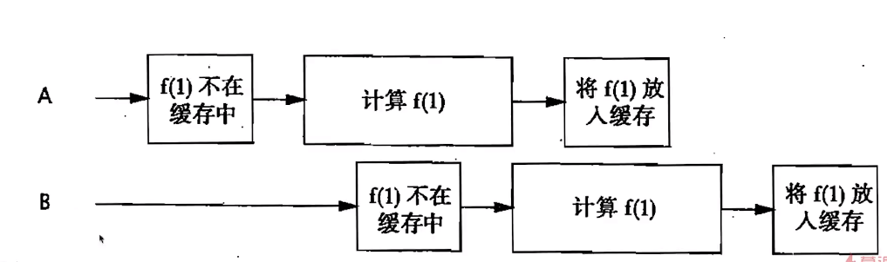
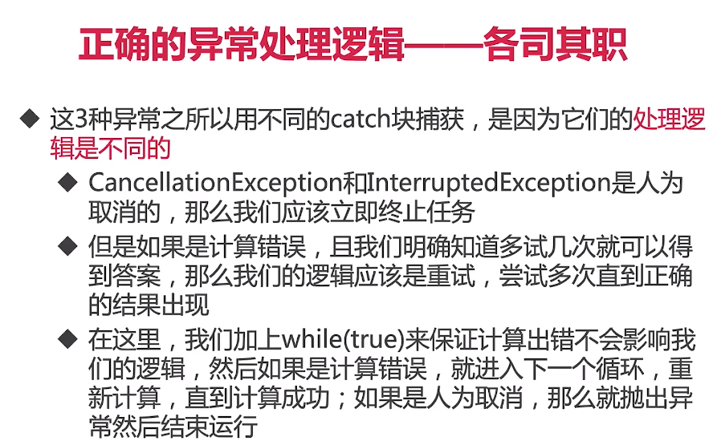

玩转Java并发工具，精通JUC，成为并发多面手
Java并发成神之路——JUC全方位详解：
https://naotu.baidu.com/file/89fb28b05e3395800f9dc2d332d2b198?token=9b45e08e55281667

1、线程池————治理线程的最大法宝
1.1 线程池的自我介绍
1.1.1 线程池的重要性
1.1.2 什么是"池"？
1.1.3 为什么要使用线程池？
1.1.4 线程池的好处
1.1.5 线程池适用的场合

1.2 创建和停止线程池
1.2.1 线程池构造函数的参数
1.2.2 添加线程规则
1.2.3 线程池应该手动创建还是自动创建？
1.2.4 线程池里的线程数量设定多少比较合适？
1.2.5 常见线程池的特点
1.2.6 阻塞队列分析
1.2.7 停止线程池的正确方法 ShutDown.java

1.3 常见线程池的特点和用法

1.4 任务太多，怎么拒绝？
1.4.1 拒绝时机
1.4.2 4种拒绝策略

1.5 钩子方法，给线程池加点料
1.5.1 在每个任务执行前后做点事情

1.6 实现原理，源码分析
1.6.1 线程池组成部分

1.6.2 Executor家族？

1.7 线程池的状态

1.8 使用线程池的注意点

2、ThreadLocal
两大使用场景————ThreadLocal的用途
典型场景1：每个线程需要一个独享的对象(通常是工具类，典型需要使用的类有SimpleDateFormat和Random)；

典型场景2：每个线程内需要保存全局变量(例如在拦截器中获取用户信息)，可以让不同方法直接使用，避免参数传递的麻烦；

3、不可不说的“锁”事【种类繁多，如何一一突破？】
3.1、Lock接口
3.2、锁的分类
3.3、乐观锁和悲观锁
3.4、可重入锁和非可重入锁，以ReentrantLock为例(*)
3.5、公平锁和非公平锁
3.6、共享锁和排它锁：以ReentrantReadWriteLock读写锁为例(*)
3.7、自旋锁和阻塞锁
3.8、可中断锁：顾名思义就是可以响应中断的锁
3.9、锁优化

4、atomic包【一刻也不能分割】
4.1、什么是原子类，有什么作用？
4.2、6类原子类纵览
4.3、Atomic*基本类型原子类，以AtomicInteger为例
4.4、Atomic*Array数组类型原子类
4.5、Atomic*Reference引用类型原子类
4.6、把普通变量升级为原子类，用AtomicIntegerFieldUpdater升级原有变量
4.7、Adder累加器
4.8、Accumulator累加器

5、CAS原理
5.1、什么是CAS
5.2、案例演示
5.3、应用场景
5.4、以AtomicInteger为例，分析在Java中是如何利用CAS实现原子操作的？
5.5、缺点

6、以不变应万变：final关键字和不变性
6.1 什么是不变性(Immutable)
6.2 final的作用
6.3 3种用法：修饰变量、方法、类
6.4 注意点
6.5 不变性和final的关系

栈封闭

7、并发容器精讲————面试杀手锏
7.1、并发容器概览
7.2、趣说集合类的历史————古老和过时的同步容器
7.3、ConcurrentHashMap(*)
7.4、CopyOnWriteArrayList
7.5、并发队列Queue(阻塞队列、非阻塞队列)
7.6、各并发容器总结

8、控制并发流程
8.1、什么是控制并发流程
8.2、CountDownLatch到计时门闩
8.3、Semaphore信号量
8.4、Condition接口(又称条件对象
8.5、CyclicBarrier循环栅栏

9、AQS【进阶必备，并发灵魂人物】
9.1、 学习AQS的思路
9.2、 为什么需要AQS
9.3、 AQS的作用
9.4、 AQS的重要性，地位
9.5、 AQS内部原理解析
9.6、 应用实例、源码解析
9.7、 利用AQS实现一个自己的Latch门闩

10、 获取子线程的执行结果【来而不往非礼也】Future和Callable——治理线程的第二大法宝(*)
10.1、Runnable的缺陷
10.2、Callable接口
10.3、Future类
10.4、用法1：线程池的submit方法返回Future对象，6个代码演示
10.5、用法2：用FutureTask来创建Future
10.6、Future的注意点

11、从0到1打造高性能缓存【学以致用，直击痛点】
11.1、从最简单版缓存入手——HashMap
ImoocCache1.java
给HashMap加final关键字
属性被声明为final后，该变量则只能被赋值一次。且一旦被赋值，final的变量就不能再被改变。
所以我们把它加上final关键字，增强安全性。

并发安全要保证——用synchronized实现：
问题：1、性能差；2、代码复用能力差；

11.2、代码有重构空间——用装饰者模式
我们假设ExpensiveFunction类是耗时计算的实现类，实现了Computable接口，但是其本身不具备缓存功能，
也不需要考虑缓存的事情。
ImoocCache2.java

问题：1、性能差；

11.3、性能待优化——引出锁性能优化经验：缩小锁的粒度
ImoocCache3.java ——> ImoocCache4.java

1)、虽然提高了并发效率，但是并不意味着就是线程安全的，还需要考虑到同时读写等情况；
2)、但是其实没必要自己实现线程安全的HashMap，也不应该加synchronized，因为我们自己实现的性能远不如现有的并发集合；
3)、使用ConcurrentHashMap优化缓存

11.4、用并发集合——ConcurrentHashMap
ImoocCache5.java

问题：在计算完成前，另一个要求计算相同值的请求到来，会导致计算两边，这和缓存想避免多次就散的初衷恰恰相反，是不可接受的。

ImoocCache6.java

11.5、避免重复计算——Future和Callable的妙用
动机：现在不同的线程进来以后，确实可以同时计算，但是如果两个线程前后脚，也就是相差无几的进来请求同一个数据，
那么我们来看看会出现什么问题：重复计算；
如果线程巨大那么会造成巨大的浪费。

改进放向：前人种树，后人乘凉
避免重复计算——ImoocCache7.java

11.6、 依然存在重复的可能——用原子操作putIfAbsent
如果有两个同时计算666的线程，同时调用cache.get()方法，
那么返回的结果都为null，后面还是会创建两个任务去计算相同的值。

ImoocCache8.java

11.7、 计算中抛出异常——ExecutionException
计算过程并不是一帆风顺的，假设有一个计算类，它有一定概率计算失败，应该如何处理？

ImoocCache9.java

11.8、 缓存污染——计算失败则移除Future，增加健壮性
ImoocCache9.java

11.9、缓存过期功能
为每个结果指定过期时间，并定期扫描过期的元素。
ImoocCache10.java

11.10、高并发访问时
如果同时过期，那么同时都拿不到缓存，导致打爆cpu和MySql，造成缓存雪崩、缓存击穿等高并发下的缓存问题。

解决：
缓存过期时间设置为随机。
ImoocCache10.java

11.11、测试并发性能，所有线程同时访问缓存

ImoocCache11.java -> ImoocCache12.java
前一个类存在一个问题，就是大量的请求实际上不是同时到达的，而是分先后，但是这样就没办法给缓存造成压力，
我们需要真正的同一时刻大量请求到达，此时可以用CountDownLatch来实现。

每个线程都有存储独立信息的需求：ThreadLocal
