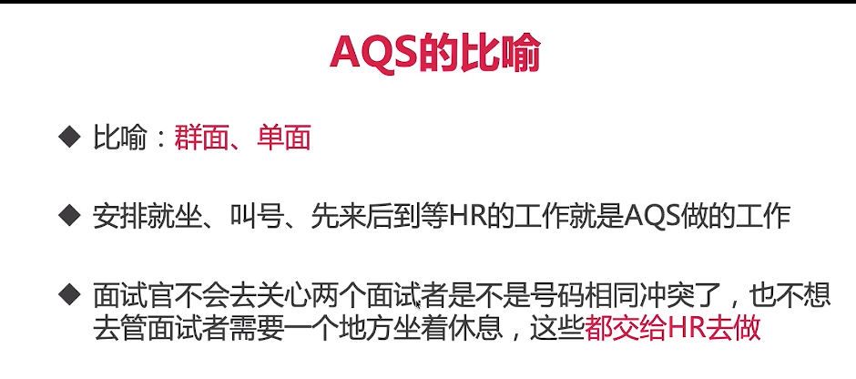
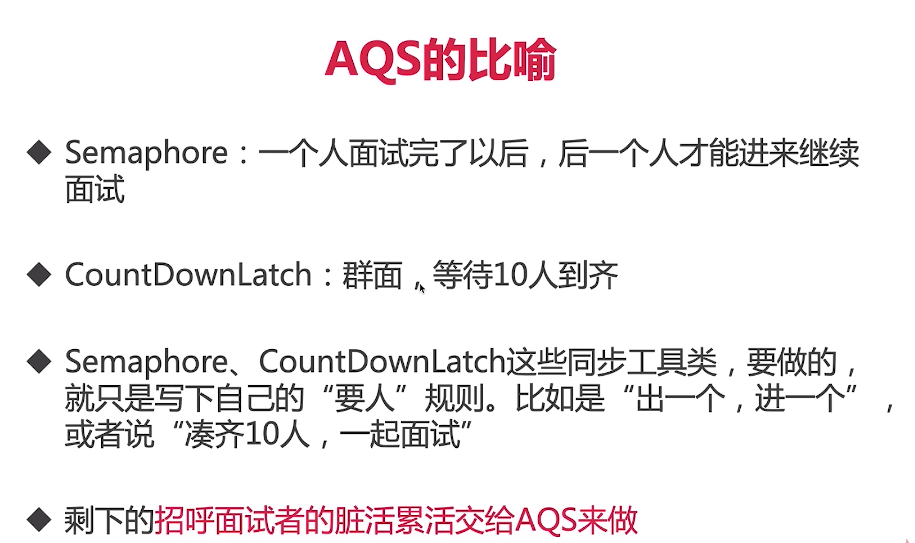
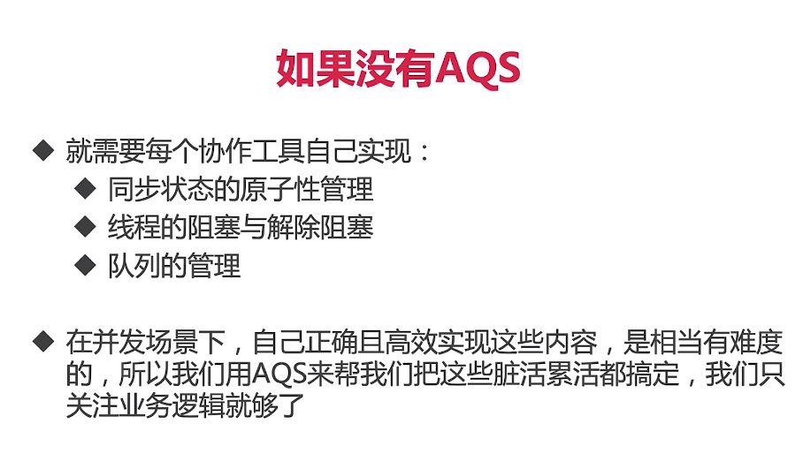
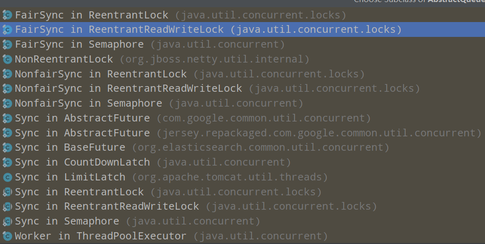

9、AQS【进阶必备，并发灵魂人物】
9.1 学习AQS的思路
AQS在ReentrantLock、CountDownLatch、Semaphore和读写锁都有所应用，
学习AQS的目的主要是想理解原理、提高技术，已经应对面试。

先从应用层面理解为什么需要它，如何使用它，然后再看一看我们Java代码的设计者
是如何设计并且使用它的，了解它的应用场景。

9.2 为什么需要AQS——AbstractQueuedSynchronizer
1)、锁和协作类的共同点：闸门，ReentrantLock和Semaphore
2)、事实上，不仅是ReentrantLock和Semaphore，包括CountDownLatch、ReentrantReadWriteLock都有这样类似的"协作"
(或者叫同步)功能，其实，它们底层都用了一个共同的基类，这就是AQS。
3)、因为上面的那些协作类，它们有很多工作都是类似的，所以如果能提取出一个工具类，那么就可以直接用，对于ReentrantLock和Semaphore而言就可以屏蔽很多细节，
只关注它们自己的"业务逻辑"就可以了。

9.3 AQS的比喻

9.3 AQS的作用
1)、AQS是一个构建锁、同步器、协作工具类的工具类(框架)。有了AQS以后，更多的协作工具类都可以很方便的被写出来。
2)、一句话总结：有了AQS，构建线程协作类就容易多了。

9.4 AQS的重要性，地位
在重要的类中起到了地基的作用

9.5 AQS内部原理解析
9.5.1、AQS的三要素
1)、AQS最核心的就是三大部分(*)
 a、state：
  (1) 这里的state的具体含义，会根据具体实现类的不同而不同，比如在Semaphore里，它表示"剩余的许可证的数量"，
 而在CountDownLatch里，它表示"还需要倒数的数量"；
  state是volatile修饰的，会被并发地修改，所以所有修改state的方法都需要保证线程安全，比如getState、setState以及compareAndSetState操作
 来读取和更新这个状态。这些方法都依赖于j.u.c.atomic包的支持；
  (2) 在ReentrantLock中，state用来表示"锁"的占有情况，包括可重入计数；当state的值为0的时候，表示该Lock不被任何线程所占有；
  
 b、控制线程抢锁和配合的FIFO队列
  (1) 这个队列用来存放"等待的线程"，AQS就是"排队管理器"，当多个线程争用同一把锁时，必须有排队机制将那些没能拿到锁的线程串在一起。
  当锁释放时，锁管理器就会挑选一个合适的线程来占有这个刚刚释放的锁；
  (2) AQS会维护一个等待的线程队列，把线程都放到这个队列里，这是一个双向形式的队列；
  
 c、期望协作工具类去实现的获取/释放等重要方法
  获取：
  (1) 获取操作会依赖state变量，经常会阻塞(比如获取不到锁的时候)
  (2) 在Semaphore中，获取就是acquire方法，作用是获取一个许可证
  (3) 而在CountDownLatch里面，获取就是await方法，作用是"等待，直到倒数结束"；
  
  释放：
  (1) 释放操作不会阻塞
  (2) 在Semaphore中，释放就是release方法，作用是释放一个许可证
  (3) CountDownLatch里面，释放就是countDown方法，作用是"倒数一个数"

9.6 应用实例、源码解析
9.6.1 AQS用法
第一步:写一个类，想好协作的逻辑，实现获取/释放方法；
第二步：内部写一个Sync类继承AbstractQueuedSynchronizer
第三步：根据是否独占来重写tryAcquire/tryRelease或tryAcquireShared(int acquires)/tryRelease(int release)等方法，
在之前写的获取/释放方法中调用AQS的acquire/release或者Shared方法；

9.6.2 AQS在CountDownLatch的应用
1)、构造函数
2)、getCount
3)、countDown
4)、await

总结：调用CountDownLatch的await方法时，便会尝试获取"共享锁"，不过一开始是获取不到该锁的，于是线程被阻塞；
而共享锁可获取到的条件就是"锁计数器"的值为0。
而"锁计数器"的初始值为count，每当一个线程调用该CountDownLatch对象的countDown()方法时，才将"锁计数器"-1。
直到减为0时，前面的等待获取共享锁的现成才能继续运行。

9.6.3  AQS在Semaphore的应用
1)、在Semaphore中，state表示许可证的剩余数量；
2)、看tryAcquire方法，判断nonfairTryAcquireShared >= 0的话，代表成功；
3)、这里会先检查剩余许可证数量够不够这次需要的，用减法计算，如果不够，直接返回负数——表示失败；
如果够了，就用自旋加compareAndSetState来改变state状态，直到改变成功就返回整数；
或者是期间如果被其他人修改了导致剩余数量不够了，那也返回负数代表获取失败。

9.6.4  AQS在ReentrantLock的应用
1)、分析释放锁的方法tryRelease
 由于是可重入的，所以state代表重入的次数，每次释放锁，先判断是不是当前持有锁的线程释放的，如果不是就抛异常，
 如果是的话，重入次数就减1，如果减到了0，就说明完全释放了，于是free就是true，并且把state设置为0。
2)、加锁的方法
 首先判断当前state是不是等于0，也会去判断当前线程是不是目前持有锁的线程，如果都不是代表目前拿不到这把锁，于是就放到队列中等待，
 并在合适的时候去唤醒。

9.7 利用AQS实现一个自己的Latch门闩
OneShotLatch.java

AQS补充材料（选修）
https://coding.imooc.com/lesson/409.html#mid=32836