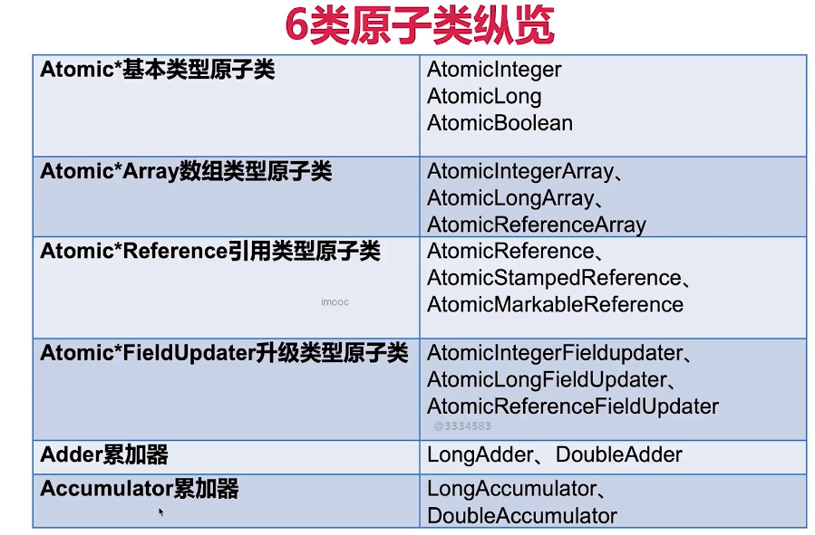
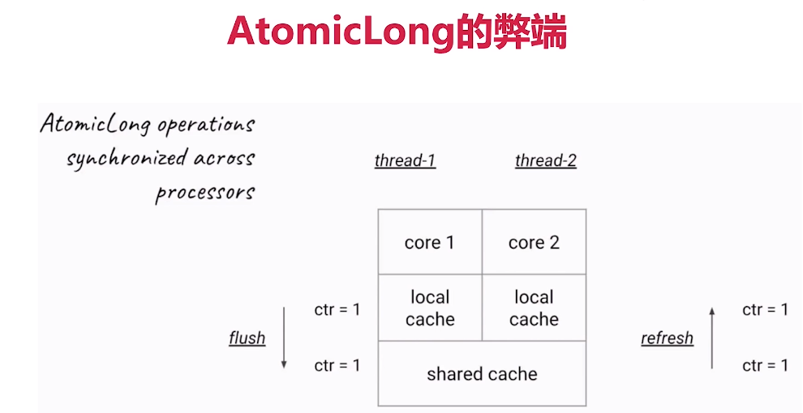
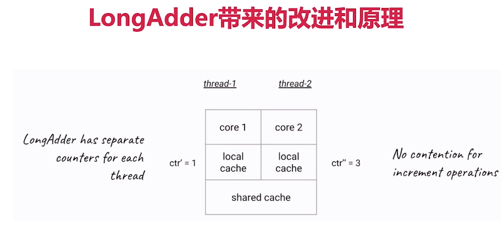

4、atomic包【一刻也不能分割】
4.1、什么是原子类，有什么作用？
特点：不可分割，一个操作是不可中断的，即便是多线程的情况下也可以保证。
java.util.concurrent.atomic

作用：原子类的作用和锁类似，是为了保证并发情况下的线程安全。
不过原子类相比于锁，有一定的优势：
1)、粒度更细：原子操作可以把竞争范围缩小到变量级别，这是我们可以获得的最细粒度的情况了，通常锁的粒度都要大于原子变量的粒度；
2)、效率更高：通常，使用原子类的效率会比使用锁的效率更高，除了高度竞争的情况。

4.2、6类原子类纵览

4.3、Atomic*基本类型原子类，以AtomicInteger为例
4.3.1 AtomicInteger：原子类
1)、get(); //获取当前的值
2)、getAndSet(int newValue); //获取当前的值，并设置新的值
3)、getAndIncrement(); //获取当前的值，并自增
4)、getAndDecrement(); //获取当前的值，并自减
5)、getAndAdd(int delta); //获取当前的值，并加上预期值
6)、compareAndSet(int expect, int update); //如果输入的值等于预期值，则以原子方式将该值设置为输入值(update)

AtomicIntegerDemo1.java

如果说在做账务系统或者财务管理的时候，经常会有并发的修改，这种修改需要保证原子性，可以利用AtomicIntegerArray来保障线程安全。

4.3.2 AtomicLong：原子类
4.3.3 AtomicBoolean：布尔型原子类

4.4、Atomic*Array数组类型原子类
AtomicArrayDemo.java

4.5、Atomic*Reference引用类型原子类
4.5.1、AtomicReference：AtomicReference类的作用，与AtomicInteger并没有本质区别。AtomicInteger可以让一个整数保证原子性，而AtomicReference可以让一个对象保证原子性，
当然，AtomicReference的功能明显比AtomicInteger强，因为一个对象里可以包含很多属性。用法和AtomicInteger类似。
SpinLock.java

4.6、把普通变量升级为原子类，用AtomicIntegerFieldUpdater升级原有变量
4.6.1、AtomicIntegerFieldUpdater对普通变量进行升级
适用场景：
1)、如果一个类不是我们编写的，我们没有权利去修改它，此时可以使用AtomicIntegerFieldUpdater;
2)、偶尔需要一个原子get-set操作；

4.6.2、AtomicIntegerFieldUpdater注意点
1)、所能修改的是具有一个可见范围的；
2)、不支持被static修饰的变量

4.7、Adder累加器(*)
java8中引入的；
高并发下LongAdder比AtomicLong效率高，不过本质是空间换时间；
最大的好处就是在竞争激烈的时候，LongAdder把不同线程对应到不同的Cell上进行修改，降低了冲突的概率，是多段锁的理念，提高了并发性；

4.7.1 代码演示
1)、这里演示多线程的情况下，AtomicLong的性能，有16个线程同时对一个AtomicLong累加；
2)、由于竞争很激烈，每一次加法，都要flush和refresh，导致很耗费资源；

AtomicLongDemo.java
LongAdderDemo.java 

4.7.2 LongAdder带来的改进和原理
1)、在内部，这个LongAdder的实现原理和刚才的AtomicLong是有不同的，刚才的AtomicLong的实现原理是：
每一次加法都需要做同步，所以在高并发的时候会导致冲突比较多，也就降低了效率；
而LongAdder不需要在每一次计算的时候都同步，而是说只有在最后求和的时候才需要把最后整个的值进行汇总。
2)、而此时的LongAdder，每个线程会有自己的一个计数器，仅用来在自己线程内计数，这样一来就不会和其他线程的计数器干扰；
3)、如图中所示，第一个线程的计数器数值也就是ctr‘，为1的时候，可能线程2的计数器ctr’‘已经是3了，它们之间并不存在竞争关系，所以在加和的过程中，
根本不需要同步机制，也不需要刚才的flush和refresh。这里也没有一个公共的counter来给所有线程统一计数。

4)、LongAdder引入了分段累加的概念，内部有一个base变量和一个Cell[]数组共同参与计数：
 a)、base变量：竞争不激烈，直接累加到该变量上
 b)、Cell[]数组：竞争激烈，各个线程分散累加自己的槽Cell[i]中
 c)、sum源码分析

4.7.3 对比AtomicLong和LongAdder
1)、在低争用下，AtomicLong和LongAdder这两个类具有相似的特征。但是在竞争激烈的情况下，LongAdder的预期吞吐量要高得多，但要消耗更多的空间。
2)、LongAdder适合的场景是统计求和的场景，而且LongAdder基本只提供了add方法，而AtomicLong还具有cas方法；

4.8、Accumulator累加器
LongAccumulatorDemo.java

Accumulator和Adder非常相似，Accumulator就是一个更通用版本的Adder。

适用场景：
1)、适合于需要大量计算并且需要并行计算的场景，如果不需要并行计算使用for循环确实可以解决问题；
但是使用了Accumulator之后可以利用多核同时计算，大大提高计算效率；
2)、计算的顺序不能有要求，线程1可能在线程5之后执行也可能之前执行。