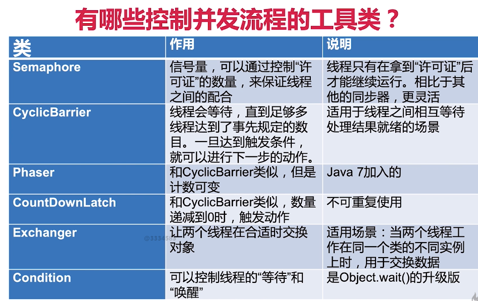
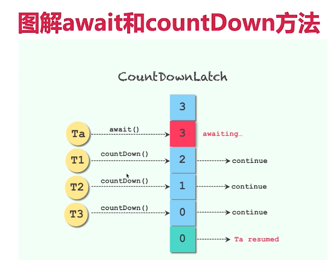
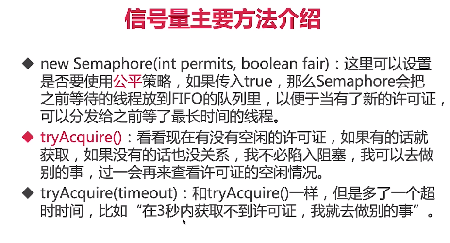

8、控制并发流程
8.1、什么是控制并发流程
在我们不控制的情况下，并发的时候多个线程是尽可能的跑，并且受线程调度器控制，这个时候实际上是不受程序员控制的；
那有的时候要求某一些任务先执行，要求一些任务等某些任务执行完毕在执行的话，这个时候就必须去控制它，依照线程调度器肯定是不靠谱的。
所以控制并发流程的工具类，作用就是帮助我们程序员更容易得让线程之间合作。
让线程之间相互配合，来满足业务逻辑。
比如让线程A等待线程B执行完毕之后，在执行等合作策略。

8.2、CountDownLatch到计时门闩
8.2.1 CountDownLatch类的作用
并发流程控制的工具
1)、倒数门闩
2)、例子：购物拼团；大巴，人满发车；
3)、流程：倒数结束之前，一直处于等待状态，直到倒计时结束了，此线程才继续工作；

8.2.2 类的主要方法介绍
1)、CountDownLatch(int count)：仅有一个构造函数，参数count为需要倒数的数值。
2)、await()：调用await()方法的线程会被挂起，它会等待直到count值为0才继续执行。
3)、countDown()：将count值减1，直到为0时，等待的线程会被换起。

8.2.3 两个典型用法
CountDownLatchDemo1.java
1)、用法一：一个线程等待多个线程都执行完毕，再继续自己的工作。

CountDownLatchDemo2.java
2)、用法二：多个线程等待某一个线程的信号，同时开始执行。

二者结合：CountDownLatchDemo1And2.java

3)、注意点：
a、拓展用法：多个线程等多个线程完成执行后，再同时执行。
b、CountDownLatch是不能够重用的，如果需要重新计数，可以考虑使用CyclicBarrier
或者创建新的CountDownLatch实例。

4)、总结
a、两个典型用法：一等多和多等一
CountDownLatch类在创建实例的时候，需要传递倒数次数。倒数到0的时候，之前等待的线程会继续运行；
b、CountDownLatch不能回滚重置；

8.3、Semaphore信号量
Semaphore可以用来限制或管理数量有限的资源的使用情况。
比如对污染工厂的管理，污染物不能太多，假设污染许可证只能发3张；
信号量的作用是维护一个"许可证"的计数，线程可以"获取"许可证，那信号量剩余的许可证就减1，线程也可以"释放"一个许可证，
那信号量剩余的许可证就加1，当信号量所拥有的的许可证数量为0时，那么下一个还想获取许可证的线程，就需要等待，
直到有另外的线程释放了许可证。

8.3.1 信号量用法
1)、信号量使用流程
 a、初始化Semaphore并指定许可证的数量
 b、在执行一个任务之前，先调用acquire()或者acquireUninterruptibly()方法；
 c、在任务执行结束后，调用release()来释放许可证；
 
2)、主要方法介绍
 a、
 b、acquire()
 c、acquireUninterruptibly()
 d、release()

8.3.2 信号量代码演示
SemaphoreDemo.java

8.3.3 信号量的特殊用法
在获取和释放的时候，可以根据我们的定制数量的；
使用情景：
一个服务器有两个方法：method1和method2，假设method1特别消耗资源，method2不是特别消耗；
此时我们对这两个方法都进行限制，假设我们一共有5个许可证；当方法1运行的时候它会把这5个许可证都拿走，
这个时候方法2就不能同时运行了；但是有的时候，方法1没有在运行，方法2可以每次只拿一个许可证；
所以要么只有1个方法1在运行，要么最多有5个方法2在运行。

8.3.4 注意点
1)、获取和释放许可证的数量必须一致，否则比如每次都获取2个但是只释放1个或者不释放，随着时间的推移，到最后许可证数量不够用，会导致程序卡死。
(虽然信号量并不对是否和获取的数量做规定，但是这是我们的编程规范，否则容易出错)；
2)、注意在初始化Semaphore的时候设置公平性，一般设置为true会更合理
3)、并不是必须由获取许可证的线程释放那个许可证，事实上，获取和释放许可证对线程并无要求，也许是A获取了，然后由B释放，只要逻辑合理即可；
4)、信号量的作用，除了控制临界区最多同时拥有N个线程访问外，另一个作用是可以实现"条件等待"，例如线程1需要在线程2完成准备工作后才能开始工作，
那么就线程1 acquire()，而线程2完成任务后release()，这样的话，相当于是轻量级的CountDownLatch。

8.4、Condition接口(又称条件对象)
8.4.1 作用
1)、假设线程1需要等待某一个条件的时候，它就去执行condition.await()方法，一旦执行了await()方法，线程就会进入阻塞状态；
2)、然后通常会有另外一个线程，假设是线程2，去执行对应的条件，直到这个条件达成的时候，线程2就会去执行condition.signal()方法，
这时JVM就会从被阻塞的线程里找到那些等待该condition的线程，当线程1就会收到可执行信号的时候，
它的线程状态就会变成Runnable可执行状态。

8.4.2 signalAll()和signal()区别
1)、signalAll()会唤起所有的正在等待的线程
2)、但signal()是公平的，只会唤起那个等待时间最长的线程

8.4.2 代码演示(*)
1)、普通示例：ConditionDemo1.java

2)、用Condition实现生产者消费者模式
ConditionDemo2.java

8.4.3 注意点
1)、实际上，如果说Lock用来代替synchronized，那么Condition就是用来代替相对应的Object.wait/notify的，
所以在用法和性质上，几乎都一样；

2)、synchronized中调用wait()方法，就会释放Monitor锁，在这里调用await方法会自动释放持有的Lock锁，和Object.wait一样，
不需要自己手动释放锁；

3)、调用await的时候，必须持有锁，否则会抛出异常，和Object.wait一样；

8.5、CyclicBarrier循环栅栏
8.5.1 作用
1)、CyclicBarrier循环栅栏和CountDownLatch很类似，都能阻塞一组线程；
2)、当有大量线程相互配合，分别计算不同任务，并且需要最后统一汇总的时候，我们可以使用CyclicBarrier。
CyclicBarrier可以构造一个集结点，当某一个线程执行完毕，它就会到集结点等待，直到所有线程都到了集结点，那么该栅栏就被撤销，
所有线程再统一出发，继续执行剩下的任务。

3)、可重用
CyclicBarrierDemo.java

8.5.2 CyclicBarrier和CountDownLatch的区别
1)、CyclicBarrier要等固定数量的线程都到了栅栏位置才能继续执行，而CountDownLatch只需等待数字到0，
也就是说，CountDownLatch用于事件，但是CyclicBarrier是用于线程的；

2)、可重用性不同：CountDownLatch在倒数到0并触发门闩打开后，就不能再次使用了，
除非新建新的实例，而CyclicBarrier可以重复使用。