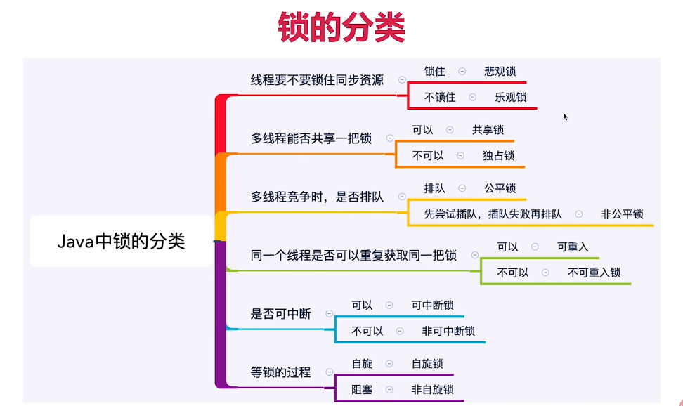
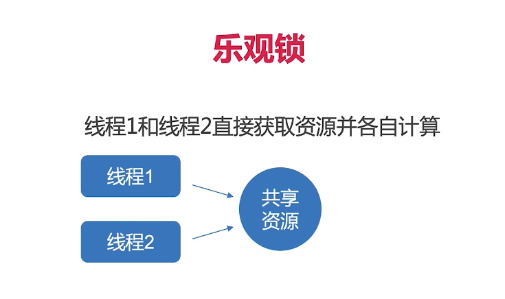
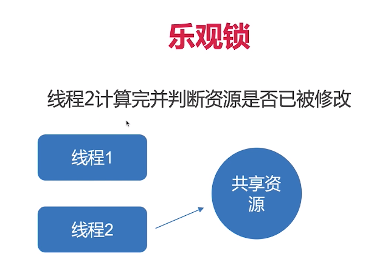
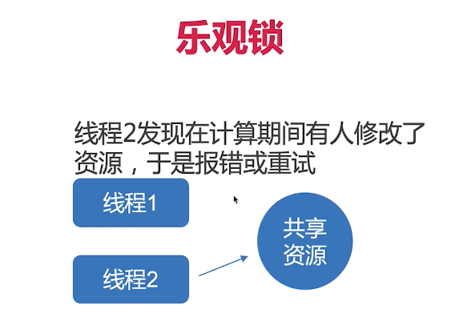
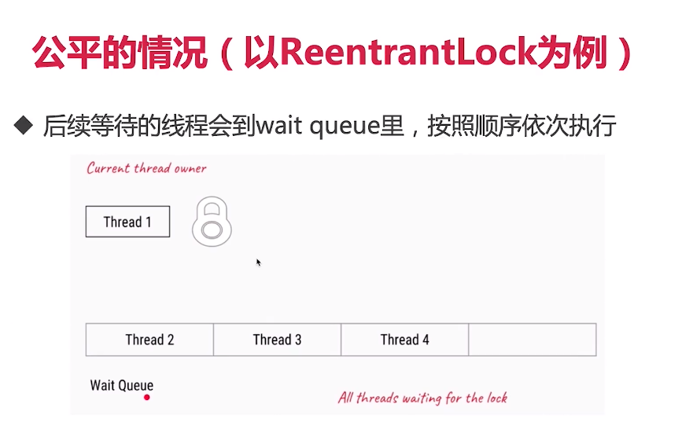
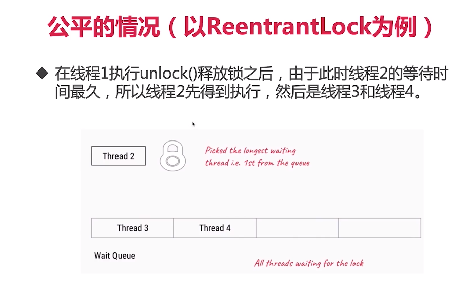
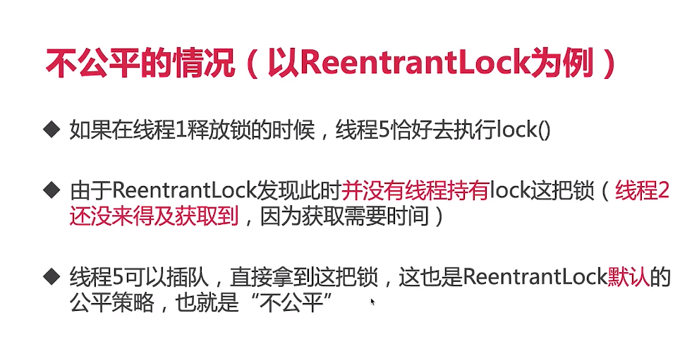
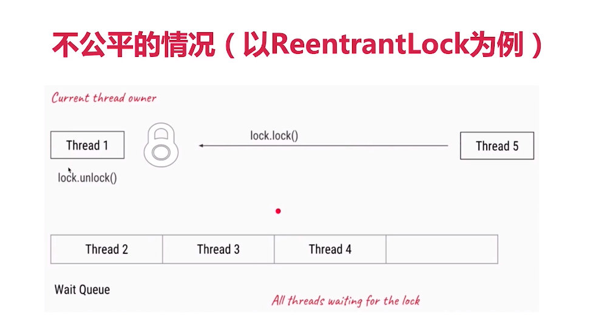

3、不可不说的“锁”事【种类繁多，如何一一突破？】
3.1、Lock接口
3.1.1 简介、地位、作用
1)、锁是一种工具，用于控制对共享资源的访问。
2)、Lock和synchronized，这两个是最常见的锁，它们都可以达到线程安全的目的，但是在使用上和功能上又有较大的不同。
3)、Lock并不是用来代替synchronized的，而是当使用synchronized不合适或不足以满足要求的时候，来提供高级功能的。
4)、Lock接口最常见的实现类是ReentrantLock
5)、通常情况下，Lock只允许一个线程来访问这个共享资源。不过有的时候，一些特殊的实现也可允许并发访问，比如ReadWriteLock里面的ReadLock。

3.1.2 为什么synchronized不够用？为什么需要Lock？
1)、效率低：锁的释放情况少（两种方式）、试图获得锁时不能设定超时、不能中断一个正在试图获得锁的线程；
2)、不够灵活(读写锁更灵活)：加锁和释放的实际单一，每个锁仅有单一的条件（某个对象），可能是不够的
3)、无法知道是否成功获取到锁

3.1.3 方法介绍
在Lock中声明了四个方法来获取锁：
lock()、tryLock()、tryLock(long time, TimeUnit unit)和lockInterruptibly()
3.1.4、四个方法的区别
1)、lock MustUnlock.java
a、lock()就是最普通的获取锁。如果锁已被其他线程获取，则进行等待；
b、Lock不会像synchronized一样在异常时自动释放锁；
c、因此最佳实践是，在finally中释放锁，以保证发生异常时锁一定被释放；
d、lock()方法不能被中断，这会带来很大的隐患：一旦陷入死锁，lock()就会陷入永久等待
2)、tryLock
a、tryLock()用来尝试获取锁，如果当前锁没有被其他线程占用，则获取成功，并且返回true，否则返回false，代表获取锁失败；
b、相比于lock，这样的方法显然功能更强大了，我们可以根据是否能获取到锁来决定后续程序的行为；
c、该方法会立即返回，即便在拿不到锁时不会一直在那等；

3)、tryLock(long time, TimeUnit unit)：超时就放弃
TryLockDeadlock.java

4)、lockInterruptibly：try(long time, TimeUnit unit)把超时时间设置为无限。在等待锁的过程中，线程可以被中断；
5)、unlock()：解锁
注意，要写在finally里面，获取锁之后的第一件事就是把unlock放到finally里面，在写业务代码。

3.1.4 可见性保证
指的是线程与线程之间并不是随时能看到对方最新的动态的；
happens-before原则：我们这件事发生了，如果其他线程一定能看到我们做的其他修改的话，就代表拥有happens-before；

Lock的加解锁和synchronized有同样的内存语义，也就是说，下一个线程加锁后可以看到所有前一个线程解锁前发生的所有操作；

3.2、锁的分类

这些分类是从各种不同角度出发去看的；
这些分类并不是互斥的，也就是多个类型可以并存：有可能一个锁，同时属于两种类型；
比如：ReentrantLock既是互斥锁，又是可重入锁，说明了这个锁又多个属性。
3.2.1 乐观锁和悲观锁
1)、为什么会诞生非互斥同步锁(乐观锁)————互斥同步锁(悲观锁)的劣势
因为互斥同步锁存在一定的劣势：
————互斥同步锁的劣势
a)、阻塞和唤醒带来的性能劣势：悲观锁锁住之后就是独占的，其他线程如果还想获得相同的资源，就必须等待，带来的最大问题就是性能问题；
乐观锁最主要解决的就是性能问题，乐观锁不需要把线程挂起；
b)、悲观锁可能陷入永久阻塞：如果持有锁的线程被永久阻塞，比如遇到了无限循环、死锁等活跃性问题，那么等待该线程释放锁的那几个悲催的线程，将永远也得不到执行；
c)、优先级反转：如果被阻塞的线程优先级比较高，而持有锁的线程优先级比较低，这就会导致优先级反转；

2)、什么是乐观锁和悲观锁
从人的性格分析：
乐观锁：遇到什么事情都很开心，认为事情总是不大会失败的，出错是小概率；所以先肆无忌惮的做一些事情，如果说真的遇到问题，有则改之无则加勉；
悲观锁：总是担惊受怕，认为出错是一种常态，无论事无巨细，都考虑的面面俱到，滴水不漏，保证万无一失。

从是否锁住资源的角度分析：
悲观锁：如果我不锁住这个资源，别人就会来争抢，就会造成数据结果错误，所以每次悲观锁为了确保结果的正确性，会在每次获取并修改数据时，把数据锁住，
让别人无法访问改数据，这样就可以确保数据内容万无一失；在Java最典型的悲观锁实现就是synchronized和Lock相关类；
具体流程：一个线程获取到锁，另一个必须等待，直到该线程释放才可以获取；
乐观锁：
a、认为自己在处理操作的时候不会有其他线程来干扰，所以并不会锁住被操作对象；
b、在更新的时候，去对比在我修改的期间，数据有没有被其他人改变过：如果没有被改变，就说明真的是只有我自己在操作，那我就正常去修改数据；
c、如果数据和我一开始拿到的不一样了，说明其他人在这段时间内改过数据，那我就不能继续刚才的更新数据过程了，我会选择放弃、报错、重试等策略；
d、乐观锁的实现一般都是利用CAS算法来实现的；
CAS的核心思想就是我可以在一个原子操作内，把你这个数据对比并且交换；那么在此期间是不会有人能打断我的。

乐观锁操作：

3)、典型例子：PessimismOptimismLock.java
悲观锁：synchronized和lock接口
乐观锁的典型例子就是原子类、并发容器等；

Git：Git就是乐观锁的典型例子，当我们往远端仓库push的时候，git会检查远端仓库的版本
是不是领先于我们现在的版本，如果远程仓库的版本号和本地不一样，就表示有其他人修改了远端代码了，
我们这次提交就失败，如果远端和本地版本号一致，我们就可以顺利提交版本到远端仓库。

数据库：
a)、select for update就是悲观锁
b)、用version控制数据库就是乐观锁

4)、开销对比
悲观锁的原始开销要高于乐观锁，但是特点是一劳永逸，临界区持锁时间就算越来越长，也不会对互斥锁的开销造成影响；
相反，虽然乐观锁一开始的开销比悲观锁小，但是如果自旋时间很长或者不停重试，那么消耗的资源也会越来越多。

5)、两种锁各自的使用场景
悲观锁：适合并发写入多的情况，适用于临界区持锁时间比较长的情况，悲观锁可以避免大量的无用自旋等消耗，典型情况：
 a)、临界区有IO操作
 b)、临界区代码比较复杂或者循环量大
 c)、临界区竞争非常激烈
乐观锁：适合并发写入少，大部分是读取的场景，不加锁的能让读取性能大幅提高。

3.2.2、可重入锁和非可重入锁，以ReentrantLock为例(*)
1)、可重入锁使用案例：
普通用法1：预定电影院座位 CinemaBookSeat.java
普通用法2：打印字符串 LockDemo.java

2)、什么是可重入？
可重入锁也叫递归锁，指的是同一个线程可以多次获取同一把锁；synchronized和ReentrantLock都是可重入锁；
好处：可以避免死锁；提升封装性；
GetHoldCount.java
RecursionDemo.java

3.3、公平锁和非公平锁
3.3.1 什么是公平和非公平？
公平指的是按照线程请求的顺序，来分配锁；
非公平指的是，不完全按照请求的顺序，在一定情况下，可以插队；

注意：非公平也同样不提倡"插队"行为，这里的公平，指的是在"合适的实际"插队，而不是盲目插队。

什么是合适的时机呢？
举例：买火车票被插队的例子

3.3.2 为什么要有非公平锁？
假设有三个线程A、B、C，线程A持有这把锁，线程B请求这把锁；由于锁已经被A持有，那么B需要去休息；
假设A此时被释放，那么B就要被唤醒并且拿到这把锁；假设这时C突然来请求这把锁，由于C一直处于唤醒状态，是可以立刻执行的；
所以很有可能在B被唤醒之前就已经获得了并且使用完释放了这把锁，这就行成了一种双赢局面。

为了提高效率，避免唤醒带来的空档期；
主要就是因为在唤醒的开销比较大，为了增加吞吐量把这个等待期间利用出去这就是非公平设计的根本原因。

3.5.3 公平的情况（以ReentrantLock为例）

如果在创建ReentrantLock对象时，参数填写为true，那么这就是个公平锁：

3.3.4 不公平的情况（以ReentrantLock为例）

3.3.5 代码案例：演示公平和非公平的效果
FairLock.java
3.3.6 特例
针对tryLock()方法，它是很猛的，它不遵守设定的公平原则。
例如，当有线程执行tryLock()的时候，一旦有线程释放了锁，那么这个正在tryLock的线程就能获取到锁，即使在它之前已经有其他现在在等待队列了；
————tryLock自带插队属性。

3.3.7 对比公平和非公平的优缺点

3.4、共享锁和排它锁：以ReentrantReadWriteLock读写锁为例(*)
3.4.1 什么是共享锁和排他锁
1)、排他锁，又称为独占锁、独享锁：排他锁获取了这个锁之后，既能读又能写；但是此时其他线程再也没有办法获取这个排他锁了，只能由它本人去修改数据；
保证了线程安全；比如：synchronized

2)、共享锁，又称为读锁，获得共享锁之后，可以查看但无法修改和删除数据，其他线程此时也可以获取到共享锁，
也可以查看但无法修改和删除数据。

共享锁和排它锁的典型是读写锁ReentrantReadWriteLock，其中读锁是共享锁（可以有多个线程同时持有），写锁是独享锁（最多有一个线程持有）。

3.4.2 读写锁的作用
在没有读写锁之前，我们假设使用ReentrantLock，那么虽然我们保证了线程安全，但是也浪费了一定的资源：多个读操作同时进行，并没有线程安全问题；

在读的地方使用读锁，在写的地方使用写锁，灵活控制，如果没有写锁的情况下，读是无阻塞的，提高了程序的执行效率。

3.4.3 读写锁的规则
1)、多个线程只申请读锁，都可以申请到
2)、如果有一个线程已经占用了读锁，则此时其他线程如果要申请写锁，则申请写锁的线程会一直等待释放读锁。
3)、如果有一个线程已经占用了写锁，则此时其他线程如果申请写锁或者读锁，则申请的线程会一直等待释放写锁。
一句话总结：要么是一个或多个线程同时有读锁，要么是一个线程有写锁，但是两者不会同时出现(要么多读，要么一写)

换一种思路更容易理解：读写锁只是一把锁，可以通过两种方式锁定：读锁定和写锁定。读写锁可以同时被一个或多个线程读锁定，也可以被单一线程写锁定。但是永远不能同时对这把锁进行读锁定和写锁定。

3.4.4 ReentrantReadWriteLock具体用法
电影院升级——CinemaReadWrite.java

3.4.5 读锁和写锁的交互方式
1)、选择规则
2)、读线程插队
3)、升降级：读锁和写锁不是平等的，写锁相对读锁要高级

ReentrantReadWriteLock：
1)、插队：不允许读锁插队
2)、升降级：允许降级不允许升级

3.4.6 读锁插队策略(*)：
对于公平锁而言，就不要想插队了；
非公平：假设线程2和线程4正在同时读取，线程3想要写入，拿不到锁，于是进入等待队列，线程5不在队列里，现在过来想要读取；

现在有两种策略：
策略1：线程5可以插队；好处：读可以插队，效率高；缺点：容易造成饥饿;
策略2：避免饥饿，不可以插队；

策略的选择取决于具体锁的实现，ReentrantReadWriteLock的实现是选择了策略2，是很明智的。

总结：
公平锁：不允许插队
非公平锁：
 写锁可以随时插队；
 读锁仅在等待队列头节点不是想获取写锁的线程的时候可以插队；
CinemaReadWrite.java
NonfairBargeDemo.java

3.4.7 锁的升降级(*)
1)、为什么需要升降级？
有一个任务，上来先写日志，写完之后需要读取一些文件；——先写后读
由于只是开始想写，后面都是读；如果一直持有写锁这样就非常浪费资源；
如果支持降级的话，我直接从写锁拿到读锁，再把写锁释放掉，这样就可以提供整个的效率。

2)、支持锁的降级，不支持升级：代码演示
Upgrading.java
只能降级，不能升级

3)、为什么不支持锁的升级？死锁
线程支持多线程读，但是只能支持一个线程写；并且不能同时有读和写；
如果我们想升级，就必须等所有读锁都释放，才可以升级；如果所有的读锁都释放完毕，就可以升级为写锁；
假设一种情况，有线程A、B、C，且都已经获取到读锁；如果A想升级为写，要求B、C都释放读锁；
如果B、C都是主动释放读锁，A就可以成功升级到写锁；

另一种情况：
假设有两个线程A、B，它们都在读；并且A、B都想升级；二者等待对方释放读锁，这样就陷入了死锁。

3.4.8 共享锁和排它锁总结
1)、ReentrantReadWriteLock实现了ReadWriteLock接口，最主要的有两个方法：readLock()和writeLock()用来获取读锁和写锁；
2)、锁申请和释放策略
 a)、多个线程只申请读锁，都可以申请到;
 b)、如果有一个线程已经占用了读锁，则此时其他线程如果要申请写锁，则申请写锁的线程会一直等待释放读锁；
 c)、如果有一个线程已经占用了写锁，则此时其他线程如果申请写锁或者读锁，则申请的线程会一直等待释放写锁；
 d)、要么是一个或多个线程同时有读锁，要么是一个线程有写锁，但是两者不会同时出现；
 总结：要么多读，要么一写
3)、插队策略：为了防止饥饿，读锁不能插队
4)、升降级策略：只能降级，不能升级
5)、适用场合：相比于ReentrantLock适用于一般场合，ReentrantReadWriteLock适用于读多写少的情况，合理使用可以进一步提高并发效率；

3.5、自旋锁和阻塞锁
3.5.1 什么叫自旋锁？
如果不使用自旋锁，那么就需要阻塞或唤醒一个Java线程，需要操作系统切换CPU状态来完成，这种状态转换需要耗费处理器时间；
如果同步代码块中的内容过于简单，状态转换消耗的时间有可能比用户代码执行的时间还要长；
为了应对 同步资源的锁定时间很短的场景，不必要为了这一小段时间去切换线程，线程挂起和恢复现场的花费可能会让系统得不偿失；
如果物理机有多个处理器的话，我们可以让两个或以上的线程同时并行执行，在这种情况下呢，后面请求锁的线程就不放弃CPU的执行时间，它会不停的检测，
是不是释放了，如果释放了，我就来拿到；这样一来CPU没有释放，一直在检测，就避免了切换的过程；

为了让当前线程去检测，也就是说让我"稍等一下"，我们让当前线程进行自旋，如果自旋完成后，前面锁定同步资源的线程已经释放了锁，那么当前线程就可以不必阻塞而是直接获取同步资源，从而避免切换线程的开销。
这就是自旋锁。

阻塞锁和自旋锁相反，阻塞锁如果遇到没拿到锁的情况，会直接把线程阻塞，直到被唤醒。

3.5.2 自旋锁缺点
如果锁被占用的时间很长，那么自旋的线程只会白浪费处理器资源；
因为在自旋的过程中，已知消耗CPU，所以虽然自旋锁的起始开销低于悲观锁，但是随着自旋时间的增长，开销也是线性增长的。

3.5.3 原理和源码分析
1)、在java1.5版本及以上的并发框架java.util.concurrent的atomic包下的类基本都是自旋锁的实现；
2)、AtomicInteger的实现：自旋锁的实现原理是CAS，AtomicInteger中调用unsafe进行自增操作的源码中的do-while循环就是一个自旋操作，如果修改过程中遇到其他线程竞争导致没修改成功，就在while里死循环，直至修改成功。

SpinLock.java

3.5.4 适用场景
1)、自旋锁一般用于多核的服务器，在并发度不是特别高的情况下，比阻塞锁的效率高；
2)、另外，自旋锁适用于临界区比较短小的情况，否则如果临界区很大(线程一旦拿到锁，很久以后才会释放)，那也是不合适的；

3.6、可中断锁：顾名思义就是可以响应中断的锁
1)、在Java中，synchronized就不是可中断锁，而Lock是可中断锁，因为tryLock(time)和lockInterruptibly都能响应中断。

2)、如果某一个线程A正在执行锁中的代码，另一线程B正在等待获取该锁，可能由于等待时间过长，线程B不想等待了，想先处理其他事情，
我们可以中断它，这种就是可中断锁。

LockInterruptibly.java

3.7、锁优化
3.7.1 自旋锁和自适应锁
在锁比较短小的情况下，使用自旋锁，可以有效提高效率；自适应的概念就是尝试了几次之后发现尝试不到，
于是就会转为阻塞锁————自适应；
可以在JVM的参数中修改默认自旋参数；

3.7.2 锁消除
有一些场景下，不需要加锁；
比如说一段代码是在方法内部，并且所有同步的东西都是在方法内部，那么在这种情况下根本不可能有外人来访问到我里面的东西，
此时虚拟机就会分析出来认为它们是私有的，无需加锁，于是就会把锁给消除了；

2.7.3 锁粗化
我们的JVM，会动态监测，如果发现前后相邻的synchronized代码块，使用的是同一个锁对象，那么它就会把这几个合为一个较大的；
这样一来，在执行的时候就无须反复的申请和释放锁，只要申请和释放锁一次就能执行完全部的代码块，也提高了性能。

3.7.4 我们在写代码是如何优化锁和提高并发性能
1)、缩小同步代码块
2)、尽量不要锁住方法
3)、减少请求锁的次数
4)、避免人为制造热点：某些数据是共享的，使用它就会加锁；避免人为去制造那些使用锁的场景；
5)、锁中尽量不要在包含锁：容易死锁
6)、选择合适的锁类型或合适的工具类