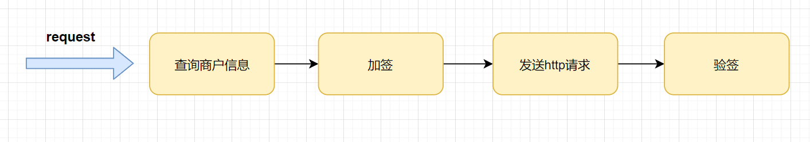

设计：

设计一：predicate
1. 按类型筛选瓜类
2. 按重量筛选瓜类
3. 按类型和重量筛选瓜类
4. 将行为作为参数传递
5. 一次性加了100个过滤条件
6. 引入泛型

设计二：codeoptimize

[一次代码优化实践，用了模板方法+策略+工厂方法模式](https://mp.weixin.qq.com/s/3KPUyKCYyBvPudote-I58w)

先来了解一下类似的业务场景，简言之，就是：多个商户接入我们系统，都是走一个类似的流程通过http请求出去的。

优化前，每个公司对应一个句柄服务，伪代码如下:
```
// 商户A处理句柄
CompanyAHandler implements RequestHandler {
   Resp hander(req){
   //查询商户信息
   queryMerchantInfo();
   //加签
   signature();
   // http请求（走代理）
   httpRequestbyProxy()
   // 验签
   verify();
   }
}
// 商户B处理句柄
CompanyBHandler implements RequestHandler {
   Resp hander(Rreq){
   //查询商户信息
   queryMerchantInfo();
   //加签
   signature();
   // http请求（不走代理）
   httpRequestbyDirect();
   // 验签
   verify(); 
   }
}
// 商户C处理句柄
CompanyBHandler implements RequestHandler {
   Resp hander(Rreq){
   //查询商户信息
   queryMerchantInfo();
   // webservice 方式调用
   requestByWebservice();
   }
}
```
优化代码思路
 重复代码，先把它抽出来，或者公用变量，或者公用方法，甚至公用类。
